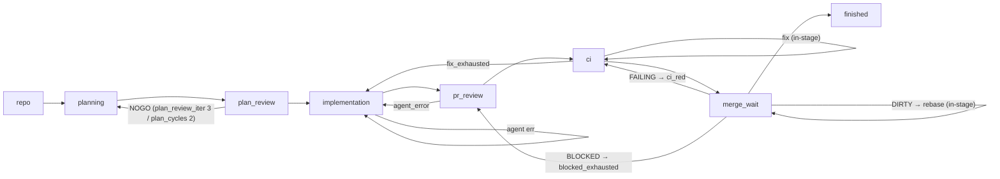

# Automation Loop Architecture

> Status: pre-implementation — this document is the design contract for epic
> #1809. Sections marked "Finalized in the cutover issue" are completed in
> issue #1818/#1819.

## Overview and goals

Replace the subprocess-per-phase issue-major loop with a single-coordinator,
eight-queue state-machine pipeline. The coordinator (main thread) owns queues
and performs validation, logging, and GitHub manipulation. A single worker pool
executes all agent invocations, build/test subprocesses, and git/network
operations. GitHub labels and PR state are the persistent journal; queues are
in-memory and reconstructed from labels at startup. An interrupt leaves items
resumable, never failed.

## Queue topology

### Mermaid



### ASCII

```
repo ─> planning ─> plan_review ─> implementation ─> pr_review ─> ci ─> merge_wait ─> finished
             ^             │              ^   ^           │  ^      │  ^       │
             └─── NOGO ────┘              │   └ agent err ┘  └ fix ─┘  └ DIRTY→rebase (in-stage),
                (iter 3, cycles 2)        └── fix_exhausted             FAILING→ci, BLOCKED→pr_review
```

The diagrams show the primary flow and the most common regressions only. The
complete edge set — including implementation → plan_review (`plan_not_go`),
implementation → ci (`already_implementation_go_pr`), and ci → pr_review
(`not_implementation_go`) — is normative in the ROUTES table below.

## Coordinator / worker contract

The main thread (coordinator) owns all eight in-memory stage queues and
performs ONLY: arg parsing, queue seeding, queue draining, validation/logging,
and GitHub API mutations (labels, comments, PR create/merge-arm — sub-second
calls). It never launches agent workflows, build/test subprocesses, or
git-network operations.

A single worker pool executes:

- **Agent jobs**: call prompt-builder callables (which may fetch diffs/bodies
  via `gh`), then invoke an agent runtime, with optional result parsing
  (e.g., `parse_review_verdict`).
- **Build/test jobs**: execute subprocess commands in worktrees (e.g., `pixi
  run pytest`).
- **Git jobs**: clone, worktree management, rebase, push — all git/network
  operations (protected by per-repo `threading.Lock` since worktrees share
  `.git`).

The only cross-thread channel is `CompletionQueue = queue.Queue[(JobHandle,
JobResult)]`, whose blocking `get(timeout=…)` also serves as the loop's idle
sleep.

## WorkItem lifecycle

In-memory per-stage mini-states (stage-local, never as labels) vs. the small
(~6-label) GitHub `state:*` vocabulary (from `state_labels.py`):
`state:needs-plan`, `state:plan-no-go`, `state:plan-go`,
`state:implementation-no-go`, `state:implementation-go`, `state:skip`.

WorkItem `state` field is in-memory ONLY and reconstructed from GitHub labels
at startup. Labels stay durable and small. Every per-stage state-machine
mutation must be journaled as a durable GitHub write (label, comment, PR
create) BEFORE the corresponding queue push — so restart = re-run, and
interrupts leave items RESUMABLE, never FAILED.

## Stages

Legend: **[M]** = coordinator main thread; **[W:A]** = worker Agent job;
**[W:B]** = worker BuildTest job; **[W:G]** = worker Git job. Every durable
write (label apply, comment post, PR create) happens BEFORE the outcome that
causes a queue push.

### 1. repo (kind=REPO)

**States**: ENTER → CLONE_WAIT → DISCOVER → SEEDED.

**Steps**:

1. [M] `ensure_state_labels` — initialize labels on all repos.
2. [W:G] Clone missing repos (parallel across worker pool).
3. [M] List issues, dedup, partition epics → tag epics `state:skip` [durable],
   exclude them, run label-based classifier to assign entry queues, build
   dependency graph.
4. [M] Discover and fast-forward: `--drive-green-all` → orphan PRs (PRs with no
   tracked issue) → ci stage.
5. [M] Push repo's discovered issues to their classified entry queues; advance
   repo item → finished (pass, seeded: N issues).

**Verdicts**: terminal — the repo item itself always advances to finished
(pass, seeded: N) once seeding completes; clone exhaustion → finished(fail).

**Budgets**: `clone` = 2 (max clone attempts per repo).

**Owned labels**: none (epics receive `state:skip` before exclusion).

**Prompt functions**: none.

### 2. planning

**States**: ENTER → ADVISE_WAIT → PLAN_WAIT → VERIFY.

**Steps**:

1. [M] on_enter: fast-forward check (if at-or-past `state:plan-go` →
   ADVANCE; if `state:skip` → SKIP).
2. [W:A] **Advise step** — `prompts/advise.py:130 get_advise_prompt_builder`.
3. [W:A] **Plan step** — `prompts/planning.py:223 get_plan_prompt` (session:
   repo, issue, planner model; plan comment = durable artifact).
4. [M] Verify plan comment exists (check `PlannerStateManager`) → ADVANCE or
   RETRY.

**Verdicts**: ADVANCE, RETRY, FAIL_BACK(reason).

**Fail routes**: default = finished(fail).

**Budget**: `plan` = 2 (max plan attempts per issue).

**Owned labels**: `state:needs-plan` (idempotent, on entry) [durable].

**Prompt functions**:

- `prompts/advise.py:130 get_advise_prompt_builder`
- `prompts/planning.py:223 get_plan_prompt`

### 3. plan_review

**States**: ENTER → REVIEW_WAIT → EVAL → AMEND_WAIT → (loop) → LEARN_WAIT.

**Steps**:

1. [W:A] **Review step** — `prompts/planning.py:261 get_plan_loop_review_prompt`;
   verdict parsed in-worker by `claude_invoke.parse_review_verdict` (GO,
   NOGO, AMBIGUOUS, ERROR).
2. [M] **EVAL**: if GO → apply `state:plan-go` label [durable] → ADVANCE; if
   NOGO and iteration < 3 → proceed to step 3; if NOGO/AMBIGUOUS at the
   iteration cap → apply `state:plan-no-go` label [durable], then
   FAIL_BACK(nogo) while plan_cycles remain or
   FAIL_BACK(plan_cycles_exhausted) once plan_cycles is exhausted; if ERROR →
   leave labels untouched, RETRY next tick.
3. [W:A] **Amend step** — resume planner session with feedback block;
   iteration counter increments.
4. [W:A] **Learn step** (on GO only) — `learn.py:111 build_learn_prompt`.

**Verdicts**: ADVANCE, RETRY, FAIL_BACK(nogo, plan_cycles_exhausted).

**Fail routes**: default = planning (previous queue); `plan_cycles_exhausted`
→ finished(fail).

**Budgets**: `plan_review_iter` = 3 (max review iterations), `plan_cycles` = 2
(max plan→review→amend cycles before giving up).

**Owned labels**: `state:plan-go` (GO verdict) [durable], `state:plan-no-go`
(exhausted) [durable].

**Prompt functions**:

- `prompts/planning.py:261 get_plan_loop_review_prompt`
- `learn.py:111 build_learn_prompt`

### 4. implementation

**States**: ENTER → GATE → WORKTREE_WAIT → DIRTY_DECISION_WAIT →
ADVISE_WAIT → IMPLEMENT_WAIT → TEST_WAIT → TESTFIX_WAIT → COMMIT_PUSH_WAIT →
PR_CREATE.

**Admission**: dependency topological order + file-overlap serialization +
per-repo in-flight cap.

**Steps**:

1. [M] **GATE**: verify `is_plan_review_go` (at-or-past); detect existing-PR
   fast path (per `_review_existing_pr` semantics) → skip to step 8.
2. [W:G] Create/refresh worktree (`worktree_manager.create_worktree(
   refresh_base=True)`).
3. [W:A] **Dirty worktree decision** — `prompts/implementation.py:280
   get_dirty_reused_worktree_decision_prompt`.
4. [W:A] **Advise step**.
5. [W:A] **Implement step** — `prompts/implementation.py:198
   get_implementation_prompt`.
6. [W:B] **Test step** (optional) — `_run_tests_in_worktree` (`pixi run
   pytest`); on failure, RETRY with budget test_fix.
7. [W:A] **Test fix step** (on test failure, budget test_fix = 1) — resume
   with test-failure feedback → repeat step 6.
8. [W:G] Commit and push (or no-op if existing-PR).
9. [M] **PR_CREATE**: call `gh pr create` (idempotent for existing) with
   `prompts/pr_review.py:339 get_pr_description` [durable] → ADVANCE.

**Verdicts**: ADVANCE, RETRY, FAIL_BACK(reason).

**Fail routes**: `plan_not_go` → plan_review; `already_implementation_go_pr`
(existing PR detected) → ci (declared route, skips pr_review); `agent_error`
→ RETRY (consumes the `implement` budget); exhaustion → finished(fail).

**Budgets**: `implement` = 2 (bounds implement-step attempts, including
`agent_error` retries), `test_fix` = 1 (retry on test failure).

**Owned labels**: PR creation is the journal entry (no labels needed).

**Prompt functions**:

- `prompts/implementation.py:280 get_dirty_reused_worktree_decision_prompt`
- `prompts/implementation.py:198 get_implementation_prompt`
- `prompts/pr_review.py:339 get_pr_description`

### 5. pr_review

**States**: ENTER → REVIEW_WAIT → VALIDATE_WAIT → POST → DIFFICULTY_WAIT →
ADDRESS_WAIT → PUSH_WAIT → EVAL → (loop) → FOLLOWUP_WAIT.

**Steps**:

1. [W:A] **Inline review step** — `prompts/pr_review.py:104
   get_pr_review_analysis_prompt` via `pr_reviewer.review_pr_inline`; output
   is review body.
2. [W:A] **Validation step** — `prompts/pr_review.py:232
   get_review_validation_prompt`.
3. [M] **POST**: post surviving review threads and comments to PR [durable].
4. [W:A] **Difficulty step** — `prompts/pr_review.py:310
   get_comment_difficulty_prompt`.
5. [W:A] **Address step**: if fresh PR → resume implementer with
   `prompts/implementation.py:323 get_impl_resume_feedback_prompt`; if
   existing-PR path → `prompts/address_review.py:181
   get_address_review_prompt`.
6. [W:G] Push (commit+force-push addressing changes).
7. [M] **EVAL**: invoke `_evaluate_go_verdict` (parse reviewerAgent verdict:
   GO, NOGO, AMBIGUOUS, ERROR, HUMAN_BLOCKED) + count unresolved threads;
   if GO + 0 unresolved threads → apply `state:implementation-go` label and
   arm auto-merge [durable] → ADVANCE; if NOGO/AMBIGUOUS/ERROR and iteration
   < 3 → RETRY; if HUMAN_BLOCKED or iteration cap exhausted → routes depend on
   iteration (hard cap 6) and unresolved-thread progress; on exhaustion →
   apply `state:skip` label [durable] → SKIP.
8. [W:A] **Follow-up step** (on GO only) — `prompts/follow_up.py:105
   get_follow_up_prompt`.

**Verdicts**: ADVANCE, RETRY, SKIP, BLOCKED (human intervention needed),
FAIL_BACK(reason).

**Fail routes**: `agent_error` → implementation (retry from implement);
`exhaustion` → SKIP (apply state:skip label); `human_blocked` →
finished(fail, human_blocked); default → pr_review (RETRY).

**Budgets**: `pr_review_iter` = 3 (soft; max iterations while threads
decrease), `pr_review_hard` = 6 (hard cap; iterations 4-6 only if
unresolved-thread count decreases).

**Owned labels**: `state:implementation-go` (GO verdict) [durable],
`state:implementation-no-go` (NOGO verdict, before retry/regress) [durable],
`state:skip` (exhaustion) [durable].

**Prompt functions**:

- `prompts/pr_review.py:104 get_pr_review_analysis_prompt`
- `prompts/pr_review.py:232 get_review_validation_prompt`
- `prompts/pr_review.py:310 get_comment_difficulty_prompt`
- `prompts/implementation.py:323 get_impl_resume_feedback_prompt`
- `prompts/address_review.py:181 get_address_review_prompt`
- `prompts/follow_up.py:105 get_follow_up_prompt`

### 6. ci

**States**: ENTER → DISCOVER → REBASE_WAIT → POLL → FIX_WAIT → PUSH_WAIT →
(POLL).

**Steps**:

1. [M] **DISCOVER**: fetch PR state via `pr_discovery`; verify
   `is_implementation_go` (fast-forward if not).
2. [W:G] **Mechanical rebase** (optional, if base changed): attempt rebase via
   git; on success, push.
3. [M] **POLL** (non-blocking): call `classify_ci_state(pr)` — a NEW pure
   function this epic extracts from `ci_run_coordinator.
   poll_ci_until_concluded`'s conclusion classifier (dropping its sleep
   loop); it does not exist yet. Returns the new vocabulary PENDING, GREEN,
   FAILING, or terminal states. If PENDING → RETRY with timer backoff; if
   GREEN → ADVANCE; if FAILING → step 4.
4. [W:A] **CI fix step** (budget ci_fix = 1) — `ci_fix_orchestrator.py:483
   build_ci_fix_prompt`; escalation via `ci_fix_orchestrator.py:147
   force_engagement_prompt`.
5. [W:G] Push fix commit(s).
6. Loop back to step 3 (POLL).

**Verdicts**: ADVANCE (GREEN), RETRY (PENDING, fix needed), FAIL_BACK(reason).

**Fail routes**: `fix_exhausted` → implementation (retry from implement);
`not_implementation_go` → pr_review (regress); `no_pr` → finished(fail);
default = ci (RETRY).

**Budgets**: `ci_fix` = 1 (max fix attempts; one escalation via
force_engagement), `rebase` = 2 (max mechanical rebase attempts).

**Owned labels**: none (ci state is reflected in PR check conclusion).

**Prompt functions**:

- `ci_fix_orchestrator.py:483 build_ci_fix_prompt`
- `ci_fix_orchestrator.py:147 force_engagement_prompt`

### 7. merge_wait

**States**: ENTER → ARM → POLL → DIRTY_REBASE_WAIT/BLOCKED_ADDRESS_WAIT →
(POLL) → LEARN_WAIT.

**Steps**:

1. [M] **ARM**: ensure auto-merge is armed (via `pr_manager.mark_pr_*` and
   `arming_state`) [durable]; if already armed, idempotent.
2. [M] **POLL** (non-blocking): fetch PR state → MERGED, CLOSED, FAILING,
   DIRTY, BLOCKED, or PENDING; if PENDING → RETRY with timer backoff.
3. On MERGED → step 4; on FAILING → FAIL_BACK(ci_red); on DIRTY → step 5a; on
   BLOCKED → step 5b; on CLOSED → finished(fail).
4. [W:A] **Post-merge learn** (deduped via `arming_state`) — learn prompt.
5a. [W:G]+[W:A] **Resolve dirty PR** — mechanical rebase + push (budget
   rebase = 2); loop back to POLL.
5b. [W:A] **Address blocked threads** (budget blocked_address = 2) —
   `get_address_review_prompt`; [W:G] push → loop back to POLL.

**Verdicts**: ADVANCE (MERGED), RETRY (PENDING, DIRTY, BLOCKED in-stage),
FAIL_BACK(reason).

**Fail routes**: `ci_red` → ci (regress); `blocked_exhausted` → pr_review
(regress); `timeout` → finished(fail); `closed` → finished(fail).

**Budgets**: `blocked_address` = 2 (max address attempts for blocked threads),
`rebase` = 2 (max mechanical rebase attempts), `merge` = --max-merge-attempts
(total merge-attempt timeout, not touched by pipeline).

**Owned labels**: none (merge state is PR state).

**Prompt functions**:

- `prompts/address_review.py:181 get_address_review_prompt`
- `learn.py:111 build_learn_prompt` (post-merge deduped)

### 8. finished

**States**: ENTER → CLEANUP.

**Steps**:

1. [M] Record `ItemResult` in run ledger.
2. [W:G] Worktree cleanup: remove on pass, preserve on fail for debugging
   (preserved list in end-of-run summary).

**Verdicts**: terminal (no outgoing routes).

**Owned labels**: none (result is recorded in summary).

**Prompt functions**: none.

## ROUTES table

Failure routing (single declarative location; per-stage fail-target and
budgets). All budgets are per-item-lifetime counters stored in
`WorkItem.attempts`; they are NEVER reset when an item re-enters a stage, so
cross-stage regression cycles (e.g. merge_wait → ci → implementation →
pr_review → ci) remain globally bounded.

| Stage | Next (success) | Fail targets | Budgets |
|-------|---|---|---|
| repo | finished(pass) — repo item is terminal; discovered issues/PRs go to their classified entry queues | finished(fail) on clone exhaustion | clone=2 |
| planning | plan_review | finished(fail) | plan=2 |
| plan_review | implementation | planning (nogo, default), finished(fail) on plan_cycles_exhausted | plan_review_iter=3, plan_cycles=2 |
| implementation | pr_review | plan_review (plan_not_go), ci (already_go_pr), finished(fail) on exhaustion | implement=2, test_fix=1 |
| pr_review | ci | implementation (agent_error), finished(fail) on human_blocked, finished(skip) on exhaustion | pr_review_iter=3, pr_review_hard=6 |
| ci | merge_wait | implementation (fix_exhausted), pr_review (not_impl_go), finished(fail) on no_pr | ci_fix=1, rebase=2 |
| merge_wait | finished(pass) | ci (ci_red), pr_review (blocked_exhausted), finished(fail) on closed/timeout | blocked_address=2, rebase=2, merge=--max-merge-attempts |
| finished | — | — | — |

## Seeding and reconstruction

One classifier serves both initial seeding (`--repos`, `--issues`, `--prs`
args) and restart reconstruction (at startup, scan GitHub for labels/PR state).
Uses ordered label rank at-or-past comparisons (never equality):

- `state:needs-plan` — rank 0 (lowest).
- `state:plan-no-go` — rank 1.
- `state:plan-go` — rank 2.
- `state:implementation-no-go` — rank 3.
- `state:implementation-go` — rank 4 (highest).

`state:skip` carries no rank: it is handled by exclusion (a skipped item
never enters the rank comparison at all), matching its operator-only,
absolute semantics.

| GitHub state | Entry queue | Notes |
|---|---|---|
| state:skip or epic | excluded | Epic tagging is the one seeding write; done BEFORE excluding. |
| PR merged | finished | pass, idempotent. |
| Open PR + state:implementation-go | ci | existing-PR advanced to merge-ready. |
| Open PR, no impl-go | pr_review | existing-PR path; will be reviewed. |
| No PR, at-or-past state:plan-go | implementation | plan approved; ready to implement. |
| No PR, state:plan-no-go | planning | plan rejected; amend with feedback. |
| state:needs-plan / no label | planning | entry point; no plan yet. |

**Thin CLI scopes** (new; trim the ROUTES table to named stages):

- `hephaestus-plan-issues` = planning → plan_review.
- `hephaestus-implement-issues` = implementation → pr_review.
- `ci_driver` = ci → merge_wait.

## Interrupt semantics and exit codes

Finalized in the cutover issue (#1818/#1819).

## Concurrency, CLI scopes, dry-run, glossary

Finalized in the cutover issue (#1818/#1819).
