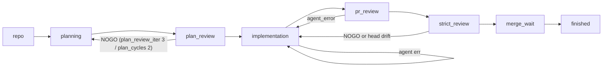

# Automation Loop Architecture

Status: implemented for the epic #1809 queue-based automation loop. The
`hephaestus-automation-loop` CLI runs this pipeline directly; the legacy
subprocess-per-phase loop was removed after the #1818/#1819 cutover.

## Overview and goals

The automation loop is a single-coordinator, eight-queue state-machine
pipeline. The coordinator (main thread) owns queues and performs validation,
logging, and GitHub manipulation. A single worker pool executes all agent
invocations, build/test subprocesses, and git/network operations. GitHub labels
and PR state are the persistent journal; queues are in-memory and reconstructed
from labels at startup. An interrupt leaves items resumable, never failed.

### Loop-owned PR review and approval

`strict_review` is the read-only `$athena:pr-review` pass between `pr_review`
and `merge_wait`. It captures a live PR head and runs in a synchronized, clean,
isolated Codex worktree. After a GO and current-head read-back, the stage itself
applies `state:implementation-go`; it does not publish a GitHub artifact or
status.

CI/CD is outside the loop: it supplies no review input, approval, repair task,
or label transition. `merge_wait` is the sole automatic armer and consumes the
loop-owned label. A restart re-reads that label and the live PR head. No
workflow, status, artifact, or lease authorizes the loop.
The live head is used only to issue or recover an auto-merge request; it never
invalidates an already-issued loop-owned label or causes post-label re-review.

## Queue topology

### Mermaid



### ASCII

```
repo ─> planning ─> plan_review ─> implementation ─> pr_review ─> strict_review ─> merge_wait ─> finished
             ^             │              ^   ^                         │
             └─── NOGO ────┘              │   └ agent err ─────────────┘ strict NOGO or head drift
                (iter 3, cycles 2)        └── implementation-GO ───────> merge_wait
```

The complete edge set — including implementation → plan_review (`plan_not_go`)
and strict-review remediation back to implementation — is normative in the
ROUTES table below.

## Coordinator / worker contract

The main thread (coordinator) owns all eight in-memory stage queues and
performs ONLY: arg parsing, queue seeding, queue draining, validation/logging,
and GitHub API mutations (labels, comments, PR create/auto-merge disablement — sub-second
calls). It never launches agent workflows, build/test subprocesses, or
git-network operations.

A single worker pool executes:

- **Agent jobs**: call prompt-builder callables (which may fetch diffs/bodies
  via `gh`), then invoke an agent runtime, with optional result parsing
  (e.g., `parse_review_verdict`).
- **Build/test jobs**: execute subprocess commands in worktrees (e.g., `uv
  run pytest`).
- **Git jobs**: clone, worktree management, rebase, push — all git/network
  operations (protected by per-repo `threading.Lock` since worktrees share
  `.git`).

The only cross-thread channel is `CompletionQueue = queue.Queue[(JobHandle,
JobResult)]`, whose blocking `get(timeout=…)` also serves as the loop's idle
sleep. When a worker starts executing a submitted job it logs a `worker_claim`
line with the stable worker thread ID plus the coordinator item/stage claim
context. The returned `JobResult` carries that same `worker_id`, and the
coordinator persists it in the durable `complete` event record so operators can
correlate queue drain/submission with actual worker execution.

## WorkItem lifecycle

In-memory per-stage mini-states (stage-local, never as labels) vs. the small
(~6-label) GitHub `state:*` vocabulary (from `state_labels.py`):
`state:needs-plan`, `state:plan-no-go`, `state:plan-go`,
`state:implementation-no-go`, `state:implementation-go`, `state:skip`.

WorkItem `state` field is in-memory ONLY and reconstructed from GitHub labels
at startup. Labels stay durable and small. Every per-stage state-machine
mutation must be journaled as a durable GitHub write (label, comment, PR
create) BEFORE the corresponding queue push — so restart = re-run, and
interrupts leave items RESUMABLE, never FAILED.

## Stages

Legend: **[M]** = coordinator main thread; **[W:A]** = worker Agent job;
**[W:B]** = worker BuildTest job; **[W:G]** = worker Git job. Every durable
write (label apply, comment post, PR create) happens BEFORE the outcome that
causes a queue push.

### 1. repo (kind=REPO)

**States**: ENTER → CLONE_WAIT → DISCOVER → SEEDED.

**Steps**:

1. [M] `ensure_state_labels` — initialize labels on all repos.
2. [W:G] Clone missing repos (parallel across worker pool).
3. [M] List issues, dedup, partition epics → tag epics `state:skip` [durable],
   exclude them, run label-based classifier to assign entry queues, build
   dependency graph.
4. [M] Discover and fast-forward: `--drive-green-all` → orphan PRs (PRs with no
   tracked issue) → strict_review stage.
5. [M] Push repo's discovered issues to their classified entry queues; advance
   repo item → finished (pass, seeded: N issues).

**Verdicts**: terminal — the repo item itself always advances to finished
(pass, seeded: N) once seeding completes; clone exhaustion → finished(fail).

**Budgets**: `clone` = 2 (max clone attempts per repo).

**Owned labels**: none (epics receive `state:skip` before exclusion).

**Prompt functions**: none.

### 2. planning

**States**: ENTER → ADVISE_WAIT → PLAN_WAIT → VERIFY.

**Steps**:

1. [M] on_enter: fast-forward check (if at-or-past `state:plan-go` →
   ADVANCE; if `state:skip` → SKIP).
2. [W:A] **Advise step** — `prompts/advise.py get_advise_prompt_builder`.
3. [W:A] **Plan step** — `prompts/planning.py get_plan_prompt` (session:
   repo, issue, planner model; plan comment = durable artifact).
4. [M] Verify plan comment exists (check `PlannerStateManager`) → ADVANCE or
   RETRY.

**Verdicts**: ADVANCE, RETRY, FAIL_BACK(reason).

**Fail routes**: default = finished(fail).

**Budget**: `plan` = 2 (max plan attempts per issue).

**Owned labels**: `state:needs-plan` (idempotent, on entry) [durable].

**Prompt functions**:

- `prompts/advise.py get_advise_prompt_builder`
- `prompts/planning.py get_plan_prompt`

### 3. plan_review

**States**: ENTER → REVIEW_WAIT → EVAL → AMEND_WAIT → (loop) → LEARN_WAIT.

**Steps**:

1. [W:A] **Review step** — `prompts/planning.py get_plan_loop_review_prompt`;
   verdict parsed in-worker by `claude_invoke.parse_review_verdict` (GO,
   NOGO, AMBIGUOUS, ERROR).
2. [M] **EVAL**: if GO → apply `state:plan-go` label [durable] → ADVANCE; if
   NOGO and iteration < 3 → proceed to step 3; if NOGO/AMBIGUOUS at the
   iteration cap → apply `state:plan-no-go` label [durable], then
   FAIL_BACK(nogo) while plan_cycles remain or
   FAIL_BACK(plan_cycles_exhausted) once plan_cycles is exhausted; if ERROR →
   leave labels untouched, RETRY next tick.
3. [W:A] **Amend step** — resume planner session with feedback block.
   [M] Upsert the amended plan comment [durable] before looping back to
   review. The iteration counter increments in EVAL when each real review
   verdict is processed.
4. [W:A] **Learn step** (on GO only) — `learn.py build_learn_prompt`.

**Verdicts**: ADVANCE, RETRY, FAIL_BACK(nogo, plan_cycles_exhausted).

**Fail routes**: default = planning (previous queue); `plan_cycles_exhausted`
→ finished(fail).

**Budgets**: `plan_review_iter` = 3 (max review iterations), `plan_cycles` = 2
(max plan→review→amend cycles before giving up).

**Owned labels**: `state:plan-go` (GO verdict) [durable], `state:plan-no-go`
(exhausted) [durable].

**Prompt functions**:

- `prompts/planning.py get_plan_loop_review_prompt`
- `learn.py build_learn_prompt`

### 4. implementation

**States**: ENTER → GATE → WORKTREE_WAIT → DIRTY_DECISION_WAIT →
ADVISE_WAIT → IMPLEMENT_WAIT → TEST_WAIT → TESTFIX_WAIT → COMMIT_PUSH_WAIT →
PR_CREATE.

**Admission**: dependency topological order + file-overlap serialization +
per-repo in-flight cap.

**Steps**:

1. [M] **GATE**: verify `is_plan_review_go` (at-or-past); detect existing-PR
   fast path (per `_review_existing_pr` semantics) → skip to step 8.
2. [W:G] Create/refresh worktree (`worktree_manager.create_worktree(
   refresh_base=True)`).
3. [W:A] **Dirty worktree decision** — `prompts/implementation.py:299
   get_dirty_reused_worktree_decision_prompt`.
4. [W:A] **Advise step**.
5. [W:A] **Implement step** — `prompts/implementation.py:217
   get_implementation_prompt`.
6. [W:B] **Test step** (optional) — `_run_tests_in_worktree` (`uv run
   pytest`); on failure, RETRY with budget test_fix.
7. [W:A] **Test fix step** (on test failure, budget test_fix = 1) — resume
   with test-failure feedback → repeat step 6.
8. [W:G] Commit and push (or no-op if existing-PR).
9. [M] **PR_CREATE**: call `gh pr create` (idempotent for existing) with
   `prompts/pr_review.py get_pr_description` [durable] → ADVANCE.

**Verdicts**: ADVANCE, RETRY, FAIL_BACK(reason).

**Fail routes**: `plan_not_go` → plan_review; `already_implementation_go_pr`
(existing PR detected) → merge_wait; `agent_error`
→ RETRY (consumes the `implement` budget); exhaustion → finished(fail).

**Budgets**: `implement` = 2 (bounds implement-step attempts, including
`agent_error` retries), `test_fix` = 1 (retry on test failure).

**Owned labels**: PR creation is the journal entry (no labels needed).

**Prompt functions**:

- `prompts/implementation.py get_dirty_reused_worktree_decision_prompt`
- `prompts/implementation.py get_implementation_prompt`
- `prompts/pr_review.py get_pr_description`

### 5. pr_review

**States**: ENTER → REVIEW_WAIT → VALIDATE_WAIT → POST → DIFFICULTY_WAIT →
ADDRESS_WAIT → PUSH_WAIT → EVAL → (loop). A clean internal GO advances to
the independent strict-review gate; it does not itself authorize a merge.

**Steps**:

1. [M] **ENTER**: verify auto-merge is disabled before any review work. A
   failed read-back finishes `auto_merge_disable_failed`.
2. [W:A] **Inline review step** — `prompts/pr_review.py:104
   get_pr_review_analysis_prompt` via `pr_reviewer.review_pr_inline`; output
   is review body.
3. [W:A] **Validation step** — `prompts/pr_review.py:232
   get_review_validation_prompt`.
4. [M] **POST**: post surviving review threads and comments to PR [durable].
5. [W:A] **Difficulty step** — `prompts/pr_review.py:310
   get_comment_difficulty_prompt`.
6. [W:A] **Address step**: if fresh PR → resume implementer with
   `prompts/implementation.py get_impl_resume_feedback_prompt`; if
   existing-PR path → `prompts/address_review.py:181
   get_address_review_prompt`.
7. [W:G] Push (commit+force-push addressing changes).
8. [M] **EVAL**: invoke `_evaluate_go_verdict` (parse reviewerAgent verdict:
   GO, NOGO, AMBIGUOUS, ERROR, HUMAN_BLOCKED) + `count_unresolved_threads_by_severity`
   (returns `(blocking_automation, minor_automation, human)`, see
   "Severity-aware GO gate" below); an explicit NOGO with zero posted thread
   IDs and zero unresolved automation or human threads is not a completed
   round: upsert the bounded `<!-- hephaestus-pr-review-zero-thread-nogo -->`
   artifact, emit the typed `pr_review_zero_thread_nogo` event, and re-enter
   `REVIEW_WAIT` for a fresh reviewer invocation without consuming a round;
   if GO + `human == 0` + `blocking_automation == 0` → resolve any advisory
   (`minor_automation`) threads, then verify auto-merge is disabled and
   advance to strict review. It does not apply `state:implementation-go` or
   arm auto-merge. If GO but
   `human > 0` → FINISH_FAIL (`human_blocked`); if NOGO/AMBIGUOUS/ERROR and
   iteration < 3 → RETRY; if HUMAN_BLOCKED or iteration cap exhausted →
   routes depend on iteration (hard cap 6) and unresolved-thread progress;
   on exhaustion → apply `state:skip` label [durable] → SKIP.

**Verdicts**: ADVANCE (to strict_review), RETRY, SKIP, BLOCKED (human
intervention needed), FAIL_BACK(reason).

**Fail routes**: `agent_error` → implementation (retry from implement);
`exhaustion` → SKIP (apply state:skip label); `human_blocked` →
finished(fail, human_blocked); default → pr_review (RETRY).

**Budgets**: `pr_review_iter` = 3 (soft; max iterations while threads
decrease), `pr_review_hard` = 6 (hard cap; iterations 4-6 only if
unresolved-thread count decreases).

Zero-thread NOGO anomalies use the bounded reviewer-error retry cap and
consume neither `pr_review_iter` nor `pr_review_hard`; cap exhaustion
escalates directly with `state:skip` (never `agent_error`) and does not
write `state:implementation-no-go`. A threadless NOGO can be a deliberate,
deterministic reviewer verdict (prose-only, no line-anchored findings) —
failing back through `agent_error` would re-adopt the same PR through
implementation with nothing new to address and re-review cannot change a
deterministic input, so cap exhaustion stands down instead of ping-ponging
to a dead end (#2079). Stage-originated JSONL events use the closed schema in
`pipeline/events.py`; raw reviewer text, GitHub bodies, and arbitrary event
objects are rejected.

**Owned labels**: `state:implementation-no-go` (NOGO verdict, before
retry/regress) [durable],
`state:skip` (exhaustion) [durable].

**Prompt functions**:

- `prompts/pr_review.py get_pr_review_analysis_prompt`
- `prompts/pr_review.py get_review_validation_prompt`
- `prompts/pr_review.py get_comment_difficulty_prompt`
- `prompts/implementation.py get_impl_resume_feedback_prompt`
- `prompts/address_review.py get_address_review_prompt`
- `prompts/follow_up.py get_follow_up_prompt`

**Severity-aware GO gate** (#1856; recovers detail from the orphaned
`automation-pr-severity-aware-gate-implementation` skill draft, #2067):

The GO gate does not treat all unresolved automation threads as equally
blocking. Each posted review comment carries a fail-safe severity marker
(`<!-- hephaestus-severity: X -->`, `X` in `critical|major|minor|nitpick`)
prepended to its body at post time (`hephaestus/automation/prompts/pr_review.py`
defines `BLOCKING_SEVERITIES = {"critical", "major"}`,
`VALID_SEVERITIES`, `SEVERITY_MARKER_PREFIX`). Extraction
(`_thread_severity_is_blocking`, `hephaestus/automation/pipeline_github.py:148`)
uses line-prefix anchoring (`stripped.startswith(prefix) and
stripped.endswith("-->")`) to avoid substring false positives, and defaults
an unmarked or unparseable thread to blocking.

`count_unresolved_threads_by_severity` (`hephaestus/automation/pipeline_github.py:625`)
returns `(blocking_automation, minor_automation, human)`: human-authored
threads are never downgraded regardless of marker; only automation-owned
threads are split by severity. The gate
(`hephaestus/automation/pipeline/stages/pr_review.py:723`) requires
`human == 0` and `blocking_automation == 0` to arm a GO; if
`minor_automation > 0` it calls `resolve_automation_threads`
(`hephaestus/automation/pipeline_github.py:647`) to resolve the waved
advisory threads before arming, so `required_review_thread_resolution`
does not re-block the PR at the merge stage.

Integration checklist for applying this pattern elsewhere: define the
three severity constants; embed the marker with a fail-safe (unknown ⇒
blocking) default and idempotency guard (don't double-prepend if already
marked); extract with line-prefix anchoring; return a 3-tuple from the
counter; gate on `blocking == 0`, not `total == 0`; resolve advisory
threads before arming; test marker idempotency, substring false
positives, and the fail-safe default explicitly.

Related: #1554 (original minor-thread deadlock this replaces), #1575
(no-commit detection, related thread-management work).

### 6. strict_review

**States**: ENTER → HEAD_CHECK → WORKTREE_WAIT → REVIEW_WAIT → EVAL → FINISH.

**Steps**:

1. [M] On **every** ingress, revoke any earlier eligibility: clear
   `state:implementation-go`, disable/readback auto-merge, then capture the
   live PR head. A previously captured head that changed is restarted from a
   fresh head check. A containment failure is terminal and fail-closed.
2. [W:G] For a direct PR or a missing worktree, synchronize an isolated
   worktree to the captured PR branch without refreshing it from the base
   branch. [W:A] Explicitly invoke `$athena:pr-review` there in
   `sandbox="read-only"`, with a fresh per-head/per-attempt session and the
   expected remote SHA. The worker grants only the skill's read-only tool
   contract and rejects a local-HEAD mismatch or any tracked/untracked local
   change before invocation. Before dispatch, the coordinator fetches a
   bounded, repo-scoped nonempty diff and authenticated prior
   review, and checks the head both before and after that fetch. Missing,
   malformed, oversized, or stale evidence is a fail-closed NOGO. All evidence
   is untrusted and nonce-fenced.
3. [M] Re-read the head before applying the label. A GO applies
   `state:implementation-go`, then re-reads the head again before advancing
   to `merge_wait`. The label is the loop's durable authorization; no GitHub
   artifact or status is written.
4. [M] An explicit NOGO, infrastructure failure, or malformed verdict verifies
   auto-merge is disabled, records remediation, and fails back to a real implementation pass. It never
   loops through an adopted PR without implementation work. An orphan PR has
   no issue-bound implementation scope, so it remains fail-closed for manual
   remediation after containment.

**Verdicts**: ADVANCE (current-head GO) → merge_wait; FAIL_BACK (`nogo`) →
implementation; RETRY (`head_changed`) → strict_review; containment failures
finish failed.

**Budgets**: `strict_review_iter` = 1 per current-head attempt.

**Owned labels**: `state:implementation-no-go` records NOGO feedback.
`strict_review` applies `state:implementation-go` after its current-head GO.

**Prompt functions**:

- `prompts/strict_review_gate.py build_strict_review_prompt`

### 7. merge_wait

**States**: ENTER → ARM. Already-merged PRs may continue through POLL and
LEARN_WAIT solely to preserve the existing post-merge learn dedupe.

**Steps**:

1. [M] **PREPARE**: for an open PR, read the current head and validate the
   loop-owned `state:implementation-go` label.
2. [M] **ARM/CONFIRM**: arm only through GitHub's conditional
   `--match-head-commit` request for that prepared head; re-read the PR,
   current GO label immediately after arming. A changed head,
   absent confirmation, or record-write failure disables auto-merge and fails
   closed. A PR that merged
   in the race window follows the existing deduped learn path.
3. [M] **POLL**: every armed poll revalidates the loop-owned label and GitHub's
   `autoMergeRequest`; a later disarm revokes eligibility
   and returns to strict review. An already-merged PR continues to
   **LEARN_WAIT** for exactly-once post-merge learning.

**Verdicts**: RETRY while waiting for GitHub; FAIL_BACK to strict review on a
missing label; FINISH_FAIL on arm-confirmation/readback or containment failure;
FINISH_PASS after a merged PR's deduped learn step.

**Fail routes**: missing-label failures → strict_review; arm-confirmation/readback
or containment failures finish failed.

**Budgets**: merge/poll budgets remain bounded by the coordinator routes.

**Owned labels**: none (merge state is PR state).

**Prompt functions**:

- `prompts/address_review.py get_address_review_prompt`
- `learn.py build_learn_prompt` (post-merge deduped)

### 8. finished

**States**: ENTER → RECORD → CLEANUP → DONE.

**Steps**:

1. [M] Record `ItemResult` in run ledger.
2. [W:G] Worktree cleanup: remove on pass, preserve on fail for debugging
   (preserved list in end-of-run summary).

**Verdicts**: terminal (no outgoing routes).

**Owned labels**: none (result is recorded in summary).

**Prompt functions**: none.

## ROUTES table

Failure routing (single declarative location; per-stage fail-target and
budgets). All budgets are per-item-lifetime counters stored in
`WorkItem.attempts`; they are NEVER reset when an item re-enters a stage, so
cross-stage regression cycles (e.g. strict_review → implementation → pr_review) remain
globally bounded.

| Stage | Next (success) | Fail targets | Budgets |
|-------|---|---|---|
| repo | finished(pass) — repo item is terminal; discovered issues/PRs go to their classified entry queues | finished(fail) on clone exhaustion | clone=2 |
| planning | plan_review | finished(fail) | plan=2 |
| plan_review | implementation | planning (nogo, default), finished(fail) on plan_cycles_exhausted | plan_review_iter=3, plan_cycles=2 |
| implementation | pr_review | plan_review (plan_not_go), merge_wait (already_implementation_go_pr), finished(fail) on exhaustion | implement=2, test_fix=1 |
| pr_review | strict_review | implementation (agent_error), finished(fail) on human_blocked or failed disable verification, finished(skip) on exhaustion | pr_review_iter=3, pr_review_hard=6 |
| strict_review | merge_wait | implementation (nogo), strict_review (head_changed), finished(fail) on containment or label failure | strict_review_iter=1 |
| merge_wait | finished(pass) | strict_review on missing loop-owned label; finished(fail) on arm confirmation/readback or containment failure; existing merged PRs learn then pass | merge/poll bounded by routes |
| finished | — | — | — |

## Seeding and reconstruction

One classifier serves both initial seeding (`--repos`, `--issues`, `--prs`) and
restart reconstruction (at startup, scan GitHub for labels/PR state). Direct PR
inputs are terminalized at the seed boundary when their PR is already merged or
closed: merged PRs become `finished(pass)` and closed PRs become
`finished(fail)`, before branch adoption or label-based routing is attempted.
Open direct PRs enter the target repo's `pr_review` queue unless the PR already
carries `state:implementation-go`, in which case they enter `merge_wait`.
When an open direct PR has no linked `Closes #N` issue, the review work item
uses the PR number as its numeric review context (GitHub PRs are issue objects)
and labels that context as `PR #N` in reviewer prompts; all PR-authored body,
description, prior-review, and diff text remains nonce-fenced as untrusted
content.
The label is the loop's sole durable merge authorization; a restarted or
adopted item re-reads the label and current PR head before `merge_wait` can
arm it. CI workflows and external review artifacts do not participate in that
decision.

The same terminal-state check is repeated at the strict-review and implementation stage
boundaries before branch adoption or implementation-label routing. This makes a
PR that closes or merges between seeding and stage execution terminal without
attempting to adopt its branch or run further work.
Uses ordered label rank at-or-past comparisons (never equality):

- `state:needs-plan` — rank 0 (lowest).
- `state:plan-no-go` — rank 1.
- `state:plan-go` — rank 2.
- `state:implementation-no-go` — rank 3.
- `state:implementation-go` — rank 4 (highest).

`state:skip` carries no rank: it is handled by exclusion (a skipped item
never enters the rank comparison at all), matching its absolute exclusion
semantics.

| GitHub state | Entry queue | Notes |
|---|---|---|
| state:skip or epic | excluded | Epic tagging is the one seeding write; done BEFORE excluding. |
| Direct PR already merged | finished | pass, idempotent; terminalized before branch adoption. |
| Direct PR already closed | finished | fail; terminalized before branch adoption. |
| Open PR + PR carries state:implementation-go | merge_wait | Re-read the loop-owned label and live head before conditional arming. |
| Open PR, no impl-go | pr_review | existing-PR path; will be reviewed. |
| No PR, at-or-past state:plan-go | implementation | plan approved; ready to implement. |
| No PR, state:plan-no-go | planning | plan rejected; amend with feedback. |
| state:needs-plan / no label | planning | entry point; no plan yet. |

**Thin pipeline scopes** (within `hephaestus-automation-loop`):

- `--repos` seeds one repo item per named repository.
- `--issues` seeds issue-scoped items through the classifier and routes them to
  planning, implementation, pr_review, strict_review, merge_wait, or finished according to durable
  labels/PR state. When explicit issue or PR scope is present, the resolved
  repository list is used only as context for those items; repo discovery is not
  enqueued, so a scoped run cannot reconstruct every open issue in the repo.
- `--org` expands to non-fork, non-archived repository seeds.

The standalone console scripts are thin queue-pipeline scoped entry points.
They preserve the historical CLI surfaces while building a `PipelineConfig`
limited to the matching stage slice.

## Interrupt semantics and exit codes

`Coordinator.run()` installs SIGINT, SIGTERM, and SIGHUP handlers unless tests
disable signal installation. The first signal sets the shutdown event and starts
a graceful drain window (`PipelineConfig.grace_s`, default 30s). During that
window the coordinator stops admitting new work, drains completed jobs, and
parks touched items as resumable. A second signal, or an expired grace window,
tears down the worker pool immediately and synthesizes interrupted results for
remaining in-flight jobs.

Interrupted items never route through stage success/failure logic. The
coordinator records them as `resumable at <stage>` and the end-of-run summary
prints them under `=== Pipeline summary ===`; with `--json`, the JSON envelope
also carries a `resumable` list. Queued and timer-parked items are finalized the
same way on shutdown. Resume is therefore label/PR/worktree reconstruction:
rerun the same scoped command and seeding will classify each issue back into
the correct entry queue. There is no persisted queue snapshot.

Summary rows, preserved worktree guidance, and exit-code calculation use the
latest effective logical item for each issue, PR, or repository. When a logical
item is re-seeded, superseded historical attempts are collapsed before these
outputs are produced: an old failed attempt does not create a failure row,
preserved-worktree hint, or non-zero exit code after a later effective attempt
passes. The effective-item rule applies only to superseded attempts; the
current item's own failed, skipped, or blocked result still counts.

Exit codes are stable: `130` for interrupted runs, `1` if any effective item
failed, skipped, blocked, or the coordinator itself hit a fatal error, and `0`
for a clean run. If an interrupt overlaps a non-passing ledger entry or fatal
coordinator error, `130` deliberately takes priority because the run did not
complete.

## Concurrency and tuning

The coordinator thread is the only owner of `WorkItem`, `StageQueue`, timers,
routing, and GitHub mutations. Worker threads receive immutable job requests
and return `(JobHandle, JobResult)` through the completion queue. Pool size is
`parallel_repos * max_workers`; `max_workers` also caps in-flight work per
repo. Implementation admission adds dependency ordering and file-overlap
serialization unless `--no-serialize-file-overlap` is passed.

The pipeline never sleeps inside stage logic. Backoff uses the coordinator's
timer heap, and low GitHub rate budget parks agent jobs until the reset instead
of blocking the loop. `--phase-timeout` bounds each agent job inside the
queue pipeline.

Dry-run mode logs GitHub mutations and job submissions without executing them;
`_submit` asserts that no worker job is submitted in dry-run. This makes
`hephaestus-automation-loop --dry-run --loops 1 -v` the operator check
for seed classification and route reconstruction.

## CLI scopes and rollout controls

`hephaestus-automation-loop` runs the queue pipeline directly; there is no
`--pipeline` compatibility flag, there is no `--legacy-loop` rollback path, and
`HEPH_PIPELINE` no longer selects a subprocess-per-phase implementation.

The default pipeline's scopes are the `hephaestus-automation-loop` selectors
listed above. Standalone scripts are thin queue-pipeline scoped entry points:

- `hephaestus-plan-issues` preserves the historical planner CLI and dispatches
  the planning/plan_review stage slice.
- `hephaestus-implement-issues` preserves the historical implementer CLI and
  dispatches the implementation/pr_review/strict_review stage slice after the
  plan-go gate.
- `hephaestus-review-prs` preserves the historical reviewer CLI and dispatches
  the pr_review stage slice.
- `hephaestus-drive-prs-green` preserves the historical drive-green CLI and
  dispatches the pr_review/strict_review/merge_wait stage slice. This lets an
  explicitly selected existing PR receive normal review before the independent
  loop-owned approval review.
- `hephaestus-merge-prs` remains a manual merge-driving command outside the
  queue coordinator.

`--run-pre-pr-tests` is an opt-in queue-runner flag that enables the
implementation-stage pre-PR unit-test gate before commit and PR creation. The
stage executes `PipelineConfig.pre_pr_test_argv` as an argv vector; CLI users get
the repository default test command through the boolean flag.

## Glossary

- **Coordinator**: the main-thread event loop that owns queues, routing,
  timers, GitHub writes, summaries, and signal handling.
- **Worker pool**: the executor for agent, build/test, and git jobs. Workers
  never mutate queues directly.
- **WorkItem**: an in-memory repo, issue, or PR unit moving through a stage.
- **StageQueue**: FIFO queue for one `StageName`, owned only by the
  coordinator.
- **CompletionQueue**: the only cross-thread channel from workers back to the
  coordinator.
- **Durable journal**: GitHub labels, comments, PR state, and local worktrees;
  this is what restart reconstruction reads.
- **Timer-park**: non-blocking retry/backoff by moving an item to the
  coordinator timer heap.
- **Resumable**: interrupted item outcome. It is not a failure verdict and is
  reconstructed from durable state on the next run.
