# Hephaestus Architecture Reference

This document is the canonical, source-grounded architecture reference for
the Hephaestus automation pipeline and supporting subsystems. Every
operational claim links to the module that backs it.
The [`docs/adr/`](adr/) records remain the bind-points for individual
architectural decisions (`0006-queue-based-in-process-automation-pipeline`,
…) — this document is the unified reference; ADRs are the historical record.
This file is source-grounded: every operational claim links to the module
that backs it, in the form `[module/file.py](path/to/file.py)` or
`[§module/Class.func](path/to/file.py)`. Per the project convention
(`"Code References": 'DO'` in [`AGENTS.md`](../AGENTS.md) §"Claude Code
Optimization"), file paths are repo-relative.

---

## Table of contents

1. [Goals, non-goals and design principles](#1-goals-non-goals-and-design-principles)
2. [System overview: single coordinator, seven queues, one worker pool](#2-system-overview)
3. [Cross-cutting invariants](#3-cross-cutting-invariants)
4. [WorkItem and the durable journal](#4-workitem-and-the-durable-journal)
5. [The seven queue stages](#5-the-seven-queue-stages)

- [5.1 Repo intake](#51-repo-intake)
- [5.2 Planning](#52-planning)
- [5.3 Plan review](#53-plan-review)
- [5.4 Implementation](#54-implementation)
- [5.5 PR review](#55-pr-review)
- [5.6 Merge wait](#56-merge-wait)
- [5.7 Finished](#57-finished)

1. [The ROUTES table — single source of truth](#6-the-routes-table)
2. [Seeding and restart reconstruction](#7-seeding-and-restart-reconstruction)
3. [The worker pool and job contract](#8-the-worker-pool-and-job-contract)
4. [Thin CLI scope wrappers and rollout controls](#9-thin-cli-scope-wrappers)
5. [Observability, dry-run and rate-budget gate](#10-observability-dry-run-and-rate-budget-gate)
6. [Interrupt semantics and exit codes](#12-interrupt-semantics-and-exit-codes)
7. [Glossary](#13-glossary)

---

## 1. Goals, non-goals and design principles

### Goals

- **Single durable journal.** GitHub labels, comments, PR state and
 `ArmingStateStore` records are the only
 crash-resistant truth. Stages may not persist any other state. Restart =
re-run: queue reconstruction reads the journal
([`coordinator._seed_pass`](hephaestus/automation/pipeline/coordinator.py),
[`seed_from_cli`](hephaestus/automation/pipeline/seeding.py)) — distinct from
the per-repo seed-side [`repo._seed_pass`](hephaestus/automation/pipeline/stages/repo.py)
in §5.1, which tags `state:skip` on epics before any other durable mutation.
- **Interrupt = resumable, never failed.** A SIGINT/SIGTERM/SIGHUP during a
 run parks the touched item with `ItemResult(passed=False,
 reason="resumable at <stage>", …)`. A subsequent restart seeds it back
 into the same queue and the loop reconverges
 ([`_park_resumable`](hephaestus/automation/pipeline/coordinator.py),
 [`_finalize_resumable`](hephaestus/automation/pipeline/coordinator.py)).
- **One automatic merge authority per head.** `state:implementation-go` is
 applied only by `pr_review._eval`, which is the sole stage authorized to
 write the label. Once applied, `merge_wait` reactivates `auto-merge` and
 revalidates the label + PR head immediately before and after arming
 ([`pr_review.py`](hephaestus/automation/pipeline/stages/pr_review.py),
 [`merge_wait.py`](hephaestus/automation/pipeline/stages/merge_wait.py)).
- **Globally bounded budgets.** Stages count retries on `_on_job_done` so
 `agent_error` retries consume the same per-item budget as ordinary
 attempts; cross-stage regression cycles terminate in finite steps
 ([`_FAIL_BACK_CAP`](hephaestus/automation/pipeline/coordinator.py),
 [`ROUTES`](hephaestus/automation/pipeline/routing.py)).

### Non-goals

- **No persisted queue snapshot.** Queues are in-memory; reconstruction
 reads GitHub via [`seeding.py`](hephaestus/automation/pipeline/seeding.py)
 ([`_all_idle`](hephaestus/automation/pipeline/coordinator.py) +
 [`_reseed_if_converged`](hephaestus/automation/pipeline/coordinator.py)).
- **No OS-level agent sandbox.** Each agent call site declares its explicit
 `--allowedTools` scope and runs in a scoped worktree
 ([`_run_agent`](hephaestus/automation/pipeline/worker_pool.py),
 [`agent_config.py`](hephaestus/automation/agent_config.py)).
- **No MCP runtime dependency.** `.mcp.json` is intentionally empty. Plugin
 marketplaces, NATS JetStream and HTTP REST remain the maintained
 integration contracts ([ADR-0011](adr/0011-mcp-integration-posture.md)).

### Design principles

- **KISS / YAGNI.** Each stage owns one responsibility. The deferred
 `AgentProtocol` and `resilience` wiring into the GitHub call path
 (issues #468, #469) are intentionally NOT built yet.
- **DRY / one-way dependency.** `automation → library` only — library
 subpackages may not import from
 [`hephaestus.automation`](hephaestus/automation/), as defined by
 [`ADR-0001`](adr/0001-automation-library-boundary.md).
- **SOLID / substitutable providers.** [`hephaestus.agents.runtime`](hephaestus/agents/runtime.py)
 abstracts over Claude Code and Codex behind a uniform `--agent` flag.
- **POLA. Least privilege, least astonishment.** Per-call
 `--allowedTools`, scoped worktrees, fenced untrusted GitHub content
 via `_fence_untrusted` in
 [`prompts/_shared.py`](hephaestus/automation/prompts/_shared.py) and
 admin-free human-gated merge.

---

## 2. System overview

### Topology

The default path is **`hephaestus-automation-loop`**, the queue-based
in-process pipeline whose coordinator lives at
[`hephaestus.automation.pipeline.coordinator`](hephaestus/automation/pipeline/coordinator.py).
The coordinator owns **seven in-memory stage queues** and dispatches
agent / build-test / git-network jobs to a single `WorkerPool`. Each agent
job runs Claude or Codex, chosen by `--agent` (default Claude).

#### Seven-stage queue block diagram

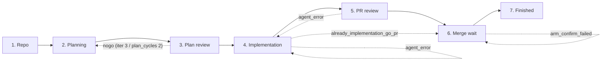

Every back-edge in the diagram is **named** in
[`ROUTES`](hephaestus/automation/pipeline/routing.py) and is the "fail-route
reason vocabulary" stages must reference verbatim in `StageOutcome.note`.

### Coordinator / worker contract

The main thread (coordinator) OWNS:

- all seven stage queues ([`self.queues`](hephaestus/automation/pipeline/coordinator.py))
- the timer heap ([`self.timers`](hephaestus/automation/pipeline/coordinator.py))
- the in-flight registry ([`self.in_flight`](hephaestus/automation/pipeline/coordinator.py))
- all routing and disposition semantics ([`_route`](hephaestus/automation/pipeline/coordinator.py))
- every GitHub API mutation, through
 [`StageGitHub`](hephaestus/automation/pipeline/stages/base.py)
 (label writes, comment upserts, PR create/auto-merge)
It NEVER launches agents, builds/tests or git/network operations. It never
sleeps — wakeups are the timer's responsibility.
The single worker pool ([`WorkerPool`](hephaestus/automation/pipeline/worker_pool.py))
executes everything else: agent invocations (Claude or Codex), build/test
subprocesses and git/network operations. Every Claude agent invocation
routed through the worker pool binds to an explicit least-privilege
`--allowedTools` scope. An explicit [`AgentJob.allowed_tools`](hephaestus/automation/pipeline/jobs.py)
grant wins (the `pr_review` job uses it for the reviewer skill); absent that,
read-only sandbox jobs use [`DEFAULT_TOOL_SCOPE`](hephaestus/automation/pipeline/tool_scopes.py),
and all other jobs resolve through
[`tool_scope_for(agent)`](hephaestus/automation/pipeline/tool_scopes.py) from
[`AGENT_TOOL_SCOPES`](hephaestus/automation/pipeline/tool_scopes.py). An
unmapped role therefore falls through to the same read-only default rather
than the most permissive scope (#2319). Every git operation crosses
[`_repo_lock`](hephaestus/automation/pipeline/worker_pool.py) (in-process
thread lock, outer) **and**
[`_interruptible_file_lock`](hephaestus/automation/pipeline/worker_pool.py)
(cross-process flock, inner). Worktrees share `.git`, so two concurrent
operations on the same checkout would race.
The only cross-thread channel is
[`CompletionQueue`](hephaestus/automation/pipeline/queues.py)
(`queue.Queue[(JobHandle, JobResult)]`); its blocking
`get(timeout=…)` is the loop's idle sleep
([`_wait_for_completion`](hephaestus/automation/pipeline/coordinator.py)).
Poll interval = [`_IDLE_POLL_S = 1.0`](hephaestus/automation/pipeline/coordinator.py).
Pool size = `parallel_repos × max_workers`
([`WorkerPool(size=…)`](hephaestus/automation/pipeline/worker_pool.py)).

### Ticks

The per-tick event loop is defined in
[`Coordinator.run`](hephaestus/automation/pipeline/coordinator.py). One
tick does, in order:

1. **Shutdown check** — graceful drain or immediate teardown after the
 grace window / a second signal
 ([`_grace_exceeded`](hephaestus/automation/pipeline/coordinator.py),
 [`_immediate`](hephaestus/automation/pipeline/coordinator.py)).
2. **Wake timers** — pop every expired entry back into its stage queue
 ([`_wake_timers`](hephaestus/automation/pipeline/coordinator.py)).
3. **Drain completions** — handle ALL ready completions without blocking;
 interrupted results park the item RESUMABLE and never reach
 `on_job_done`
 ([`_drain_completions`](hephaestus/automation/pipeline/coordinator.py),
 [`_park_resumable`](hephaestus/automation/pipeline/coordinator.py)).
4. **Emit observability tick** — push queue-depth / in-flight / circuit
 breaker gauges and record alert transitions
 ([`_emit_observability_tick`](hephaestus/automation/pipeline/coordinator.py)).
5. **Drain queues down-stream first** — `finished → merge_wait →
 pr_review → implementation → plan_review → planning → repo`
 ([`_DRAIN_ORDER`](hephaestus/automation/pipeline/coordinator.py)).
 Implementation drains separately to enforce dependency topo-order
 and file-overlap serialization; other queues drain with the per-repo
 in-flight cap ([`_drain_implementation`](hephaestus/automation/pipeline/coordinator.py),
 [`_drain_queues`](hephaestus/automation/pipeline/coordinator.py),
 [`_admit`](hephaestus/automation/pipeline/coordinator.py)).
6. **Idle-or-loop check** — if all queues + timers + in-flight are empty,
 re-seed up to `--loops` and either exit on zero work or continue
 ([`_all_idle`](hephaestus/automation/pipeline/coordinator.py),
 [`_reseed_if_converged`](hephaestus/automation/pipeline/coordinator.py)).
 Otherwise block on [`completion_q`](hephaestus/automation/pipeline/coordinator.py).
A defensive step watchdog ([`_STEP_WATCHDOG_S = 15.0`](hephaestus/automation/pipeline/coordinator.py))
warns when any `stage.step()` call exceeds ~15 s. 5 s proved too tight in
practice: routine repo-stage steps (clone + label reads over the network)
breached it on nearly every multi-repo run, burying real stalls in noise
(#2247).

### Library → product layer boundary

[`hephaestus.automation`](hephaestus/automation/) is the product layer. The
base import surface (`import hephaestus`) MUST NOT pull `curses`, `fcntl`,
`pydantic` or any `hephaestus.automation.*` module. Library subpackages
therefore cannot import `hephaestus.automation`.

---

## 3. Cross-cutting invariants

These invariants apply to **every** stage. Each stage section below cites
back to them.

### Journal-order invariant: durable write BEFORE the queue push

Every durable GitHub mutation (label add / remove / edit, comment upsert,
PR create) happens IMMEDIATELY BEFORE the
`StageOutcome` that causes the queue push. Restart then re-runs the stage
and the stage's idempotency checks (at-or-past label comparison, plan
comment presence, PR existence) fast-forward through already-completed
work. Interrupts therefore leave items RESUMABLE, never FAILED — a restart's
seeding classifies them back into the same entry queue and `on_enter`
restarts from the same state.
Implementation: each stage method performs its durable op via a single
[`ctx.github`](hephaestus/automation/pipeline/stages/base.py) accessor call
on the coordinator-owned [`StageGitHub`](hephaestus/automation/pipeline/stages/base.py)
protocol, then returns `StageOutcome(…)`. The coordinator's
[`_route`](hephaestus/automation/pipeline/coordinator.py) applies the
disposition to the queue.

### Non-blocking retry / timer-park contract

Stages never sleep — the coordinator's timer heap owns every delay.
When a stage wants to wait (typically on a CI poll), it writes the delay
into `item.payload["retry_delay_s"]` and returns
`StageOutcome(Disposition.RETRY, note)`. The coordinator's
[`_route_retry`](hephaestus/automation/pipeline/coordinator.py) reads that
key and parks the item on the heap
([`_timer_park`](hephaestus/automation/pipeline/coordinator.py)).
A missing key means "retry on the next drain tick" (no delay).
[`BACKOFF_CAP_S = 60`](hephaestus/automation/pipeline/stages/base.py) is
shared by every stage that uses the legacy exponential poll delay.

### Interrupt semantics

`Coordinator.run` installs SIGINT, SIGTERM, SIGHUP handlers
([`_install_signal_handlers`](hephaestus/automation/pipeline/coordinator.py)).
A first signal sets `shutdown` and starts a graceful drain window
([`_DEFAULT_GRACE_S = 30.0`](hephaestus/automation/pipeline/coordinator.py)).
The coordinator stops admitting new work, drains in-flight to RESUMABLE and parks touched items at their current stage. A second signal or an
expired grace window, tears the pool down immediately and the coordinator
synthesizes interrupted results for remaining in-flight jobs.
Items touched by an interrupt report
`ItemResult(passed=False, reason="resumable at <stage>", …)` — **never** FAILED. The
end-of-run summary lists them under `RESUMABLE at <stage>`. Resume is
label/PR/worktree reconstruction: rerunning the same scoped command
re-seeds each item into the correct entry queue. There is no persisted
queue snapshot.

### Exit codes

- `130` — interrupted run.
- `1` — any effective item failed, skipped, blocked; or the coordinator hit a fatal error.
- `0` — clean run.
[`_exit_code`](hephaestus/automation/pipeline/coordinator.py) deliberately
gives `130` priority over non-passing ledger entries and fatal coordinator
errors: a signal means the run did not complete.

### Effective-item rule

The summary uses `latest_logical_items(self.items)` from
[`summary.py`](hephaestus/automation/pipeline/summary.py) so a re-seeded
item's superseded attempts are collapsed before per-row / exit-code /
preserved-worktree calculation. The current item's own failed, skipped or blocked result still counts; an old failed attempt that was superseded
by a later passing attempt does not. Pull requests already merged/closed are
terminalized before summary collapse so stale attempts cannot re-enter the queue.

### Rate-budget gate

The legacy `_maybe_sleep_for_rate_budget` SLEEPS its loop thread — fatal
for a single coordinator thread. The new gate lives at the submit
chokepoint ([`_submit`](hephaestus/automation/pipeline/coordinator.py)):
[`_rate_budget_ok`](hephaestus/automation/pipeline/coordinator.py) calls
[`hephaestus.automation.pipeline_github.rate_budget_ok`](hephaestus/automation/pipeline_github.py)
and timer-parks an `AgentJob` until the upstream reset when the GraphQL
budget is low. Git/build jobs are unaffected. No `time.sleep` lives in any
stage module.

### Dry-run

When `--dry-run` is set, the coordinator:

- logs would-submit job descriptions and ADVANCEs the item
 ([`_run_item`](hephaestus/automation/pipeline/coordinator.py));
- asserts no job is EVER submitted
 ([`_submit`](hephaestus/automation/pipeline/coordinator.py));
- log-and-skip mutators in
 [`StageGitHub`](hephaestus/automation/pipeline/stages/base.py);
- finishes items instead of parking on RETRY with `retry_delay_s` (the
 preview will never see real-world CI / merge progress)
 ([`_route_retry`](hephaestus/automation/pipeline/coordinator.py));
- finishes items instead of failing back on FAIL_BACK (a dry-run mutator
 never writes the labels an earlier stage would re-check, so a regression
 would ping-pong until the safety cap)
 ([`_route_fail_back`](hephaestus/automation/pipeline/coordinator.py)).
The fleet-sync `--dry-run` is also a preview contract (see
[`AGENTS.md`](../AGENTS.md) §"Claude non-interactive permission policy").

### Poisoned-item fail-safety

Every `_run_item` call is wrapped in a per-item `try/except`; an item that
raises an unhandled exception inside a stage accessor is logged and routed
to [`FINISH_FAIL`](hephaestus/automation/pipeline/routing.py) instead of
terminating the loop, so one bad item never poisons the whole run (#2295).
Equivalently, when a `scope.trimmed_routes()` rewrite or a stage's own
`ROUTES` row has no `next`/`fail` mapping, the item lands at the next valid
mapping or `finished(fail)` rather than raising `KeyError`.

### Closed-schema stage events

Stage-originated JSONL events use the closed schema in
[`events.py`](hephaestus/automation/pipeline/events.py). `encode_stage_event`
rejects raw reviewer text, GitHub bodies and arbitrary event objects.
The only event type currently defined is
[`PrReviewZeroThreadNogoEvent`](hephaestus/automation/pipeline/events.py).

### Scope trimming

[`PipelineScope`](hephaestus/automation/pipeline/routing.py) lets the
coordinator route items through a contiguous subset of stages
(`hephaestus-plan-issues` runs `planning → plan_review`;
`hephaestus-implement-issues` runs `implementation → pr_review`).
`hephaestus-merge-prs` is the manual merge-driving command outside the queue
coordinator (see [`hephaestus.github.pr_merge`](hephaestus/github/pr_merge.py)). `trimmed_routes()` rewrites every out-of-scope next/fail
target to `FINISHED`, so the partial route table is closed under
`scope ∪ {FINISHED}`. The coordinator always re-adds the universal sink:
see [`_routes = config.scope.trimmed_routes()`](hephaestus/automation/pipeline/coordinator.py).
`--force` on the planner CLI re-routes any at-or-past-scope stage back to
the scope's first stage so the scoped work is redone
([`_scope_seed_decision`](hephaestus/automation/pipeline/coordinator.py)).

### Cross-stage ping-pong bound

Some regression edges (`pr_review → implementation` for `agent_error`)
can ping-pong. The
[`_FAIL_BACK_CAP`](hephaestus/automation/pipeline/coordinator.py)
constant is the sum of every budget in
[`ROUTES`](hephaestus/automation/pipeline/routing.py). Stages enforce the
real per-key budgets themselves; the safety cap only guarantees
cross-stage cycles terminate even if a stage has a budget bookkeeping bug
([`_route_fail_back`](hephaestus/automation/pipeline/coordinator.py)).

---

## 4. WorkItem and the durable journal

### [§`WorkItem`](hephaestus/automation/pipeline/work_item.py)

The single per-item record moving through the queue. Thread-safety is by
construction: a `WorkItem` and its `StageQueue` are only ever touched by
the coordinator thread; the single cross-thread channel is
[`CompletionQueue`](hephaestus/automation/pipeline/queues.py).
Key fields:

- `repo`, `kind` ([`ItemKind`](hephaestus/automation/pipeline/work_item.py)) —
 repo / issue / PR.
- `issue` (optional), `pr` (optional) — the GitHub identifier.
- `stage` ([`StageName`](hephaestus/automation/pipeline/routing.py)) —
 current queue.
- `state` — stage-local mini-state string (never a label).
- `attempts` — `dict` keyed by ROUTES budget names. Per-item-lifetime
 counter; never reset when an item re-enters a stage
 ([`_default_attempts`](hephaestus/automation/pipeline/work_item.py),
 [`routing.py`](hephaestus/automation/pipeline/routing.py) module
 docstring).
- `history` — `deque[HistoryEvent]` capped at
 [`HISTORY_CAP = 200`](hephaestus/automation/pipeline/work_item.py).
- `session_ids` — `dict[str, str]`, populated by agent invocations.
- `labels_cache` — last-known diagnostic label set. Planning and plan-review
 transition gates require a fresh GitHub read; cached labels never authorize
 advancement.
- `payload` — `dict[str, Any]`. The stage-local scratchpad for cross-step
 handoff (`retry_delay_s`, `*_verdict`, base-captured `base_branch`,
 reviewer text, etc.).
- `result` ([`ItemResult`](hephaestus/automation/pipeline/work_item.py)) —
 final `passed / reason / final_stage` written by
 [`_finish`](hephaestus/automation/pipeline/coordinator.py).
- `armed` — `bool` set on a confirmed drive-green arm
 ([`_arm`](hephaestus/automation/pipeline/stages/merge_wait.py)).
- `worktree`, `branch` — populated by [`implementation`](hephaestus/automation/pipeline/stages/implementation.py).

### [§`StageName`](hephaestus/automation/pipeline/routing.py)

`str`-flavored `Enum`:

```
REPO → PLANNING → PLAN_REVIEW → IMPLEMENTATION → PR_REVIEW →
 MERGE_WAIT → FINISHED
```

Declaration order matches
[`PIPELINE_ORDER`](hephaestus/automation/pipeline/routing.py) and the
[`_DRAIN_ORDER`](hephaestus/automation/pipeline/coordinator.py) reversed.
DO NOT REORDER — the `PipelineScope` contiguity check indexes by position.

### [§`Disposition`](hephaestus/automation/pipeline/routing.py)

`str`-flavored `Enum` returned in
[`StageOutcome.disposition`](hephaestus/automation/pipeline/routing.py):

- `ADVANCE` — route to `ROUTES[stage].next`.
- `RETRY` — read `payload["retry_delay_s"]`, timer-park (or re-push if
 missing) to `stage`.
- `FAIL_BACK` — reason-keyed regression via
 `ROUTES[stage].fail_routes.get(note, …)`; failing-back from the
 coordinator's safety cap finishes failed.
- `SKIP` — finish failed with reason `skip:<note>`.
- `BLOCKED` — finish failed with reason `blocked:<note>`.
- `FINISH_PASS` / `FINISH_FAIL` — terminal; pass with reason `<note>` /
 fail with reason `<note>`.
The disposition funnel is exhaustive: every layer in
[`Disposition`](hephaestus/automation/pipeline/routing.py) has a branch
in [`_route`](hephaestus/automation/pipeline/coordinator.py), so a new
value would be a static `TypeError` and a safe routing table edit.

### State-label vocabulary

Defined in [`state_labels.py`](hephaestus/automation/state_labels.py) and
imported throughout the pipeline. Seven labels: four mutually exclusive
planning states, two mutually exclusive implementation-review states, and one
absolute operator state:

| Label | Group | Authoritative stage |
|--------------------------------|--------------|---------------------------------|
| `state:needs-plan` | planner-scope| [`planning.on_enter`](hephaestus/automation/pipeline/stages/planning.py) |
| `state:plan-no-go` | planner-scope| [`plan_review._eval`](hephaestus/automation/pipeline/stages/plan_review.py) |
| `state:plan-go` | planner-scope| [`plan_review._eval`](hephaestus/automation/pipeline/stages/plan_review.py) |
| `state:plan-blocked` | planner-scope| [`plan_review._eval`](hephaestus/automation/pipeline/stages/plan_review.py) |
| `state:implementation-no-go` | review-scope | [`pr_review._eval`](hephaestus/automation/pipeline/stages/pr_review.py) |
| `state:implementation-go` | review-scope | [`pr_review._eval`](hephaestus/automation/pipeline/stages/pr_review.py) — **sole authority** |
| `state:skip` | absolute | operator / exhaustion in [`pr_review`](hephaestus/automation/pipeline/stages/pr_review.py) / [`implementation`](hephaestus/automation/pipeline/stages/implementation.py) |

Every **stage-issued** `state:skip` durable write (the `pr_review` and
`implementation` write paths, plus repo-stage epic tagging) has a
best-effort `gh_issue_upsert_comment` companion produced via
[`format_skip_reason_comment`](hephaestus/automation/state_labels.py), using
the [`SKIP_REASON_MARKER`](hephaestus/automation/state_labels.py) prefix
`<!-- hephaestus-state-skip-reason -->` so the reason survives outside the
run log (#2264). Epic tagging in
[`repo._seed_pass`](hephaestus/automation/pipeline/stages/repo.py) is the
sole sanctioned seeding write: it adds both the skip label and this comment
before excluding the epic from the rest of the pipeline.

Label colors per [`STATE_LABEL_SPECS`](hephaestus/automation/state_labels.py).
Provisioning script
([`hephaestus-ensure-state-labels`](scripts/)) creates them on a repo.

#### Ordered rank (`_LABEL_RANK`)

Used by [`seeding.py`](hephaestus/automation/pipeline/seeding.py) and
[`planning.on_enter`](hephaestus/automation/pipeline/stages/planning.py).
**NEVER use equality.** The at-or-past comparison is the only read the
gate trusts:

```
needs-plan : 0
plan-no-go : 1
plan-go : 2
implementation-no-go: 3
implementation-go : 4
state:skip : NO RANK (excluded from rank compare)
```

A label alone never authorizes merge. `merge_wait` revalidates the
`state:implementation-go` label and the PR head immediately before and
after arming and revokes on drift.

Plan-review labels are the sole durable authority. Review comments explain and
audit a decision but never authorize a transition, block a stage, or backfill a
missing label. Comment markers locate actor-owned journal artifacts only;
foreign marker text is ignored.

---

## 5. The seven queue stages

The seven stages are architectural responsibilities, not implementation
modules. This section describes boundaries, durable state, and transitions.
Worker types, helper functions, payload fields, and source-code structure are
intentionally omitted.

### Queue block diagram

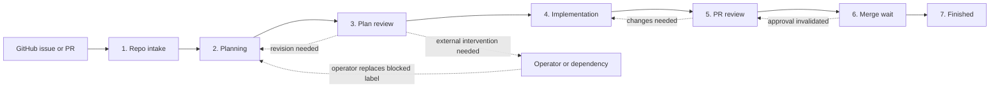

GitHub is the durable journal. After a restart, labels, issue comments, pull
request reviews, review threads, and merge state reconstruct where work should
resume.

### 5.1 Repo intake

Repo intake discovers candidate work, records exclusions, and routes each
eligible issue or pull request to the stage implied by its durable state.

#### Boundary diagram

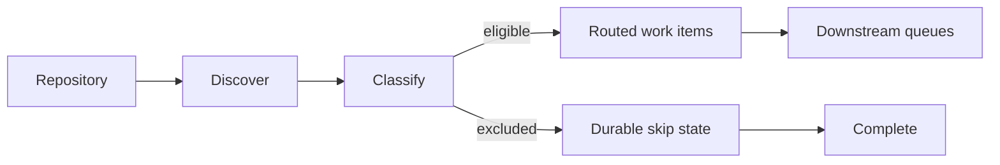

#### State machine

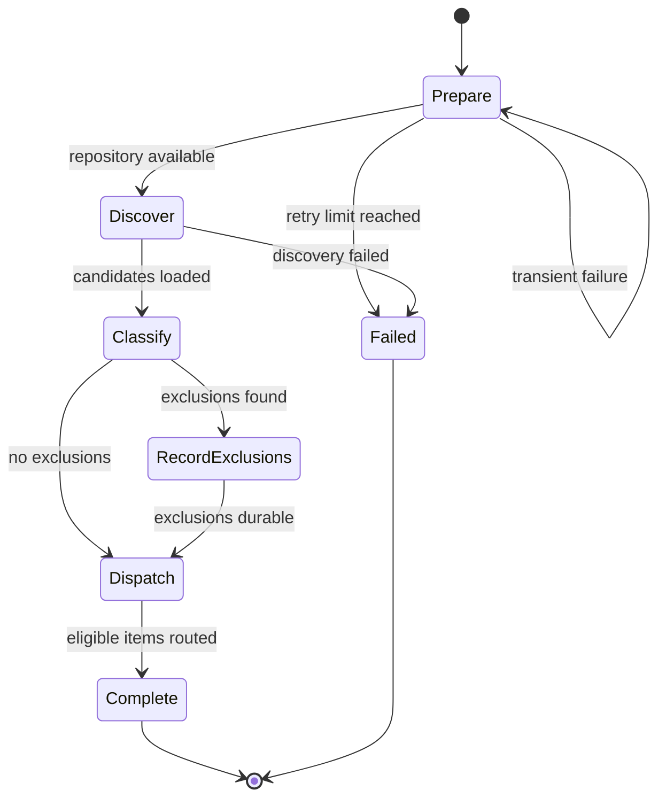

Architectural contract:

- Exclusions become durable before excluded work leaves the queue.
- Discovery never writes planning, review, implementation, or merge verdicts.
- Failure of the repository item does not fabricate outcomes for its issues.

### 5.2 Planning

Planning produces one canonical implementation plan from the issue and its
durable chronological journal. The GitHub journal remains complete; agent
prompts receive the complete sequence while it fits the context budget, then
an ordered revision index plus the latest complete plan and review. A blocked
plan is an automation stop: only an external actor may resolve the dependency
and replace `state:plan-blocked` with exactly one next plan-state label.

#### Boundary diagram

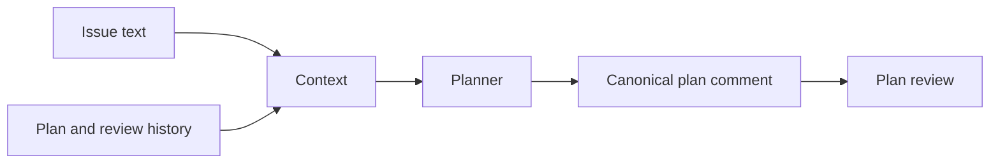

#### State machine

```mermaid
stateDiagram-v2
    [*] --> Eligibility
    Eligibility --> Skipped: excluded or already implemented
    Eligibility --> Ready: approved plan exists
    Eligibility --> AwaitOperator: state:plan-blocked present
    Eligibility --> BuildContext: eligible plan-state label
    AwaitOperator --> Eligibility: external actor replaces blocked label
    BuildContext --> Draft
    Draft --> Verify: candidate produced
    Draft --> Draft: recoverable failure
    Verify --> Publish: candidate complete
    Verify --> Draft: candidate unusable
    Verify --> Failed: retry limit reached
    Publish --> Ready: canonical plan updated; label transition confirmed
    Ready --> [*]
    Skipped --> [*]
    Failed --> [*]
```

Architectural contract:

- The first automation journal role is the canonical implementation plan,
  identified by an opaque marker and updated only by its owning GitHub actor.
- Every iteration receives the ordered issue → plan → review → revision
  sequence, with a bounded index projection only when the complete journal is
  too large for an agent prompt.
- Journal ingestion is bounded by both comment count and body bytes. If either
  limit is exceeded, automation stops with an explicit manual-recovery error
  instead of silently dropping old plan/review revisions.
- Historical revision comments are actor-owned, append-once, and never edited
  or deleted.
- Each durable state transition is published with its corresponding canonical
  artifact, and restart routing reads the label rather than comment prose.
- `state:plan-blocked` is never removed or replaced by automation. Comments do
  not revive it. After resolving the dependency, an external actor sets exactly
  one next state: ordinarily `state:plan-no-go` to request amendment,
  `state:plan-go` to approve, or `state:needs-plan` only when no canonical plan
  should be reused.

### 5.3 Plan review

Plan review decides whether the canonical plan is ready, can improve through a
bounded revision, or needs external intervention. The GitHub issue label is the
sole durable authority: `state:plan-go`, `state:plan-no-go`, or
`state:plan-blocked`. Reviewer output proposes one of those labels, but routing
occurs only after GitHub confirms the label write. The canonical review remains
an audit record and context source, never an authorization fallback.

#### Boundary diagram

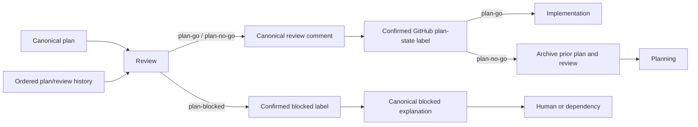

#### State machine

```mermaid
stateDiagram-v2
    [*] --> ReconcileJournal
    ReconcileJournal --> LoadHistory: journal complete
    ReconcileJournal --> ReconcileJournal: interrupted archive recovered
    ReconcileJournal --> Failed: conflicting actor-owned immutable artifact
    LoadHistory --> Review: context available
    LoadHistory --> Failed: context unavailable
    Review --> RetryReview: invalid reviewer response
    RetryReview --> Review: retry available
    RetryReview --> Failed: reviewer failures exhausted
    Review --> PublishAudit: plan-go or plan-no-go proposal
    Review --> ApplyBlocked: plan-blocked proposal
    ApplyBlocked --> RetryReview: blocked label write or confirmation failed
    ApplyBlocked --> PublishBlockedAudit: state:plan-blocked confirmed
    PublishBlockedAudit --> Blocked: explanation stored; latch remains on audit failure
    PublishAudit --> ApplyLabel: review comment stored
    ApplyLabel --> RetryReview: label write or confirmation failed
    ApplyLabel --> Approved: state:plan-go confirmed
    ApplyLabel --> AssessRevision: state:plan-no-go confirmed
    AssessRevision --> ArchiveRevision: improvement remains possible
    AssessRevision --> Blocked: no improvement and planning is stuck
    AssessRevision --> Blocked: external decision or dependency required
    AssessRevision --> Failed: revision limit reached
    ArchiveRevision --> Amend: prior plan archived with recovery payload
    Amend --> PublishRevision: revised plan produced
    PublishRevision --> Review: canonical comments updated
    Approved --> [*]
    Blocked --> [*]
    Failed --> [*]
```

Architectural contract:

- The second automation journal role is the canonical plan review, identified
  by an opaque marker and updated only by its owning GitHub actor.
- Marker collisions authored by other actors are inert. They cannot become
  canonical artifacts, establish replay identity, or stop an owned write.
- Before canonical comments change, the previous plan and its review are
  appended as immutable chronological comments.
- The plan archive contains the next-plan recovery payload. On restart, a
  missing review archive or canonical update is completed idempotently before
  another agent runs.
- A blocked verdict states exactly what decision or dependency is required.
  Because BLOCKED is the safety latch, its label is confirmed before the
  fallible explanatory write; an audit-write failure can never leave the item
  eligible for autonomous work.
  On restart, automation may repair a missing explanation with a generic,
  actionable audit comment, but it does not change the blocked label or invoke
  a planning agent.
  Automation remains stopped until an external actor resolves it and replaces
  the blocked label; a comment by itself has no routing effect.
- No-improvement detection exits early as blocked instead of spending further
  planning iterations.
- Invalid reviewer output retries review without consuming a plan revision.

### 5.4 Implementation

Implementation converts an approved plan into a published pull request. It may
adopt an existing pull request, but it cannot approve its own work or authorize
a merge.

#### Boundary diagram

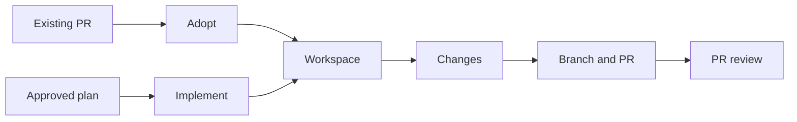

#### State machine

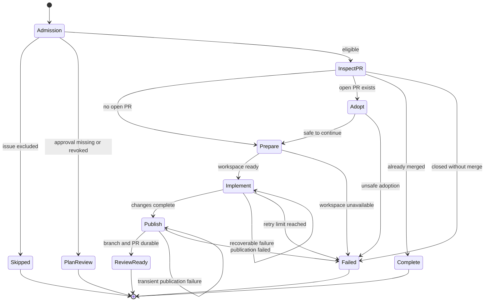

Architectural contract:

- One issue maps to one active implementation pull request.
- Auto-merge remains disabled while review is pending.
- Implementation never writes `state:implementation-go`.
- Missing approval returns to plan review; unsafe or exhausted work terminates
  without approval.

### 5.5 PR review

PR review is the sole authority for implementation approval. Reviews and
findings are recorded on the GitHub pull request so their history survives
local process or agent-session loss.

#### Boundary diagram

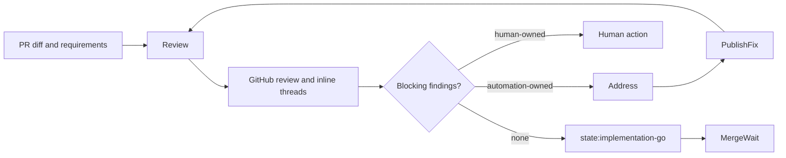

#### State machine

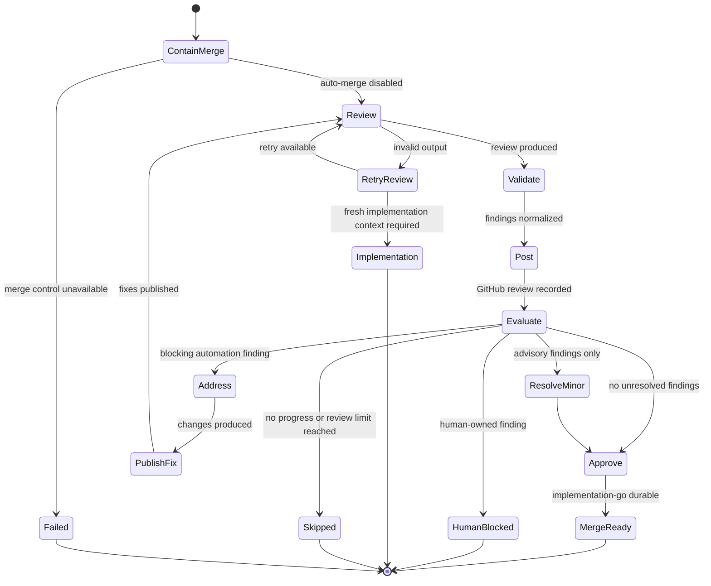

Architectural contract:

- Every implementation review is posted to the pull request.
- Actionable findings use durable inline threads and severity.
- Prior rounds remain visible in the PR timeline.
- Blocking findings produce `state:implementation-nogo`; only a clean review
  produces `state:implementation-go`.
- Human-owned findings stop automation with an explanatory PR comment.
- This stage never arms auto-merge.

### 5.6 Merge wait

Merge wait turns a still-valid implementation approval into a head-bound
auto-merge request and observes only the request it created. It does not take
ownership of merge requests created by another actor.

#### Boundary diagram

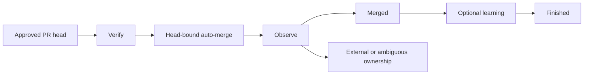

#### State machine

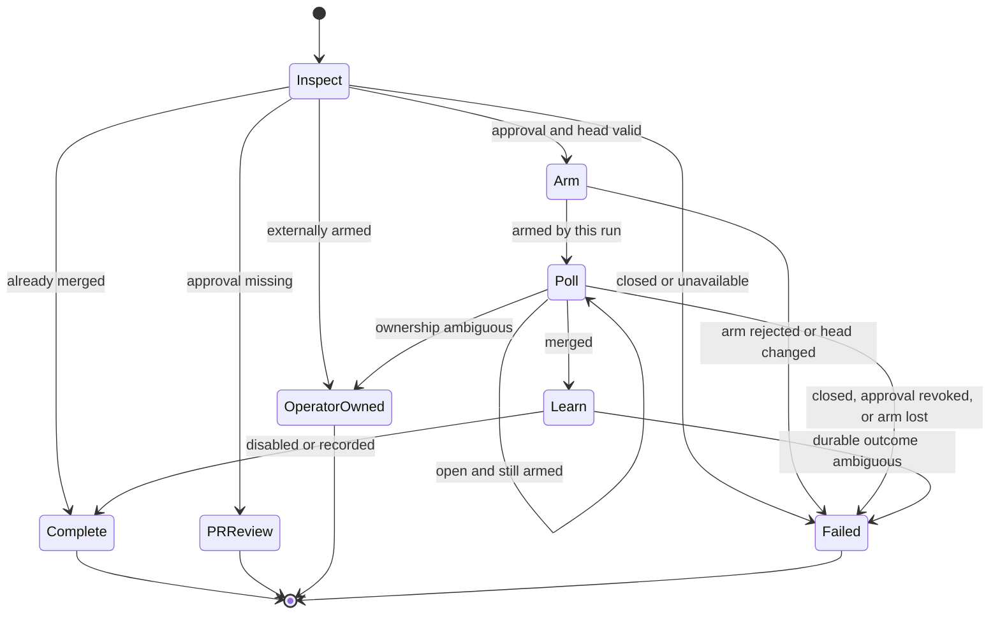

Architectural contract:

- Merge authorization is bound to the reviewed head commit.
- Existing external merge ownership is preserved.
- Revoked approval returns to PR review before a new arm.
- Ambiguous merge or learning state stops for operator inspection.
- Polling is timer-driven and consumes no review or implementation revision.

### 5.7 `finished`

Finished records the final outcome exactly once and applies workspace retention
policy. It does not change issue, review, or merge verdicts.

States: `ENTER → RECORD → CLEANUP → DONE`.

#### Boundary diagram

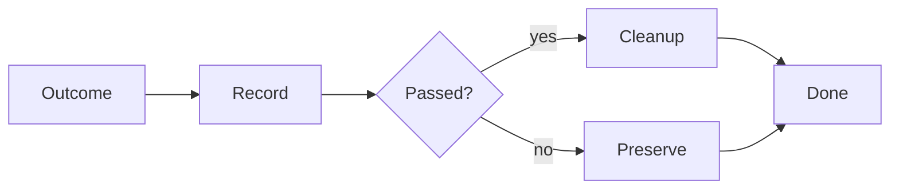

#### State machine

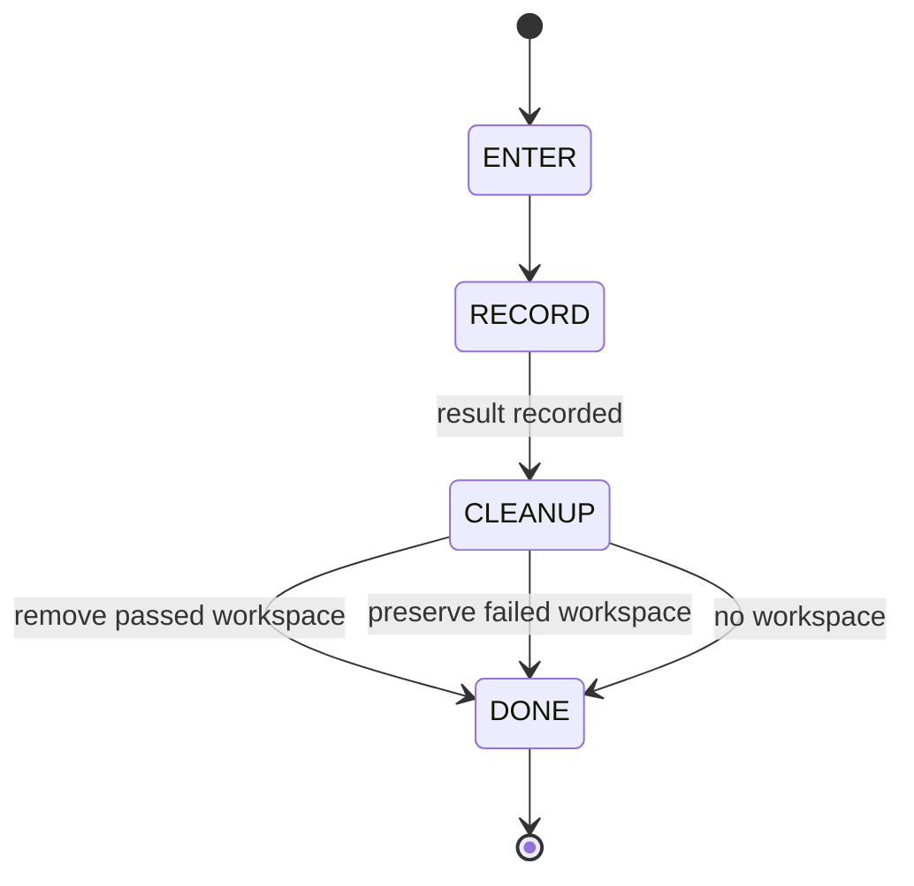

Architectural contract:

- A terminal result is recorded once.
- Failed workspaces are preserved for diagnosis.
- Successful temporary workspaces are removed when safe.
- Cleanup failure never rewrites the underlying result.

---

## 6. The ROUTES table — single source of truth

[`ROUTES`](hephaestus/automation/pipeline/routing.py) (and its mirror in
[`docs/architecture.md`](architecture.md))
is the **single source of truth** for next-stage targets and per-stage
budgets. Every `routes.py` row and every doc row MUST agree.

| Stage | `next` (success) | Fail reasons → target | Budgets |
|-------------------|------------------|-------------------------------------------------------------|----------------------------|
| `repo` | `FINISHED` | `*` → `FINISHED` | `clone = 2` |
| `planning` | `PLAN_REVIEW` | `*` → `FINISHED` | `plan = 2` |
| `plan_review` | `IMPLEMENTATION` | `nogo` → `PLANNING`; `plan_cycles_exhausted` → `FINISHED`; `*` → `PLANNING` | `plan_review_iter = 3`, `plan_cycles = 2` |
| `implementation` | `PR_REVIEW` | `plan_not_go` → `PLAN_REVIEW`; `already_implementation_go_pr` → `MERGE_WAIT`; `*` → `FINISHED` | `implement = 2`, `test_fix = 1` |
| `pr_review` | `MERGE_WAIT` | `agent_error` → `IMPLEMENTATION`; `human_blocked` → `FINISHED`; `exhaustion` → `FINISHED`; `*` → `PR_REVIEW` | `pr_review_iter = 3`, `pr_review_hard = 6` |
| `merge_wait` | `FINISHED` | `not_implementation_go` → `PR_REVIEW`; `closed` → `FINISHED`; `*` → `FINISHED` | (none) |
| `finished` | `FINISHED` | — (terminal) | — |

Budget provenance (cross-check):

- `plan_review_iter = 3`, `pr_review_iter = 3` ←
 [`_review_phase.py MAX_REVIEW_ITERATIONS`](hephaestus/automation/_review_phase.py)
 (the review-iteration cap; the value tag is the durable reference —
 line numbers drift).
- `pr_review_hard = 6` ←
 [`_review_phase.py MAX_REVIEW_ITERATIONS_HARD_CAP`](hephaestus/automation/_review_phase.py)
 (= 3 × 2, the progress-aware extension cap).
- `blocked_address = 2` ←
 [`review_thread_resolver.py _BLOCKED_ADDRESS_MAX_ATTEMPTS`](hephaestus/automation/review_thread_resolver.py)
 (not a stage routing table row but an inner budget).
- `clone = 2`, `plan = 2`, `plan_cycles = 2`, `implement = 2`,
 `test_fix = 1`, `merge =
 DEFAULT_DRIVE_GREEN_LOOPS = 5` ←
 [`loop_runner.py LoopConfig.drive_green_loops`](hephaestus/automation/loop_runner.py).
- `merge = 5` (CLI default for `--drive-green-loops`,
 [`DEFAULT_DRIVE_GREEN_LOOPS`](hephaestus/automation/pipeline/routing.py))
 is the pre-merge poll budget mirrored by the merge-wait coordination.
All per-item-lifetime counters live in
[`WorkItem.attempts`](hephaestus/automation/pipeline/work_item.py);
they are NEVER reset when an item re-enters a stage, so cross-stage
regression cycles (e.g. pr_review → implementation) remain
globally bounded.

---

## 7. Seeding and restart reconstruction

[`seeding.py`](hephaestus/automation/pipeline/seeding.py) is the pure
classifier the coordinator consults on every restart. It maps
`(labels, PR existence/state)` to a single entry stage using **ordered
label rank**:

```
needs-plan (0) < plan-no-go (1) < plan-go (2) <
 implementation-no-go (3) < implementation-go (4)
```

The at-or-past comparison is the only read the gates trust; equality
strands issues already past target.

### Tri-state PR fetch

[`seed_issue_from_github`](hephaestus/automation/pipeline/seeding.py)
(or its CLI counterpart
[`seed_issue`](hephaestus/automation/pipeline/seeding.py)) runs the
two-lookup PR fetch in a strict order: open first
([`find_pr_for_issue`](hephaestus/automation/pipeline/seeding.py)),
then merged ([`find_merged_pr_for_issue`](hephaestus/automation/pipeline/seeding.py)).
A closed PR is invisible to both lookups and is normalized to
`pr_number = None` — the classifier then ONLY ever sees a clean
`{no live PR | open PR | merged PR}` tri-state. Fail-closed: any GitHub
error from the issue fetch OR either PR lookup propagates (so a transient
PR-probe failure cannot misclassify toward IMPLEMENTATION).

### Classification table

| GitHub state | Entry stage |
|-------------------------------------------------------|----------------------------------|
| `state:skip`/`epic` | excluded (`stage = None`) |
| Direct PR already merged | `FINISHED` (pass, idempotent) |
| Direct PR already closed | excluded |
| Open PR carries `state:implementation-go` | `MERGE_WAIT` |
| Open PR with `state:implementation-no-go` | `PR_REVIEW` |
| Open PR, neither impl label | `PR_REVIEW` |
| No PR, at-or-past `state:plan-go` | `IMPLEMENTATION` |
| No PR, `state:plan-no-go` | `PLANNING` (amend path) |
| No PR, `state:plan-blocked` | excluded until an external actor resolves the block and replaces the label; comments alone are inert |
| No state label / `state:needs-plan` | `PLANNING` |

Epic tagging is the **ONE sanctioned seeding write**. GitHub mutations are
forbidden in `seeding.py`, so
[`EpicSkipTagObligation`](hephaestus/automation/pipeline/seeding.py)
is discharged by the coordinator through
[`ctx.github.skip_epics`](hephaestus/automation/pipeline/stages/base.py)
BEFORE the exclusion is honored
([`_seed_pass`](hephaestus/automation/pipeline/coordinator.py)).

### Seeding and re-seed scope

- `--repos` seeds one repo item per named repository
 ([`seed_from_cli`](hephaestus/automation/pipeline/seeding.py)).
- `--issues` seeds issue-scoped items through the classifier and routes
 them past the durable-label-based decision.
- `--prs` routes direct PRs by merge/close state then impl label.
- `--org` expands to non-fork, non-archived repository seeds
 ([`loop_runner.py`](hephaestus/automation/loop_runner.py)).
When `--issues` or `--prs` is set, the resolved `--repos` list is used
ONLY for context — repo discovery is NOT enqueued, so a scoped run
cannot reconstruct every open issue in the repo (deliberate scope
isolation).
After `coordinator._seed_pass`, if all queues + timers + in-flight are empty,
[`_reseed_if_converged`](hephaestus/automation/pipeline/coordinator.py)
re-seeds up to `--loops` and either exits on a zero-work pass or
continues.

### Merge-wait recovery seeding

On restart the coordinator reads
[`pending_drive_green_arms`](hephaestus/automation/pipeline/stages/base.py)
per repo and seeds any non-terminal arms back into `merge_wait` with
`SeedEntry.merge_wait_recovery=True`
([`_pending_arm_recovery_entries`](hephaestus/automation/pipeline/coordinator.py)).
`MergeWaitStage.on_enter` then reconciles durable `prepared` records
(distinguished from `confirmed` records) so a known-armed PR does not
get enabled a second time.

---

## 8. The worker pool and job contract

[`WorkerPool`](hephaestus/automation/pipeline/worker_pool.py) is the
single executor. It receives frozen specs and returns bounded
[`JobResult`](hephaestus/automation/pipeline/jobs.py) tuples. Workers
never touch WorkItems or stage queues and never perform GitHub API
mutations.

### Job kinds

- [`AgentJob`](hephaestus/automation/pipeline/jobs.py) — Claude or
 Codex (`agent = resolve_agent(job.agent)`) with
 `prompt_builder(**prompt_kwargs)` composed in-worker.
 `resume_session_id`, when set for a direct runner, selects its persisted
 session instead of creating a fresh one; its returned id is carried in the
 `JobResult` and persisted by the coordinator under the job's logical role.
 `sandbox = "workspace-write"` (default) or `"read-only"`
 (implementation review only); `expected_head_sha` — when set, the worker
 refuses to dispatch the agent unless the local `git rev-parse HEAD`
 equals this remote-reviewed SHA and the worktree is clean.
 `sandbox = "read-only"` activates `allowed_tools = "Read,Glob,Grep"`
 and `permission_mode = "dontAsk"` on the Claude call site.
- [`BuildTestJob`](hephaestus/automation/pipeline/jobs.py) — subprocess
 argv. Security: argv MUST NOT carry untrusted strings; only the
 coordinator constructs them from vetted templates
 (`PRE_PR_TEST_ARGV` for the pre-PR test gate).
- [`GitJob`](hephaestus/automation/pipeline/jobs.py) — `op ∈ {clone,
 create_worktree, remove_worktree, rebase, push, commit_push}`,
 validated by `__post_init__`.
- [`CompactJob`](hephaestus/automation/pipeline/jobs.py) — a best-effort
 `/compact` turn for a persisted Claude, Codex, or Pi session; it never blocks
 the retry lifecycle.

### Result semantics

[`JobResult.ok = False, value = None, error`](hephaestus/automation/pipeline/jobs.py)
on any failure (return code != 0, `subprocess.TimeoutExpired`,
exception). Stdout/stderr tails trimmed to 4 KiB for the JSONL event
log; error message truncated to 500 chars.

### Completion contract

Every non-cancelled `submit()` produces EXACTLY ONE
`(JobHandle, JobResult)` tuple on the completion queue
([`_on_future_done`](hephaestus/automation/pipeline/worker_pool.py)).
Normal job failures are converted to error results in `_run`; anything
that escapes `future.result()` (exception + process-control escapes
`KeyboardInterrupt`/`SystemExit`/`GeneratorExit`) is converted to a
`worker_crash` result so a non-cancelled submit never silently loses
its completion. Only futures cancelled before starting emit no
completion (the coordinator synthesizes those).

### Per-repo lock layering

[`_run_git`](hephaestus/automation/pipeline/worker_pool.py) wraps every
git operation in two locks:

1. **Outer**: in-process `threading.Lock` per repo ([`_repo_lock`](hephaestus/automation/pipeline/worker_pool.py))
 — single-thread per process serializes at most one thread per
 repo, sidestepping `flock`'s same-process ambiguity.
2. **Inner**: cross-process
 [`file_lock`](hephaestus/utils/file_lock.py) at
 `<repo_root>/<DEFAULT_STATE_DIR>/locks/git-<repo>.lock`
 ([`_repo_lock_path`](hephaestus/automation/pipeline/worker_pool.py))
 with a bounded wait using interruptible polling.
Both locks are held for the entire operation because worktrees share
`.git`.

### Resilience wiring

[`hephaestus.resilience.resilient_call`](hephaestus/resilience/__init__.py)
wraps agent invocation. The retry predicate is
`retry_predicate=lambda _exc: not self._shutdown.is_set()` — we accept
the cost of re-running the whole agent session on a transient blip
(network reset, gh flake) because agent invocations are
workflow-idsempotent (plan/review comments upsert; implementer re-runs
converge on the same branch). Non-transient errors (`rc != 0`, timeouts)
are NOT retried.

### Rate budget + timeout mapping

- `phase_timeout_s` (CLI `--phase-timeout`) bounds each AgentJob at
 [`_submit`](hephaestus/automation/pipeline/coordinator.py), not the
 whole phase subprocess.
- `agent_default_timeout()` / `planner_claude_timeout()` /
 `implementer_claude_timeout()` / `pr_reviewer_claude_timeout()` /
 `ci_driver_claude_timeout()` /
 `learn_claude_timeout()` /
 [`...`](hephaestus/automation/agent_config.py) are
 phase-specific CLI-time defaults; every per-phase timeout reads
 `HEPH_<PHASE>_AGENT_TIMEOUT` so operators can tune without code
 change.

---

## 9. Thin CLI scope wrappers and rollout controls

Five console scripts are thin queue-pipeline scoped entry points
(preserve their historical CLI surfaces). Manual merge-driving is
out-of-band.

| Console script | Stage slice | Entry module |
|--------------------------------------|-----------------------------------|---------------------------------------------------|
| `hephaestus-plan-issues` | `planning → plan_review` | [`planner`](hephaestus/automation/planner.py) |
| `hephaestus-implement-issues` | `implementation → pr_review` | [`implementer`](hephaestus/automation/implementer.py) |
| `hephaestus-review-prs` | `pr_review` (internal slice) | [`pr_reviewer`](hephaestus/automation/pr_reviewer.py) |
| `hephaestus-drive-prs-green` | `pr_review → merge_wait` | [`ci_driver`](hephaestus/automation/ci_driver.py) |
| `hephaestus-merge-prs` | (manual merge-driving, queues disabled) | [`hephaestus.github.pr_merge`](hephaestus/github/pr_merge.py) |
| `hephaestus-agent-stage` | (one-shot stage invocation) | [`agent_stage`](hephaestus/automation/agent_stage.py) |

`--run-pre-pr-tests` is an opt-in queue-runner flag enabling the
[`implementation`](hephaestus/automation/pipeline/stages/implementation.py)
pre-PR unit-test gate — argv comes from
`PipelineConfig.pre_pr_test_argv` so non-standard unit-test layouts
work without code change.

Three Codex-only flags control per-role reasoning effort:
`--planner-reasoning-effort {default|low|medium|high|xhigh}` and the
analogous `--reviewer-reasoning-effort` and `--implementer-reasoning-effort`
([`_build_parser`](hephaestus/automation/loop_runner.py)). A role-specific
value takes precedence over the selected model alias's `model_reasoning_effort`
default; `default` deliberately omits the setting so the alias keeps its
established baseline. These flags are applied only to the Codex provider
and never modify Claude or Pi model IDs (#2287).
The default pipeline accepts `--loops`, `--parallel-repos`,
`--max-workers` and per-agent `--agent` plus per-phase reasoning
controls:

- `--planner-reasoning-effort`
- `--implementer-reasoning-effort`
- `--reviewer-reasoning-effort`
Each takes `default | low | medium | high | xhigh`. `default` deliberately
omits Codex's `model_reasoning_effort` setting. When omitted the
selected model alias's default takes over. The values are injected
through [`stage_model`](hephaestus/automation/pipeline/stages/base.py),
which re-cuts the model id with `:effort` for Codex only.

---

## 10. Observability, dry-run and rate-budget gate

Observability is **opt-in**: it is built only when
`PipelineConfig.metrics_port > 0`. The coordinator imports
[`MetricsRegistry`](hephaestus/observability/metrics.py),
[`MetricsHTTPServer`](hephaestus/observability/server.py) and
[`AlertTracker`](hephaestus/observability/alerts.py) lazily inside
the constructor so the default construction path keeps its zero-I/O
import contract
([`Coordinator.__init__`](hephaestus/automation/pipeline/coordinator.py)).

### Gauges

[`_emit_observability_tick`](hephaestus/automation/pipeline/coordinator.py)
publishes the following gauges once per coordinator tick. Each gauge
retains its label series across ticks so a completed job or
state-transition is rendered as zero, not as stale active work.

| Gauge | Type | Labels | Default | Semantics |
|-------------------------------------------|--------|-----------|---------|-----------|
| `hephaestus_pipeline_queue_depth` | Gauge | `stage` | `0` | Item count per pipeline stage. Useful for detecting back-pressure. |
| `hephaestus_pipeline_inflight_jobs` | Gauge | (none) | `0` | Total in-flight jobs across all worker pools. |
| `hephaestus_pipeline_inflight_per_repo` | Gauge | `repo` | `0` | In-flight jobs by repo, capped by `max_workers`. |
| `hephaestus_circuit_breaker_state` | Gauge | `name`,`state` | `0` | `1` for the active state, `0` for prior states (only emitted from the optional `circuit_breaker_snapshot_provider`). |
| `hephaestus_pipeline_alert_active` | Gauge | `name` | `0` | `1` while a fired alert is unresolved, `0` when resolved. |

The `circuit_breaker_snapshot_provider` is **product-layer supplied**;
the coordinator never imports the resilience capability directly
([`PipelineConfig.circuit_breaker_snapshot_provider`](hephaestus/automation/pipeline/coordinator.py)).
A broken provider is swallowed by a `logger.exception` and treated as
"no breakers known this tick" — observability must NEVER be able to
terminate a production automation loop.

### AlertTracker behavior

[`AlertTracker.observe(snapshot)`](hephaestus/observability/alerts.py) is
called once per tick with the coordinator's
[`_observability_snapshot`](hephaestus/automation/pipeline/coordinator.py).
Emitted events drive `hephaestus_pipeline_alert_active` and a durable
`alert_<fired|resolved>` event log entry.

- **Default trigger**: queue-depth threshold is read from
 [`PipelineConfig.alert_queue_depth_threshold`](hephaestus/automation/pipeline/coordinator.py)
 (int, non-negative; the CLI tool validates this in `[tool.coverage]`-style
 pre-flight before it ever reaches the coordinator). The constructor
 fails fast on a negative input.
- **Default value**: 100. Operators tune via `--alert-queue-depth-threshold N`
 on `hephaestus-automation-loop`.
- **Resolution events**: an alert transitions to `resolved` when the depth
 drops below the threshold for a tick; `AlertTracker` is responsible
 for emitting the resolved event (the coordinator records it in the
 event log).
- **Failure-mode safety**: alerts are emitted only from measured queue
 depths and circuit-breaker snapshots, never from worker pool internal
 liveness (so a slow worker never causes an alert).

### Health endpoint

[`_health_snapshot`](hephaestus/automation/pipeline/coordinator.py)
serves the JSON shape:

```json
{
 "queue_depths": {"repo": 0, "planning": 3,...},
 "inflight_per_repo": {"Hephaestus": 2},
 "inflight_jobs": 2,
 "circuit_breakers": {},
 "loops_run": 1,
 "status": "ok" | "stopping"
}
```

The `status` field flips to `"stopping"` the moment `shutdown.is_set()`
returns True, so a scratch `/healthz` probe is sufficient for liveness
without subscribing to the event log.

### Dry-run operator check

The canonical operator check is
`hephaestus-automation-loop --dry-run --loops 1 -v`. Stage accessors
log-and-skip mutators; when a stage requests a job the coordinator
logs `[dry-run] would <descr>` and ADVANCEs the item instead of
submitting ([`_run_item`](hephaestus/automation/pipeline/coordinator.py)).
`--dry-run --loops 1` validates seed classification and route
reconstruction end-to-end without consuming rate budget.
Dry-run also overrides two retry semantics that would otherwise stall:

- **RETRY with `retry_delay_s`**: under dry-run a delayed retry waits on
 real-world progress (CI runs, PR merges) the preview will never make,
 so the item finishes with reason `[dry-run] would wait {delay}s`
 ([`_route_retry`](hephaestus/automation/pipeline/coordinator.py)).
- **FAIL_BACK**: a dry-run mutator never writes the gate labels the
 earlier stage would re-check, so a regression would ping-pong until
 the safety cap; dry-run finishes with reason `[dry-run] would
 fail_back` instead ([`_route_fail_back`](hephaestus/automation/pipeline/coordinator.py)).

---

## Legacy compatibility inventory and retirement gates

Compatibility paths accept durable GitHub state written before the current
head-bound review workflow. They remain contained until their observable
retirement conditions are satisfied.

| Compatibility path | Retirement gate |
|---|---|
| `legacy_issue_impl_go_fallback` | After #2055 is deployed, a complete supported-repository seed pass reports zero fallback observations. |
| `already_implementation_go_pr` and `not_implementation_go` | After #2055 reconstructs eligibility from head-bound review proof and supported repositories contain zero open legacy implementation-GO PRs. |

---

## 12. Interrupt semantics and exit codes

The coordinator handles SIGINT, SIGTERM, SIGHUP as a two-step shutdown. The
first signal stops new admissions and drains active work into a resumable
state. A second signal, or expiry of the grace window, stops immediately.
Interrupted items record `resumable at <stage>` so durable GitHub state can
reconstruct their queue position on the next run.

Exit-code priority is:

| Priority | Code | Meaning |
|---|---:|---|
| 1 | `130` | The run was interrupted; this takes priority over other outcomes. |
| 2 | `1` | At least one effective item failed, skipped, or blocked. |
| 3 | `0` | Every effective item completed successfully. |

---

## 13. Glossary

- **Coordinator** — pip line's main thread; owns all queues, the
 timer heap, in-flight registry, routing, signal handlers, GitHub
 APIs. See [`coordinator.py`](hephaestus/automation/pipeline/coordinator.py).
- **Worker pool** — the executor for agent / build/test / git jobs.
 [`WorkerPool`](hephaestus/automation/pipeline/worker_pool.py).
- **WorkItem** — single in-memory record moving through the pipeline.
 [`work_item.py`](hephaestus/automation/pipeline/work_item.py).
- **StageQueue** — FIFO queue for one
 [`StageName`](hephaestus/automation/pipeline/routing.py), owned only
 by the coordinator. [`queues.py`](hephaestus/automation/pipeline/queues.py).
- **CompletionQueue** — the only cross-thread channel
 (`queue.Queue[(JobHandle, JobResult)]`).
 [`queues.py`](hephaestus/automation/pipeline/queues.py).
- **Durable journal** — GitHub labels, comments, PR state, and
 `ArmingStateStore` records. Restart reconstruction reads this;
 nothing else.
- **Timer-park** — non-blocking retry/backoff by pushing an item onto
 the coordinator timer heap
 ([`_timer_park`](hephaestus/automation/pipeline/coordinator.py)).
- **Resumable** — interrupt outcome. `ItemResult.passed = False`,
 `reason = "resumable at <stage>"`.
- **At-or-past** — label-rank comparison that allows an item to
 short-circuit through earlier stages when it carries a later-stage
 label. Never equality.
- **Head-bound** — an artifact or check whose correctness depends on
 matching the live `headRefOid` of the PR. `merge_wait` captures the
 head SHA at arm time and polls it; a head drift between ARM and POLL
 is a terminal containment failure.
- **Skip-reason marker** — the `<!-- hephaestus-state-skip-reason -->` HTML-comment marker ([`SKIP_REASON_MARKER`](hephaestus/automation/state_labels.py)) that prefixes every `state:skip` reason-comment body produced by [`format_skip_reason_comment`](hephaestus/automation/state_labels.py), so a repo reader can deterministically trace the automated skip reason.
- **File-system loader** — the Jinja `FileSystemLoader` resolved from `__file__`-relative paths in [`prompts/catalog.py`](hephaestus/prompts/catalog.py); deliberately NOT `PackageLoader` to avoid importlib editable-install staleness (#2308).
- **Conflict-resolution request** — the [`ConflictResolutionRequest`](hephaestus/automation/_review_conflict_resolver.py) immutable context consumed by the cohesive [`ReviewConflictResolver`](hephaestus/automation/_review_conflict_resolver.py) unit split out of `_review_phase.py` (#2209).
- **Advise-skipped breadcrumb** — the [`advise_skipped(reason)`](hephaestus/automation/advise_runner.py) marker string returned by [`run_advise`](hephaestus/automation/advise_runner.py) when Mnemosyne is unavailable, so a stage aborts as `SKIP` rather than failing; the reason is forwarded verbatim from [`resolve_marketplace`](hephaestus/automation/advise_runner.py) (e.g. `clone_failed`, `manifest_missing`).
- **Tool scope** — the explicit `(allowed_tools, permission_mode)` pair in [`AGENT_TOOL_SCOPES`](hephaestus/automation/pipeline/tool_scopes.py) for one of the 9 pipeline agent roles (advise, planner, plan-reviewer, implementer, pr-reviewer, comment-classifier, address-review, ci-driver, learnings); unmapped roles fall through to the read-only [`DEFAULT_TOOL_SCOPE`](hephaestus/automation/pipeline/tool_scopes.py) per the fail-closed security contract (#2319).
- **Reasoning effort** — explicit Codex-only `--<role>-reasoning-effort` CLI flag value (`default|low|medium|high|xhigh`) mapped onto Codex's `model_reasoning_effort`; `default` omits the setting, `low|medium|high|xhigh` override per-role, and omitted flags preserve the model-alias default (#2287).
- **Review posture** — the falsification-first rubric prefix [`REVIEW POSTURE`](hephaestus/prompts/templates/default/review_rubrics/reviewer.j2); combined with anti-inflation grading rules, the max grade is `C` for any dimension the reviewer did not actively attempt to falsify (#2302).
- **Push retry** — [`_git_retry(item, "commit_push failed")`](hephaestus/automation/pipeline/stages/implementation.py) re-attempts a transient push before PR_CREATE; the retry is budget-untouched so the next `implement` attempt remains available (#2274).

- **Severity-aware GO gate** — logic that classifies posted review
 comments by marker (`critical|major|minor|nitpick`) and decides
 whether the `pr_review` round can advance. **See [§5.5 _Gate
 logic_](#55-pr_review) for the authoritative definition and routing
 matrix.**

---
