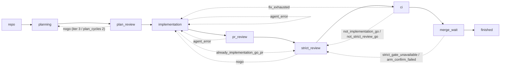

# Hephaestus Architecture Reference

Status: canonical merge of all architecture-level documentation for the
Hephaestus automation pipeline and supporting subsystems. **This file
supersedes [`docs/AUTOMATION_LOOP_ARCHITECTURE.md`](AUTOMATION_LOOP_ARCHITECTURE.md)**
(the original pipeline narrative — folded into §2 / §3 / §5). The legacy
file remains in the repository only as a redirect for now; do not edit it
independently, and remove it once any external links have been updated.

Other folded material:

- The "Automation queue topology" section of [`AGENTS.md`](../AGENTS.md)
  (folded into §1 / §5).
- The architecture excerpts of [`CLAUDE.md`](../CLAUDE.md) (folded into §1).

> **In-flight refactor notice.** This doc describes the architecture on
> `main` *today*. Two in-flight refactors cover its scope and are
> sequenced to merge **before** this doc's rewrite PR: the pipeline
> becomes **7 stages** (REPO … FINISHED, with `strict_review` and `ci`
> removed) and `pr_review` becomes the sole authority for
> `state:implementation-go` — see [PR #2280](https://github.com/HomericIntelligence/Hephaestus/pull/2280)
> (§15) and 16 other architectural PRs (§16).
>
> Banner + §15 + §16 are deleted by the rewrite PR once all in-flight
> architectural PRs merge.> PR #2280's merge.

The [`docs/adr/`](adr/) records remain the bind-points for individual
architectural decisions (`0006-queue-based-in-process-automation-pipeline`,
`0009-head-bound-strict-review-merge-gate`, `0010-trusted-strict-review-proof`,
`0005-multi-agent-runtime-abstraction`, `0001-automation-library-boundary`,
…) — this document is the unified reference; ADRs are the historical record.

This file is source-grounded: every operational claim links to the module
that backs it, in the form `[module/file.py](path/to/file.py)` or
`[§module/Class.func](path/to/file.py)`. Per the project convention
(`"Code References": 'DO'` in [`CLAUDE.md`](../CLAUDE.md) §"Claude Code
Optimization"), file paths are repo-relative.

---

## Table of contents

1. [Goals, non-goals, and design principles](#1-goals-non-goals-and-design-principles)
2. [System overview: single coordinator, nine queues, one worker pool](#2-system-overview)
3. [Cross-cutting invariants](#3-cross-cutting-invariants)
4. [WorkItem and the durable journal](#4-workitem-and-the-durable-journal)
5. [The nine queue stages](#5-the-nine-queue-stages)
   - [5.1  `repo` — discover and classify](#51-repo)
   - [5.2  `planning` — advise and produce a plan](#52-planning)
   - [5.3  `plan_review` — strict plan review, amend, learn](#53-plan_review)
   - [5.4  `implementation` — gate, worktree, implement, test, PR](#54-implementation)
   - [5.5  `pr_review` — review, validate, address, severity-aware GO gate](#55-pr_review)
   - [5.6  `strict_review` — independent head-bound authority for `state:implementation-go`](#56-strict_review)
   - [5.7  `ci` — non-blocking CI classification and drive-green fix loop](#57-ci)
   - [5.8  `merge_wait` — sole automatic armer, post-merge learn dedupe](#58-merge_wait)
   - [5.9  `finished` — terminal ledger and worktree cleanup/preservation](#59-finished)
6. [The ROUTES table — single source of truth](#6-the-routes-table)
7. [Seeding and restart reconstruction](#7-seeding-and-restart-reconstruction)
8. [The worker pool and job contract](#8-the-worker-pool-and-job-contract)
9. [Thin CLI scope wrappers and rollout controls](#9-thin-cli-scope-wrappers)
10. [Observability, dry-run, and rate-budget gate](#10-observability-dry-run-and-rate-budget-gate)
11. [Key subsystems and cross-cutting modules](#11-key-subsystems-and-cross-cutting-modules)
12. [Interrupt semantics and exit codes](#12-interrupt-semantics-and-exit-codes)
13. [Glossary](#13-glossary)
14. [Provenance audit checklist](#14-provenance-audit-checklist)
15. [In-flight refactor: PR #2280](#15-in-flight-refactor-pr-2280)
16. [Other in-flight architectural changes (16 PRs)](#16-other-in-flight-architectural-changes-16-prs)

---

## 1. Goals, non-goals, and design principles

### Goals

- **Single durable journal.** GitHub labels, comments, PR state, the durable
  `strict_review_artifact`, and `ArmingStateStore` records are the only
  crash-resistant truth. Stages may not persist any other state. Restart =
  re-run: queue reconstruction reads the journal
  ([`_seed_pass`](hephaestus/automation/pipeline/coordinator.py),
  [`seed_from_cli`](hephaestus/automation/pipeline/seeding.py)).
- **Interrupt = resumable, never failed.** A SIGINT/SIGTERM/SIGHUP during a
  run parks the touched item with `ItemResult(passed=False,
  reason="resumable at <stage>", …)`. A subsequent restart seeds it back
  into the same queue and the loop reconverges
  ([`_park_resumable`](hephaestus/automation/pipeline/coordinator.py),
  [`_finalize_resumable`](hephaestus/automation/pipeline/coordinator.py)).
- **One automatic merge authority per head.** `state:implementation-go` is
  applied only by `strict_review`, only after an authenticated
  exact-head artifact, and only ever reactivates `auto-merge` through
  `merge_wait` — which revalidates the artifact immediately before and after
  arming ([ADR-0009](adr/0009-head-bound-strict-review-merge-gate.md),
  [`strict_review.py`](hephaestus/automation/pipeline/stages/strict_review.py),
  [`merge_wait.py`](hephaestus/automation/pipeline/stages/merge_wait.py)).
  **Planned change (PR #2280, in flight):** the `strict_review` stage is
  removed; `pr_review` becomes the sole authority for
  `state:implementation-go`, and `merge_wait` no longer revalidates a
  strict-GO artifact (because there isn't one). See
  [§15](#15-in-flight-refactor-pr-2280) for the full delta and the
  follow-up doc-rewrite plan.
- **Globally bounded budgets.** Stages count retries on `_on_job_done` so
  `agent_error` retries consume the same per-item budget as ordinary
  attempts; cross-stage regression cycles terminate in finite steps
  ([`_FAIL_BACK_CAP`](hephaestus/automation/pipeline/coordinator.py),
  [`ROUTES`](hephaestus/automation/pipeline/routing.py)).

### Non-goals

- **No persisted queue snapshot.** Queues are in-memory; reconstruction
  reads GitHub via [`seeding.py`](hephaestus/automation/pipeline/seeding.py)
  ([`_all_idle`](hephaestus/automation/pipeline/coordinator.py) +
  [`_reseed_if_converged`](hephaestus/automation/pipeline/coordinator.py)).
- **No OS-level agent sandbox.** Each agent call site declares its explicit
  `--allowedTools` scope and runs in a scoped worktree; the strict-review
  agent additionally requests `sandbox="read-only"`
  ([`_run_agent`](hephaestus/automation/pipeline/worker_pool.py),
  [`agent_config.py`](hephaestus/automation/agent_config.py)).
- **No MCP runtime dependency.** `.mcp.json` is intentionally empty. Plugin
  marketplaces, NATS JetStream, and HTTP REST remain the maintained
  integration contracts ([ADR-0011](adr/0011-mcp-integration-posture.md)).

### Design principles (inherited from ProjectOdyssey)

- **KISS / YAGNI.** Each stage owns one responsibility. The deferred
  `AgentProtocol` and `resilience` wiring into the GitHub call path
  (issues #468, #469) are intentionally NOT built yet.
- **DRY / one-way dependency.** `automation → library` only — library
  subpackages may not import from
  [`hephaestus.automation`](hephaestus/automation/). The fence is enforced
  by [`tests/unit/validation/test_automation_boundary.py`](tests/unit/validation/test_automation_boundary.py)
  and [`ADR-0001`](adr/0001-automation-library-boundary.md).
- **SOLID / substitutable providers.** [`hephaestus.agents.runtime`](hephaestus/agents/runtime.py)
  abstracts over Claude Code and Codex behind a uniform `--agent` flag.
- **POLA. Least privilege, least astonishment.** Per-call
  `--allowedTools`, scoped worktrees, fenced untrusted GitHub content
  via `_fence_untrusted` in
  [`prompts/_shared.py`](hephaestus/automation/prompts/_shared.py), and
  admin-free human-gated merge.

---

## 2. System overview

### Topology

The default path is **`hephaestus-automation-loop`**, the queue-based
in-process pipeline whose coordinator lives at
[`hephaestus.automation.pipeline.coordinator`](hephaestus/automation/pipeline/coordinator.py).
The coordinator owns **nine in-memory stage queues** and dispatches
agent / build-test / git-network jobs to a single `WorkerPool`. Each agent
job runs Claude or Codex, chosen by `--agent` (default Claude).

#### Mermaid



#### ASCII

```
repo → planning → plan_review → implementation → pr_review → strict_review → ci → merge_wait → finished
           ↑             │              ↑   ↑                         │
           └─── NOGO ────┘              │   └─ agent err ─────────────┘
              (iter 3 / cycles 2)       └─── implementation-GO → strict_review
                                                                │
                                                      strict NOGO / head drift
                                                                │
                                                                ▼
                                                       implementation (real pass)
```

Every back-edge in the diagram is **named** in
[`ROUTES`](hephaestus/automation/pipeline/routing.py) and is the "fail-route
reason vocabulary" stages must reference verbatim in `StageOutcome.note`.

### Coordinator / worker contract

The main thread (coordinator) OWNS:

- all nine stage queues ([`self.queues`](hephaestus/automation/pipeline/coordinator.py))
- the timer heap ([`self.timers`](hephaestus/automation/pipeline/coordinator.py))
- the in-flight registry ([`self.in_flight`](hephaestus/automation/pipeline/coordinator.py))
- all routing and disposition semantics ([`_route`](hephaestus/automation/pipeline/coordinator.py))
- every GitHub API mutation, through
  [`StageGitHub`](hephaestus/automation/pipeline/stages/base.py)
  (label writes, comment upserts, PR create/auto-merge, strict-review
  artifact publish)

It NEVER launches agents, builds/tests, or git/network operations. It never
sleeps — wakeups are the timer's responsibility.

The single worker pool ([`WorkerPool`](hephaestus/automation/pipeline/worker_pool.py))
executes everything else: agent invocations (Claude or Codex), build/test
subprocesses, and git/network operations. Every git operation crosses
[`_repo_lock`](hephaestus/automation/pipeline/worker_pool.py) (in-process
thread lock, outer) **and**
[`_interruptible_file_lock`](hephaestus/automation/pipeline/worker_pool.py)
(cross-process flock, inner). Worktrees share `.git`, so two concurrent
operations on the same checkout would race.

The only cross-thread channel is
[`CompletionQueue`](hephaestus/automation/pipeline/queues.py)
(`queue.Queue[(JobHandle, JobResult)]`); its blocking
`get(timeout=…)` is the loop's idle sleep
([`_wait_for_completion`](hephaestus/automation/pipeline/coordinator.py)).

Poll interval = [`_IDLE_POLL_S = 1.0`](hephaestus/automation/pipeline/coordinator.py).
Pool size = `parallel_repos × max_workers`
([`WorkerPool(size=…)`](hephaestus/automation/pipeline/worker_pool.py)).

### Ticks

The per-tick event loop is defined in
[`Coordinator.run`](hephaestus/automation/pipeline/coordinator.py). One
tick does, in order:

1. **Shutdown check** — graceful drain, or immediate teardown after the
   grace window / a second signal
   ([`_grace_exceeded`](hephaestus/automation/pipeline/coordinator.py),
   [`_immediate`](hephaestus/automation/pipeline/coordinator.py)).
2. **Wake timers** — pop every expired entry back into its stage queue
   ([`_wake_timers`](hephaestus/automation/pipeline/coordinator.py)).
3. **Drain completions** — handle ALL ready completions without blocking;
   interrupted results park the item RESUMABLE and never reach
   `on_job_done`
   ([`_drain_completions`](hephaestus/automation/pipeline/coordinator.py),
   [`_park_resumable`](hephaestus/automation/pipeline/coordinator.py)).
4. **Emit observability tick** — push queue-depth / in-flight / circuit
   breaker gauges and record alert transitions
   ([`_emit_observability_tick`](hephaestus/automation/pipeline/coordinator.py)).
5. **Drain queues down-stream first** — `finished → merge_wait → ci →
   strict_review → pr_review → implementation → plan_review → planning →
   repo` ([`_DRAIN_ORDER`](hephaestus/automation/pipeline/coordinator.py)).
   Implementation drains separately to enforce dependency topo-order
   and file-overlap serialization; other queues drain with the per-repo
   in-flight cap ([`_drain_implementation`](hephaestus/automation/pipeline/coordinator.py),
   [`_drain_queues`](hephaestus/automation/pipeline/coordinator.py),
   [`_admit`](hephaestus/automation/pipeline/coordinator.py)).
6. **Idle-or-loop check** — if all queues + timers + in-flight are empty,
   re-seed up to `--loops` and either exit on zero work or continue
   ([`_all_idle`](hephaestus/automation/pipeline/coordinator.py),
   [`_reseed_if_converged`](hephaestus/automation/pipeline/coordinator.py)).
   Otherwise block on [`completion_q`](hephaestus/automation/pipeline/coordinator.py).

A defensive step watchdog ([`_STEP_WATCHDOG_S = 15.0`](hephaestus/automation/pipeline/coordinator.py))
warns when any `stage.step()` call exceeds ~15 s. 5 s proved too tight in
practice: routine repo-stage steps (clone + label reads over the network)
breached it on nearly every multi-repo run, burying real stalls in noise
(#2247).

### Library → product layer boundary

[`hephaestus.automation`](hephaestus/automation/) is the product layer. The
base import surface (`import hephaestus`) MUST NOT pull `curses`, `fcntl`,
`pydantic`, or any `hephaestus.automation.*` module. The fence is:

- [`tests/unit/validation/test_import_surface.py`](tests/unit/validation/test_import_surface.py)
  (subprocess-based).
- [`tests/unit/validation/test_automation_boundary.py`](tests/unit/validation/test_automation_boundary.py)
  (static grep — no `import hephaestus.automation` from any library
  subpackage).

A small set of orchestration modules are excluded from coverage via
`[tool.coverage.run].omit`; the omit list is frozen by
[`tests/unit/validation/test_omit_allowlist.py`](tests/unit/validation/test_omit_allowlist.py)
and every omitted module has a backing test suite enforced by
[`tests/unit/validation/test_omit_justification.py`](tests/unit/validation/test_omit_justification.py).

---

## 3. Cross-cutting invariants

These invariants apply to **every** stage. Each stage section below cites
back to them.

### Journal-order invariant: durable write BEFORE the queue push

Every durable GitHub mutation (label add / remove / edit, comment upsert,
PR create, strict-review artifact publish) happens IMMEDIATELY BEFORE the
`StageOutcome` that causes the queue push. Restart then re-runs the stage
and the stage's idempotency checks (at-or-past label comparison, plan
comment presence, PR existence) fast-forward through already-completed
work. Interrupts therefore leave items RESUMABLE, never FAILED — a restart's
seeding classifies them back into the same entry queue and `on_enter`
restarts from the same state.

Implementation: each stage method performs its durable op via a single
[`ctx.github`](hephaestus/automation/pipeline/stages/base.py) accessor call
on the coordinator-owned [`StageGitHub`](hephaestus/automation/pipeline/stages/base.py)
protocol, then returns `StageOutcome(…)`. The coordinator's
[`_route`](hephaestus/automation/pipeline/coordinator.py) applies the
disposition to the queue.

### Non-blocking retry / timer-park contract

Stages never sleep — the coordinator's timer heap owns every delay.
When a stage wants to wait (typically on a CI poll), it writes the delay
into `item.payload["retry_delay_s"]` and returns
`StageOutcome(Disposition.RETRY, note)`. The coordinator's
[`_route_retry`](hephaestus/automation/pipeline/coordinator.py) reads that
key and parks the item on the heap
([`_timer_park`](hephaestus/automation/pipeline/coordinator.py)).
A missing key means "retry on the next drain tick" (no delay).
[`BACKOFF_CAP_S = 60`](hephaestus/automation/pipeline/stages/base.py) is
shared by every stage that uses the legacy exponential poll delay.

### Interrupt semantics

`Coordinator.run` installs SIGINT, SIGTERM, SIGHUP handlers
([`_install_signal_handlers`](hephaestus/automation/pipeline/coordinator.py)).
A first signal sets `shutdown` and starts a graceful drain window
([`_DEFAULT_GRACE_S = 30.0`](hephaestus/automation/pipeline/coordinator.py)).
The coordinator stops admitting new work, drains in-flight to RESUMABLE,
and parks touched items at their current stage. A second signal, or an
expired grace window, tears the pool down immediately and the coordinator
synthesizes interrupted results for remaining in-flight jobs.

Items touched by an interrupt report
`ItemResult(passed=False, reason="resumable at <stage>", …)` — **never** FAILED. The
end-of-run summary lists them under `RESUMABLE at <stage>`. Resume is
label/PR/worktree reconstruction: rerunning the same scoped command
re-seeds each item into the correct entry queue. There is no persisted
queue snapshot.

### Exit codes

- `130` — interrupted run.
- `1` — any effective item failed, skipped, blocked; or the coordinator hit a fatal error.
- `0` — clean run.

[`_exit_code`](hephaestus/automation/pipeline/coordinator.py) deliberately
gives `130` priority over non-passing ledger entries and fatal coordinator
errors: a signal means the run did not complete.

### Effective-item rule

The summary uses `latest_logical_items(self.items)` from
[`summary.py`](hephaestus/automation/pipeline/summary.py) so a re-seeded
item's superseded attempts are collapsed before per-row / exit-code /
preserved-worktree calculation. The current item's own failed, skipped,
or blocked result still counts; an old failed attempt that was superseded
by a later passing attempt does not.

### Rate-budget gate

The legacy `_maybe_sleep_for_rate_budget` SLEEPS its loop thread — fatal
for a single coordinator thread. The new gate lives at the submit
chokepoint ([`_submit`](hephaestus/automation/pipeline/coordinator.py)):
[`_rate_budget_ok`](hephaestus/automation/pipeline/coordinator.py) calls
[`hephaestus.automation.pipeline_github.rate_budget_ok`](hephaestus/automation/pipeline_github.py)
and timer-parks an `AgentJob` until the upstream reset when the GraphQL
budget is low. Git/build jobs are unaffected. No `time.sleep` lives in any
stage module — enforced by
[`tests/unit/automation/pipeline/test_pipeline_architecture.py`](tests/unit/automation/pipeline/test_pipeline_architecture.py).

### Dry-run

When `--dry-run` is set, the coordinator:

- logs would-submit job descriptions and ADVANCEs the item
  ([`_run_item`](hephaestus/automation/pipeline/coordinator.py));
- asserts no job is EVER submitted
  ([`_submit`](hephaestus/automation/pipeline/coordinator.py));
- log-and-skip mutators in
  [`StageGitHub`](hephaestus/automation/pipeline/stages/base.py);
- finishes items instead of parking on RETRY with `retry_delay_s` (the
  preview will never see real-world CI / merge progress)
  ([`_route_retry`](hephaestus/automation/pipeline/coordinator.py));
- finishes items instead of failing back on FAIL_BACK (a dry-run mutator
  never writes the labels an earlier stage would re-check, so a regression
  would ping-pong until the safety cap)
  ([`_route_fail_back`](hephaestus/automation/pipeline/coordinator.py)).

The fleet-sync `--dry-run` is also a preview contract (see
[`AGENTS.md`](../AGENTS.md) §"Claude non-interactive permission policy").

### Closed-schema stage events

Stage-originated JSONL events use the closed schema in
[`events.py`](hephaestus/automation/pipeline/events.py). `encode_stage_event`
rejects raw reviewer text, GitHub bodies, and arbitrary event objects.
The only event type currently defined is
[`PrReviewZeroThreadNogoEvent`](hephaestus/automation/pipeline/events.py).

### Scope trimming

[`PipelineScope`](hephaestus/automation/pipeline/routing.py) lets the
coordinator route items through a contiguous subset of stages
(`hephaestus-plan-issues` runs `planning → plan_review`;
`hephaestus-implement-issues` runs `implementation → pr_review →
strict_review`; `hephaestus-drive-prs-green` runs `strict_review → ci →
merge_wait`). `trimmed_routes()` rewrites every out-of-scope next/fail
target to `FINISHED`, so the partial route table is closed under
`scope ∪ {FINISHED}`. The coordinator always re-adds the universal sink:
see [`_routes = config.scope.trimmed_routes()`](hephaestus/automation/pipeline/coordinator.py).

`--force` on the planner CLI re-routes any at-or-past-scope stage back to
the scope's first stage so the scoped work is redone
([`_scope_seed_decision`](hephaestus/automation/pipeline/coordinator.py)).

### Cross-stage ping-pong bound

Some regression edges (`pr_review → implementation` for `agent_error`,
`ci → implementation` for `fix_exhausted`) can ping-pong. The
[`_FAIL_BACK_CAP`](hephaestus/automation/pipeline/coordinator.py)
constant is the sum of every budget in
[`ROUTES`](hephaestus/automation/pipeline/routing.py). Stages enforce the
real per-key budgets themselves; the safety cap only guarantees
cross-stage cycles terminate even if a stage has a budget bookkeeping bug
([`_route_fail_back`](hephaestus/automation/pipeline/coordinator.py)).

---

## 4. WorkItem and the durable journal

### [§`WorkItem`](hephaestus/automation/pipeline/work_item.py)

The single per-item record moving through the queue. Thread-safety is by
construction: a `WorkItem` and its `StageQueue` are only ever touched by
the coordinator thread; the single cross-thread channel is
[`CompletionQueue`](hephaestus/automation/pipeline/queues.py).

Key fields:

- `repo`, `kind` ([`ItemKind`](hephaestus/automation/pipeline/work_item.py)) —
  repo / issue / PR.
- `issue` (optional), `pr` (optional) — the GitHub identifier.
- `stage` ([`StageName`](hephaestus/automation/pipeline/routing.py)) —
  current queue.
- `state` — stage-local mini-state string (never a label).
- `attempts` — `dict` keyed by ROUTES budget names. Per-item-lifetime
  counter; never reset when an item re-enters a stage
  ([`_default_attempts`](hephaestus/automation/pipeline/work_item.py),
  [`routing.py`](hephaestus/automation/pipeline/routing.py) module
  docstring).
- `history` — `deque[HistoryEvent]` capped at
  [`HISTORY_CAP = 200`](hephaestus/automation/pipeline/work_item.py).
- `session_ids` — `dict[str, str]`, populated by agent invocations.
- `labels_cache` — last-known label set, fallback on transient API blips
  ([`_issue_labels`](hephaestus/automation/pipeline/stages/base.py)).
- `payload` — `dict[str, Any]`. The stage-local scratchpad for cross-step
  handoff (`retry_delay_s`, `*_verdict`, base-captured `base_branch`,
  reviewer text, etc.).
- `result` ([`ItemResult`](hephaestus/automation/pipeline/work_item.py)) —
  final `passed / reason / final_stage` written by
  [`_finish`](hephaestus/automation/pipeline/coordinator.py).
- `armed` — `bool` set on a confirmed drive-green arm
  ([`_arm`](hephaestus/automation/pipeline/stages/merge_wait.py)).
- `worktree`, `branch` — populated by [`implementation`](hephaestus/automation/pipeline/stages/implementation.py)
  / [`strict_review`](hephaestus/automation/pipeline/stages/strict_review.py).

### [§`StageName`](hephaestus/automation/pipeline/routing.py)

`str`-flavored `Enum`:

```
REPO → PLANNING → PLAN_REVIEW → IMPLEMENTATION → PR_REVIEW →
  STRICT_REVIEW → CI → MERGE_WAIT → FINISHED
```

Declaration order matches
[`PIPELINE_ORDER`](hephaestus/automation/pipeline/routing.py) and the
[`_DRAIN_ORDER`](hephaestus/automation/pipeline/coordinator.py) reversed.
DO NOT REORDER — the `PipelineScope` contiguity check indexes by position.

### [§`Disposition`](hephaestus/automation/pipeline/routing.py)

`str`-flavored `Enum` returned in
[`StageOutcome.disposition`](hephaestus/automation/pipeline/routing.py):

- `ADVANCE` — route to `ROUTES[stage].next`.
- `RETRY` — read `payload["retry_delay_s"]`, timer-park (or re-push if
  missing) to `stage`.
- `FAIL_BACK` — reason-keyed regression via
  `ROUTES[stage].fail_routes.get(note, …)`; failing-back from the
  coordinator's safety cap finishes failed.
- `SKIP` — finish failed with reason `skip:<note>`.
- `BLOCKED` — finish failed with reason `blocked:<note>`.
- `FINISH_PASS` / `FINISH_FAIL` — terminal; pass with reason `<note>` /
  fail with reason `<note>`.

The disposition funnel is exhaustive: every layer in
[`Disposition`](hephaestus/automation/pipeline/routing.py) has a branch
in [`_route`](hephaestus/automation/pipeline/coordinator.py), so a new
value would be a static `TypeError` and a safe routing table edit.

### State-label vocabulary

Defined in [`state_labels.py`](hephaestus/automation/state_labels.py) and
imported throughout the pipeline. Six labels, four mutually exclusive in
two pairs:

| Label                          | Pair         | Authoritative stage             |
|--------------------------------|--------------|---------------------------------|
| `state:needs-plan`            | planner-scope| [`planning.on_enter`](hephaestus/automation/pipeline/stages/planning.py) |
| `state:plan-no-go`            | planner-scope| [`plan_review._eval`](hephaestus/automation/pipeline/stages/plan_review.py) |
| `state:plan-go`               | planner-scope| [`plan_review._eval`](hephaestus/automation/pipeline/stages/plan_review.py) |
| `state:implementation-no-go` | review-scope | [`pr_review.EVAL`](hephaestus/automation/pipeline/stages/pr_review.py), [`strict_review._handle_nogo`](hephaestus/automation/pipeline/stages/strict_review.py) |
| `state:implementation-go`    | review-scope | [`strict_review._handle_go`](hephaestus/automation/pipeline/stages/strict_review.py) — **sole authority** |
| `state:skip`                  | absolute     | operator / exhaustion in [`pr_review`](hephaestus/automation/pipeline/stages/pr_review.py) / [`implementation`](hephaestus/automation/pipeline/stages/implementation.py) |

Label colors per [`STATE_LABEL_SPECS`](hephaestus/automation/state_labels.py).
Provisioning script
([`hephaestus-ensure-state-labels`](scripts/)) creates them on a repo.

#### Ordered rank (`_LABEL_RANK`)

Used by [`seeding.py`](hephaestus/automation/pipeline/seeding.py) and
[`planning.on_enter`](hephaestus/automation/pipeline/stages/planning.py).
**NEVER use equality.** The at-or-past comparison is the only read the
gate trusts:

```
needs-plan          : 0
plan-no-go          : 1
plan-go             : 2
implementation-no-go: 3
implementation-go   : 4
state:skip          : NO RANK  (excluded from rank compare)
```

A label alone never authorizes merge. CI and merge_wait each require a
current-head authenticated strict-GO artifact, and merge_wait revokes on
drift.

#### [`apply_plan_verdict(is_go)`](hephaestus/automation/state_labels.py)

Returns `(label_to_add, labels_to_remove)`. Pure — both the plan_review
stage and the legacy loop apply identical transitions through this helper.
Non-fatal pair (each write wrapped independently) — see
[`PlanReviewStage._write_verdict_labels`](hephaestus/automation/pipeline/stages/plan_review.py).

---

## 5. The nine queue stages

Each stage implements
[`Stage.on_enter / step / on_job_done`](hephaestus/automation/pipeline/stages/base.py).

Legend:

- `[M]` — coordinator main-thread step (kept short, <15 s in practice).
- `[W:A]` — worker AgentJob (Claude or Codex).
- `[W:B]` — worker BuildTestJob (subprocess argv).
- `[W:G]` — worker GitJob (in-process + cross-process flock).

Every durable GitHub mutation precedes the `StageOutcome` that causes a
queue push. Sources are pinned per-action.

### 5.1  `repo`

> Source: [`pipeline/stages/repo.py`](hephaestus/automation/pipeline/stages/repo.py)
> (the only stage that mutates the gate
> [`ctx.github.skip_epics`](hephaestus/automation/pipeline/stages/base.py)).
> Binding contract: "ROUTES table" + "Seeding and reconstruction" of
> [`docs/AUTOMATION_LOOP_ARCHITECTURE.md`](AUTOMATION_LOOP_ARCHITECTURE.md).

**Objective.** Per-repo, discover open issues, dedup, partition epics,
durably tag every epic **`state:skip`** BEFORE exclusion, classify each
kept issue via the seeded classifier, and push the resulting products to
their entry queues. The repo item itself is terminal — it advances to
`finished(pass, seeded:N)` once seeding completes.

**Pre-conditions.** A repo entry exists. (One repo seed per `--repos`
CLI arg, or one per repo discovered by `--org`.)

**States.** `ENTER → CLONE_WAIT → DISCOVER → SEEDED`.

#### ENTER

* `[M]` [`on_enter`](hephaestus/automation/pipeline/stages/repo.py) →
  [`ctx.github.ensure_state_labels()`](hephaestus/automation/pipeline/stages/repo.py)
  (idempotent label vocabulary setup; coordinator maps to
  [`github_api._ensure_labels_exist`](hephaestus/automation/github_api.py))
  → `Continue(CLONE_WAIT)`.

#### CLONE_WAIT [W:G]

* Submit a `GitJob(op="clone")` if the checkout is missing at
  `_repo_checkout_path(item, ctx)`
  ([`_repo_checkout_path`](hephaestus/automation/pipeline/stages/repo.py)).
  Dry-run / already-cloned both `Continue(DISCOVER)`.
* `on_job_done` records `payload["clone_failed"]` on failure
  ([`on_job_done`](hephaestus/automation/pipeline/stages/repo.py)).
* Budget consumption: `attempts["clone"]` on completion (success or hard
  failure alike; see "house `on_job_done` pattern"). `clone` budget = 2
  ([`ROUTES[REPO]`](hephaestus/automation/pipeline/routing.py)).
  Exhaustion → `FINISH_FAIL("clone exhausted after N attempts")`.

#### DISCOVER [M]

* [`_list_open_issue_meta`](hephaestus/automation/loop_repo_manager.py)
  read; dedup by `number` (preserve listing order).
* **Epic tagging is the ONE sanctioned seeding write.** Issue metadata is
  partitioned by [`partition_epics`](hephaestus/automation/state_labels.py)
  (label match **OR** title-leading-token match per [`is_epic`](hephaestus/automation/state_labels.py),
  #2251). Every epic is durably tagged via
  [`_tag_epics`](hephaestus/automation/pipeline/stages/repo.py) BEFORE
  the exclusion — guarded by `EpicSkipTagObligation` in
  [`seeding.py`](hephaestus/automation/pipeline/seeding.py) so the
  pipeline's mutator fence can discharge the write programmatically.
* Each kept issue becomes a product
  `{kind: "issue", number, stage, reason, pr, labels, title, body}`
  via [`seed_issue_from_github`](hephaestus/automation/pipeline/seeding.py)
  + [`classify_issue`](hephaestus/automation/pipeline/seeding.py).
  The classifier is the canonical at-or-past comparison.
* `--drive-green-all`: orphan PRs (open PRs whose issue is not in `kept`
  and which pass the bot/author scope filter) are added as
  `kind: "pr", stage: STRICT_REVIEW` products
  ([`_drive_green_pr_is_in_scope`](hephaestus/automation/pipeline/stages/repo.py)).
* Continues to `SEEDED`.

#### SEEDED [M]

* `FINISH_PASS(f"seeded:{N}")`. The coordinator's
  [`_seed_products`](hephaestus/automation/pipeline/coordinator.py)
  pops `payload["products"]` and pushes a
  [`product_to_work_item`](hephaestus/automation/pipeline/stages/repo.py)
  per non-excluded product, fanning them out into their classified
  entry queues. Excluded products (epics) are only logged.

**Durable writes**: `ensure_state_labels`; `skip_epics` (for epics
only — the ONE seeding write); PR-related writes are downstream
stages' responsibility.

**Owned labels**: none. Epics receive `state:skip` but that is
_seed_-side: it bypasses this stage's labels section because
epics are excluded before any other durable mutation.

**Verdicts**: terminal — the repo item always advances to
`finished(pass)` once seeding completes; `clone` exhaustion → `finished(fail)`.

**Fail routes**: `*` → `FINISHED`
([`ROUTES[REPO]`](hephaestus/automation/pipeline/routing.py)).

### 5.2  `planning`

> Source: [`pipeline/stages/planning.py`](hephaestus/automation/pipeline/stages/planning.py).
> Binding contract: §"2. planning" of
> [`AUTOMATION_LOOP_ARCHITECTURE.md`](AUTOMATION_LOOP_ARCHITECTURE.md).

**Objective.** Decide whether the issue already has an approvable plan,
else run advise + plan + verify to produce one and durably journal it
as the single `PLAN_COMMENT_MARKER` plan comment.

**Pre-conditions.** Item has an `issue` number. (Direct PR inputs
terminalize at the seed boundary; repo discovery issues are pushed
here by [`classify_issue`](hephaestus/automation/pipeline/seeding.py).)

**States.** `ENTER → ADVISE_WAIT → PLAN_WAIT → VERIFY`.

#### on_enter [M]

[`PlanningStage.on_enter`](hephaestus/automation/pipeline/stages/planning.py)
runs an ordered series of fast-forward checks:

1. `[`is_skipped(labels)`](hephaestus/automation/state_labels.py) → `SKIP`. Skip wins over
   everything (#1835) — even a contradictory `state:plan-go`, which emits
   a `WARN`.
2. `[`is_plan_go(labels)`](hephaestus/automation/state_labels.py) → `ADVANCE` (zero jobs).
3. `[`github.find_merged_closing_pr(issue)`](hephaestus/automation/pipeline/stages/base.py)
   → close issue as covered (via
   [`close_issue_as_covered`](hephaestus/automation/pipeline/stages/base.py))
   → `SKIP`.
4. `[`github.find_pr_for_issue(issue)`](hephaestus/automation/pipeline/stages/base.py)
   → SKIP with reason (PR already covers implementation).
5. Entry-label normalization via
   [`enter_planning_transition`](hephaestus/automation/state_labels.py)
   on plan_review fail-back (`state:plan-no-go` carry-over needs an
   atomic swap, #1857).
6. Owned-label write: `state:needs-plan` is added idempotently on every
   entry that does not already carry the label.
7. Restart fast-forward: if a plan comment already exists, set
   `item.state = "VERIFY"` so re-entry never redoes advise + plan.

#### ENTER / ADVISE_WAIT [W:A]

When `ctx.config.enable_advise` is False, skip directly to `PLAN_WAIT`.
Otherwise submit an `AgentJob` with
[`get_advise_prompt_builder`](hephaestus/automation/prompts/advise.py).
Result lands in `payload["advise_findings"]`.

#### PLAN_WAIT [W:A]

Submit the `AgentJob` with `build_plan_prompt`
([`build_plan_prompt`](hephaestus/automation/pipeline/stages/planning.py))
which composes `get_plan_prompt` with fenced issue + advise-findings
blocks. Result lands in `payload["plan_text"]`. The planner session
resumes via `session_agent=AGENT_PLANNER`.

#### VERIFY [M]

* If `payload["plan_text"]` exists AND
  [`has_existing_plan`](hephaestus/automation/pipeline/stages/base.py)
  is False, DURABLY
  [`upsert_plan_comment(issue, _normalize_plan_comment(plan))`](hephaestus/automation/pipeline/stages/planning.py)
  before the ADVANCE decision. `_normalize_plan_comment` strips leading
  whitespace and prefixes the body with `PLAN_COMMENT_MARKER` so the
  upsert dedupe key matches even if the planner returned trailing-rich
  text (#700).
* If a plan comment exists OR `posted_plan` is True → `ADVANCE`.
* Else: bump `attempts["plan"]`. Below budget (`plan = 2` from
  [`ROUTES[PLANNING]`](hephaestus/automation/pipeline/routing.py)) → set
  `item.state = "PLAN_WAIT"` and return `RETRY("plan not found, retry N/M")`.
  Failure to install the plan comment after the cap → `FINISH_FAIL`.

**Durable writes**: `close_issue_as_covered` (merged-PR skip), label
add/remove/edit for entry normalization, `upsert_plan_comment`.

**Owned label**: `state:needs-plan` (idempotent, on entry) [durable].

**Verdicts**: `ADVANCE` (plan posted or pre-existing), `SKIP`, `RETRY`
within `plan` budget, `FINISH_FAIL` on exhaustion.

**Fail routes**: `*` → `FINISHED`
([`ROUTES[PLANNING]`](hephaestus/automation/pipeline/routing.py)).

**Prompt functions (imported, never re-authored)**:
[`get_advise_prompt_builder`](hephaestus/automation/prompts/advise.py),
[`get_plan_prompt`](hephaestus/automation/prompts/planning.py).

### 5.3  `plan_review`

> Source: [`pipeline/stages/plan_review.py`](hephaestus/automation/pipeline/stages/plan_review.py).
> Binding contract: §"3. plan_review" of
> [`AUTOMATION_LOOP_ARCHITECTURE.md`](AUTOMATION_LOOP_ARCHITECTURE.md).

**Objective.** Apply the strict plan-review loop: review → evaluate →
amend on NOGO, learn on GO. Real verdicts (GO/NOGO/AMBIGUOUS)
increment the per-cycle and lifetime iteration counters; ERROR/missing
verdicts never do (#911 / #1554 / #1794).

**Pre-conditions.** Item has an `issue` number.

**States.** `ENTER → REVIEW_WAIT → EVAL → AMEND_WAIT → (loop) →
LEARN_WAIT → PLAN_FINISH`.

#### on_enter [M]

- Fast-forward at-or-past (`is_plan_go(labels)`) → `ADVANCE`
  ([`PlanReviewStage.on_enter`](hephaestus/automation/pipeline/stages/plan_review.py)).
  Otherwise: reset the cycle-relative counter when a new plan cycle
  begins; keys on `attempts["plan_cycles"]` recorded in
  `payload["review_cycle"]` so a same-cycle RETRY keeps its round
  count and a fresh cycle also resets the consecutive
  reviewer-failure streak (`payload["review_error_retries"]`, #1869).

#### REVIEW_WAIT [W:A]

- Clear `payload["review_verdict"]` at submission so a failed later
  round can never replay an earlier round's verdict.
- Submit `AgentJob` with [`get_plan_loop_review_prompt`](hephaestus/automation/prompts/planning.py)
  + `parse=parse_review_verdict` (parses in-worker).
- Result lands in `payload["review_verdict"]` (ReviewVerdict with
  verdict + raw). For NOGO, `payload["prior_review"] = verdict.raw`.

#### EVAL [M]

[`PlanReviewStage._eval`](hephaestus/automation/pipeline/stages/plan_review.py):

- **Missing verdict** or **`verdict.is_error`** — labels untouched, NO
  iteration burned. RETRY in-stage, bounded by the CONSECUTIVE-failure
  cap [`REVIEW_ERROR_RETRY_CAP = 2`](hephaestus/automation/pipeline/stages/plan_review.py).
  At the cap → `FINISH_FAIL`, no labels written. A reviewer-infrastructure
  failure must not become a planner re-plan.
- **Real verdict** — bump `payload["review_round"]` (cycle-relative)
  AND `attempts["plan_review_iter"]` (lifetime audit) and reset
  `payload["review_error_retries"] = 0`.
- **GO** → apply labels via
  [`PlanReviewStage._write_verdict_labels`](hephaestus/automation/pipeline/stages/plan_review.py)
  (uses [`apply_plan_verdict(is_go=True)`](hephaestus/automation/state_labels.py)),
  pair-wrapped non-fatal — THEN either `Continue(LEARN_WAIT)` (when
  `ctx.config.enable_learn`) or `ADVANCE`.
- **NOGO/AMBIGUOUS within budget** (`plan_review_iter = 3` from
  [`ROUTES[PLAN_REVIEW]`](hephaestus/automation/pipeline/routing.py)) →
  `Continue(AMEND_WAIT)`.
- **NOGO/AMBIGUOUS at cap** → apply no-go labels, then
  `FAIL_BACK("nogo")` while `plan_cycles` remain or
  `FAIL_BACK("plan_cycles_exhausted")` once they are exhausted
  (`plan_cycles = 2`).

#### AMEND_WAIT [W:A]

- Submit `AgentJob` with [`build_amend_prompt`](hephaestus/automation/pipeline/stages/plan_review.py)
  (composes `build_plan_prompt` with the fenced `prior_review` feedback
  block from [`prompts/planning.amend_feedback.j2`](hephaestus/automation/prompts/planning/amend_feedback.j2)).
  Resume the planner session. Output lands in `payload["plan_text"]`.
- `on_job_done` upserts the amended plan comment BEFORE looping back
  to REVIEW_WAIT (atomic write, durable).

#### LEARN_WAIT [W:A]

- GO only, when `ctx.config.enable_learn`. Submit `AgentJob` with
  [`build_learn_prompt`](hephaestus/automation/learn.py) and
  resume the planner session.

#### PLAN_FINISH [M]

- `ADVANCE("plan approved and learned")`.

**Durable writes**: `state:plan-go` (on GO), `state:plan-no-go` (on
exhausted NOGO). Pair-wrapped non-fatal.

**Owned labels**: `state:plan-go`, `state:plan-no-go`
([`ROUTES[PLAN_REVIEW]`](hephaestus/automation/pipeline/routing.py)).

**Verdicts**: `ADVANCE`, `RETRY` (in-stage ERROR, no round burned),
`FAIL_BACK("nogo")`, `FAIL_BACK("plan_cycles_exhausted")`,
`FINISH_FAIL` (reviewer-error cap).

**Fail routes** ([`ROUTES[PLAN_REVIEW]`](hephaestus/automation/pipeline/routing.py)):
`nogo` → `PLANNING`; `plan_cycles_exhausted` → `FINISHED`; `*` →
`PLANNING`.

**Budgets**: `plan_review_iter = 3`, `plan_cycles = 2`.

**Prompt functions**:
[`get_plan_loop_review_prompt`](hephaestus/automation/prompts/planning.py),
[`build_learn_prompt`](hephaestus/automation/learn.py).

### 5.4  `implementation`

> Source: [`pipeline/stages/implementation.py`](hephaestus/automation/pipeline/stages/implementation.py).
> Binding contract: §"4. implementation" of
> [`AUTOMATION_LOOP_ARCHITECTURE.md`](AUTOMATION_LOOP_ARCHITECTURE.md).

**Objective.** Get to `state:plan-go` (or existing PR), cut a worktree,
implement (with the optional pre-PR unit-test gate + one fix attempt),
commit + push, and create / persist a PR. May adopt an existing PR
without re-implementing.

**Admission** (per [`_drain_implementation`](hephaestus/automation/pipeline/coordinator.py)):

1. Per-repo in-flight cap = `max_workers`
   ([`_admit`](hephaestus/automation/pipeline/coordinator.py));
2. Cross-issue dependency topologic order via
   [`order_for_implementation`](hephaestus/automation/pipeline/admission.py)
   (Kahn's algorithm over `DependencyResolver`, fail-open on cycle);
3. Greedy first-fit file-overlap serialization via
   [`_select_non_overlapping`](hephaestus/automation/pipeline/admission.py)
   — parses backticked repo-relative paths in the plan comment's
   `## Files to Modify` / `## Files to Create` sections
   ([`_PLAN_FILE_RE`](hephaestus/automation/pipeline/admission.py),
   skip when `serialize_file_overlap=False` or `max_workers == 1` or
   `len(ordered) <= 1`);
4. Transient duplicate drop via
   [`_dedup_implementation_items`](hephaestus/automation/pipeline/coordinator.py)
   keyed on `(repo, issue)` (#2057).

**States.** `ENTER → GATE → WORKTREE_WAIT → DIRTY_DECISION_WAIT →
ADVISE_WAIT → IMPLEMENT_WAIT → TEST_WAIT → TESTFIX_WAIT →
COMMIT_PUSH_WAIT → PR_CREATE`. `ADOPTED` and `ADOPTED_CI` are
adopted-PR equivalents.

#### on_enter → GATE [M]

[`ImplementationStage._gate`](hephaestus/automation/pipeline/stages/implementation.py):

1. **Skip gate** ([`_skip_gate`](hephaestus/automation/pipeline/stages/implementation.py)):
   `is_skipped(labels)` → `SKIP` with WARN on
   contradictory GO. Checked BEFORE either the existing-PR fast path
   or the fresh-implement plan-go gate (#1835).
2. Pop `agent_error_failback` marker unconditionally. On adopted PR path
   the GATE consumes `implement` budget itself (M1: a
   `pr_review → implementation → ADOPTED → ADVANCE` cycle does not
   naturally consume the budget, so without this it could ping-pong
   forever).
3. **existing-PR fast path** — `github.find_pr_for_issue(issue)`:
   - Terminal PR state (merged/closed) →
     [`_terminal_pr_outcome`](hephaestus/automation/pipeline/stages/base.py)
     disposition (`FINISH_PASS` for merged, `FINISH_FAIL` for closed).
   - Defer auto-merge (verify disable readback) → on failure,
     `FINISH_FAIL("auto_merge_disable_failed")`.
   - Adopt the PR's REAL head branch (never assume
     `{issue}-auto-impl`, the `_review_existing_pr` bug).
   - If `pr_has_implementation_state_label(pr).has_go` →
     [`_impl_go_route`](hephaestus/automation/pipeline/stages/implementation.py)
     (set `payload["existing_pr_impl_go"] = True`; either ADVANCE
     directly via `FAIL_BACK("already_implementation_go_pr")` when
     a propagated worktree is set, or `Continue(WORKTREE_WAIT)` to
     prepare one).
   - If not impl-go: adopt and `Continue(WORKTREE_WAIT)` with
     `sync_to_remote=True` (anti-clobber reset of
     `_prepare_worktree_for_existing_pr`).
4. **At-or-past plan gate**: requires
   [`is_plan_go(labels)`](hephaestus/automation/state_labels.py) OR
   [`is_implementation_go(labels)`](hephaestus/automation/state_labels.py).
   Otherwise → `FAIL_BACK("plan_not_go")` (routes back to `plan_review`).
5. Compute `item.branch = issue_auto_impl_branch_name(issue)`.

#### WORKTREE_WAIT [W:G]

[`_worktree_wait`](hephaestus/automation/pipeline/stages/implementation.py):
`GitJob(op="create_worktree", kwargs={…, refresh_base=not adopted,
sync_to_remote=adopted, pr_number=adopted?})`
([`_worktree_wait`](hephaestus/automation/pipeline/stages/implementation.py)).
`on_job_done` records path/dirty/status/diff on success or
`payload["git_error"] = True` on failure.

#### DIRTY_DECISION_WAIT [W:A] (optional)

If the adopted worktree is dirty, submit an `AgentJob` with
[`get_dirty_reused_worktree_decision_prompt`](hephaestus/automation/prompts/implementation.py)
to salvage commit/stash; the worker acts on the verdict in
`payload["dirty_decision"]`. If `git_error`, RETRY up to
[`GIT_ERROR_RETRY_CAP = 2`](hephaestus/automation/pipeline/stages/implementation.py)
without burning `implement` budget (M5).

#### ADVISE_WAIT [W:A] (optional)

Submit an `AgentJob` with
[`get_advise_prompt_builder`](hephaestus/automation/prompts/advise.py)
when `ctx.config.enable_advise`. Skipped otherwise.

#### IMPLEMENT_WAIT [W:A]

[`_implement_wait`](hephaestus/automation/pipeline/stages/implementation.py)
checks `attempts["implement"] < budget` (`implement = 2` from
[`ROUTES[IMPLEMENTATION]`](hephaestus/automation/pipeline/routing.py))
then submits the `AgentJob` with
[`build_implementation_prompt`](hephaestus/automation/pipeline/stages/implementation.py)
(composes the base [`get_implementation_prompt`](hephaestus/automation/prompts/implementation.py)
with `advise_findings` block AND a fenced `STRICT_REVIEW_NOGO` block
when `payload["strict_review_feedback"]` is set).

`on_job_done` increments `attempts["implement"]` on completion
(success OR hard failure alike — `agent_error` consumes the budget).
Result lands in `payload["implement_summary"]`.

On test-fail or implement-fail routing, control returns to
IMPLEMENT_WAIT with `payload["implement_error"]` cleared. Implement cap
exhaustion → `FINISH_FAIL("implement_exhausted")`.

When the previous `pr_review → implementation` re-entry set
`agent_error_failback`, the adopted-path GATE already counted the
attempt; impressions that cannot yield an actual implementation job
finish fail (`agent_error_exhausted`).

#### TEST_WAIT [W:B] (optional)

Only when `ctx.config.run_pre_pr_tests`. Submit `BuildTestJob` with
`argv = pre_pr_test_argv`
([`PRE_PR_TEST_ARGV = ("uv","run","pytest","tests/unit","-q","--tb=short")`](hephaestus/automation/pipeline/stages/implementation.py)).
`argv` MUST NOT carry untrusted strings; only the coordinator may
construct this from vetted templates
([`BuildTestJob`](hephaestus/automation/pipeline/jobs.py) docstring).
On test failure → `Continue(TESTFIX_WAIT)`.

#### TESTFIX_WAIT [W:A]

Submit `AgentJob` with
[`build_test_fix_prompt`](hephaestus/automation/pipeline/stages/implementation.py).
Budget `test_fix = 1` from
[`ROUTES[IMPLEMENTATION]`](hephaestus/automation/pipeline/routing.py).
Cap exhaustion → `FINISH_FAIL("tests_red")`.

#### COMMIT_PUSH_WAIT [W:G]

`GitJob(op="commit_push")` carries the implementer agent's sign-off /
message. The worker's `commit_push` returns `value=False` BOTH for
"worktree clean" AND for "commit attempted but failed"
([`_git_commit_push`](hephaestus/automation/pipeline/worker_pool.py)).
`on_job_done` records `payload["no_commits"]` on `value=False`, or
`payload["git_error"]` on hard failure and bumps the consecutive
git-failure counter (`GIT_ERROR_RETRY_CAP`).

#### PR_CREATE [M]

[`_create_pr`](hephaestus/automation/pipeline/stages/implementation.py):

1. `payload["no_commits"]` → `write_skip_label(issue, ctx)`
   (legacy "no commits vs base" handler) → `SKIP`.
2. `payload["git_error"]` → `RETRY` up to `GIT_ERROR_RETRY_CAP`.
3. `github.create_pr(issue, branch, title, body)` with a body composed by
   [`get_pr_description`](hephaestus/automation/prompts/pr_review.py)
   (PR creation is the stage's journal entry — durable). **The pipeline
   does NOT guarantee signed commits or DCO trailers**: that policy is
   enforced by the GitHub `pr-policy` required check
   ([`CLAUDE.md`](../CLAUDE.md) §"PR policy"); the implementer session
   writes signed commits through
   [`worker_pool._git_commit_push`](hephaestus/automation/pipeline/worker_pool.py)
   → [`git_utils.commit_if_changes`](hephaestus/automation/git_utils.py).
4. `github.defer_auto_merge(pr)` immediately after creation —
   load-bearing legacy runner order: auto-merge must stay disabled and
   `state:implementation-go` does NOT create merge eligibility by
   itself.
5. Disable-verify read-back failure → `FINISH_FAIL("auto_merge_disable_failed")`.
6. `ADVANCE("PR #N ready for review")`.

**Durable writes**: PR creation (idempotent), `defer_auto_merge`
verify readback, optional `state:skip` on no-commits.

**Owned labels**: none (PR create is the journal entry).

**Verdicts**: `ADVANCE`, `RETRY("agent_error")`,
`RETRY(git transient, bounded by GIT_ERROR_RETRY_CAP)`, `SKIP`,
`FAIL_BACK("plan_not_go")`,
`FAIL_BACK("already_implementation_go_pr")`,
`FINISH_FAIL`.

**Fail routes** ([`ROUTES[IMPLEMENTATION]`](hephaestus/automation/pipeline/routing.py)):
`plan_not_go` → `plan_review`;
`already_implementation_go_pr` → `strict_review`; `*` → `finished`.

**Budgets**: `implement = 2`, `test_fix = 1`.

**Prompt functions**:
[`get_dirty_reused_worktree_decision_prompt`](hephaestus/automation/prompts/implementation.py),
[`get_implementation_prompt`](hephaestus/automation/prompts/implementation.py),
[`get_pr_description`](hephaestus/automation/prompts/pr_review.py).

### 5.5  `pr_review`

> Source: [`pipeline/stages/pr_review.py`](hephaestus/automation/pipeline/stages/pr_review.py).
> Binding contract: §"5. pr_review" of
> [`AUTOMATION_LOOP_ARCHITECTURE.md`](AUTOMATION_LOOP_ARCHITECTURE.md).

**Objective.** Re-house the fused implementation-review loop as a
pipeline stage; raise severity-aware legitimate GO only through the
strict-review gate. `pr_review`'s GO does not itself authorize merge.

**Pre-conditions.** Item has an `issue` AND a `pr` number; otherwise
fail back to implementation via [`_fail_back_agent_error`](hephaestus/automation/pipeline/stages/pr_review.py).

**States.** `ENTER → REVIEW_WAIT → VALIDATE_WAIT → POST →
DIFFICULTY_WAIT → ADDRESS_WAIT → PUSH_WAIT → EVAL → (loop or
FOLLOWUP_WAIT → PR_FINISH) or ADVANCE to `strict_review`.

#### on_enter [M]

[`PrReviewStage.on_enter`](hephaestus/automation/pipeline/stages/pr_review.py):

1. Contain an earlier arm: `github.defer_auto_merge(pr)` and verify
   disable readback. Failure → `FINISH_FAIL("auto_merge_disable_failed")`.
2. Reset the cycle-relative counter keyed on `attempts["implement"]`
   (skip path: same-cycle re-entry keeps its round count; fresh
   implementation cycle resets BOTH the cycle counter AND the
   consecutive reviewer-failure streak).

#### REVIEW_WAIT [W:A]

Clear all round-scoped payload
([`_ROUND_PAYLOAD_KEYS`](hephaestus/automation/pipeline/stages/pr_review.py))
so a failed later round can never replay an earlier round's results.
Submit `AgentJob` with
[`get_pr_review_analysis_prompt`](hephaestus/automation/prompts/pr_review.py)
+ `parse=parse_review_verdict`. Reviewer text lands in
`payload["review_verdict"]`; raw review text in `payload["review_text"]`.

#### VALIDATE_WAIT [W:A]

If the review job failed (`payload["review_failed"]`), skip → `EVAL`.
Else submit `AgentJob` with
[`get_review_validation_prompt`](hephaestus/automation/prompts/pr_review.py).
Output is JSON, parsed last-block-wins tolerantly by
[`_parse_validation_result`](hephaestus/automation/pipeline/stages/pr_review.py).

#### POST [M]

[`_post`](hephaestus/automation/pipeline/stages/pr_review.py):
[`post_review_threads`](hephaestus/automation/pipeline/stages/base.py)
filters round threads through [`_surviving_threads`](hephaestus/automation/pipeline/stages/pr_review.py):

- `wont_fix` entries are accepted → dropped (#1329 legacy
  recurrence-acceptance).
- `unaddressed` entries are RE-OPENED as new postable threads
  unless the reviewer already re-raised the same thread id this round.
- Fail-open: missing/unparseable validator output filters nothing.

After posting, refresh the unresolved counts via
[`count_unresolved_threads_by_severity`](hephaestus/automation/pipeline/stages/base.py)
which returns `(blocking_automation, minor_automation, human)`.

#### DIFFICULTY_WAIT [W:A]

Submit `AgentJob` with
[`get_comment_difficulty_prompt`](hephaestus/automation/prompts/pr_review.py).

#### ADDRESS_WAIT [W:A]

Fresh-PR path: [`build_implementation_prompt`](hephaestus/automation/pipeline/stages/implementation.py)
composed with `get_impl_resume_feedback_prompt` (resumes the
implementer session).
Existing-PR path: `get_address_review_prompt` from
[`prompts/address_review.py`](hephaestus/automation/prompts/address_review.py).

#### PUSH_WAIT [W:G]

`GitJob(op="commit_push")` for the addressing changes. The
"real-commit gate" (#1575): the `value` returned flags no-commit vs.
real-commit.

#### EVAL [M]

[`PrReviewStage._eval`](hephaestus/automation/pipeline/stages/pr_review.py) implements
the severity-aware GO gate from
[`pipeline_github.py:928`](hephaestus/automation/pipeline_github.py).
A `<!-- hephaestus-severity: X -->` marker (`X` in
`critical|major|minor|nitpick`) is prepended to every posted comment
([`prompts/pr_review.py:16-22`](hephaestus/automation/prompts/pr_review.py):
`BLOCKING_SEVERITIES = {"critical","major"}`, `VALID_SEVERITIES`,
`SEVERITY_MARKER_PREFIX`). [`_thread_severity_is_blocking`](hephaestus/automation/pipeline_github.py)
uses line-prefix anchoring to avoid substring false positives
(`stripped.startswith(prefix) and stripped.endswith("-->")`) and
defaults an unmarked or unparseable thread to blocking (fail-safe).

The gate logic at [`PrReviewStage._eval`](hephaestus/automation/pipeline/stages/pr_review.py):
1. **Missing/ERROR verdict** → `RETRY` (no round burned), bounded by
   `REVIEW_ERROR_RETRY_CAP = 2`. Cap → `_fail_back_agent_error` →
   `FAIL_BACK("agent_error")` (routed to implementation by
   [`ROUTES[PR_REVIEW]`](hephaestus/automation/pipeline/routing.py)).
2. **`review_threads == 0 AND `raw NOGO`** →
   `_handle_zero_thread_nogo` → retries fresh reviewer invocation
   in-stage; on cap exhaustion → ESCALATE_SKIP
   (state:skip applied, never bounced to implementation; #2079).
   Emits a [`PrReviewZeroThreadNogoEvent`](hephaestus/automation/pipeline/events.py).
3. **Real NOGO/AMBIGUOUS round** → apply
   `state:implementation-no-go` (non-fatal pair write under
   [`PostReviewManager`](hephaestus/automation/pipeline/stages/pr_review.py)),
   bump round counters, RETRY loop. cap exhaustion → `SKIP` with
   `state:skip` durable write.
4. **GO round** → check the (blocking, minor, human) triple:
   - `human > 0` → apply `HUMAN_BLOCKED`, post explanatory comment,
     `FINISH_FAIL("blocked:human_blocked")` — the human must act;
     automation may never resolve human threads.
   - `blocking_automation > 0` → downgraded to NOGO; runs the
     address leg on the NEXT round (DELIBERATE 1-round cost over
     legacy so the budget/extension gate stays a single chokepoint).
   - `blocking == 0, minor > 0` →
     [`resolve_automation_threads`](hephaestus/automation/pipeline/stages/base.py)
     before arming so `required_review_thread_resolution` does not
     re-block at merge.
   - Clean GO → verify `defer_auto_merge` is still disabled and ADVANCE to
     `strict_review`. **NEVER** applies `state:implementation-go`.
     **NEVER** arms auto-merge — that is exclusively `merge_wait`'s job.

**Durable writes**: review-thread posts, severity markers, `post_pr_comment`
on `HUMAN_BLOCKED`, `state:implementation-no-go` (every real NOGO),
`state:skip` (cap exhaustions),
`resolve_automation_threads` (advisory waved threads).

**Owned labels**: `state:implementation-no-go` (NOGO verdict, before
retry/regress) [durable], `state:skip` (exhaustion) [durable]
([`ROUTES[PR_REVIEW]`](hephaestus/automation/pipeline/routing.py)).

**Verdicts**: `ADVANCE` (clean GO), `RETRY` (in-stage ERROR/missing),
`FAIL_BACK("agent_error")`, `SKIP` (zero-thread cap or `pr_review_hard`
exhaustion), `FINISH_FAIL("human_blocked")`,
`FINISH_FAIL("auto_merge_disable_failed")`.

**Fail routes** ([`ROUTES[PR_REVIEW]`](hephaestus/automation/pipeline/routing.py)):
`agent_error` → `IMPLEMENTATION`; `human_blocked` → `FINISHED`;
`exhaustion` → `FINISHED`; `*` → `PR_REVIEW` (RETRY).

**Budgets**: `pr_review_iter = 3` (soft cap),
`pr_review_hard = 6` (hard cap; rounds 4–6 admitted only while
unresolved-thread count strictly decreases — the #1554 progress-aware
extension, mirrors legacy
`_review_thread_count_decreased`).

**Prompt functions**:
[`get_pr_review_analysis_prompt`](hephaestus/automation/prompts/pr_review.py),
[`get_review_validation_prompt`](hephaestus/automation/prompts/pr_review.py),
[`get_comment_difficulty_prompt`](hephaestus/automation/prompts/pr_review.py),
[`get_impl_resume_feedback_prompt`](hephaestus/automation/prompts/implementation.py),
[`get_address_review_prompt`](hephaestus/automation/prompts/address_review.py),
[`get_follow_up_prompt`](hephaestus/automation/prompts/follow_up.py).

### 5.6  `strict_review`  *(removed by PR #2280; see [§15](#15-in-flight-refactor-pr-2280))*

> Source: [`pipeline/stages/strict_review.py`](hephaestus/automation/pipeline/stages/strict_review.py).
> ADRs: [`0009-head-bound-strict-review-merge-gate.md`](adr/0009-head-bound-strict-review-merge-gate.md),
> [`0010-trusted-strict-review-proof.md`](adr/0010-trusted-strict-review-proof.md).

**Objective.** Independent read-only reviewer pass on the EXACT current
PR head. **The sole automatic producer of `state:implementation-go`**.
Never arms auto-merge; that is exclusively
[`merge_wait`'s job](hephaestus/automation/pipeline/stages/merge_wait.py).

**Pre-conditions.** Item has an `issue` AND a `pr` number. An orphan PR
without an issue-bound scope fails closed with `strict_review_orphan`
because the strict gate cannot judge whether the diff fulfils work it
is about to authorize for merge.

**States.** `ENTER → HEAD_CHECK → WORKTREE_WAIT → REVIEW_WAIT →
EVAL → SR_FINISH`.

#### on_enter [M] — containment + revocation

[`StrictReviewStage._contain_and_revoke_on_entry`](hephaestus/automation/pipeline/stages/strict_review.py):

1. Terminal PR state → `_terminal_pr_outcome` disposition.
2. Capture live head SHA; if a prior pass's `payload["strict_review_head"]`
   does not match, drop the stale `payload` (lease_id, comment_id,
   verdict, etc.) and restart `HEAD_CHECK` for the new head.
3. Clear `state:implementation-go` label (non-fatal write).
4. `defer_auto_merge(pr)` and verify `autoMergeRequest` is unset. A
   containment failure here is terminal (`FINISH_FAIL`).

#### HEAD_CHECK [M] + WORKTREE_WAIT [W:G]

[`_head_check`](hephaestus/automation/pipeline/stages/strict_review.py):
capture the live `headRefOid` into `payload["strict_review_head"]` —
the value baked into both the session key (
[`strict_review_agent`](hephaestus/automation/agent_config.py))
and the published artifact. If `payload["strict_review_worktree_head"]`
≠ captured head, submit a `GitJob(op="create_worktree", kwargs={…,
refresh_base=False, sync_to_remote=True, pr_number})` and continue to
WORKTREE_WAIT. The worker verifies local HEAD == `expected_head_sha` AND
the worktree is clean before the reviewer can run
([`_verify_expected_worktree`](hephaestus/automation/pipeline/worker_pool.py)).

#### REVIEW_WAIT [W:A]

[`_review_wait`](hephaestus/automation/pipeline/stages/strict_review.py):

1. **Terminal-artifact fast path** — if
   [`strict_review_terminal_artifact`](hephaestus/automation/pipeline/stages/base.py)
   reports a non-GO for this head, fail closed via
   `_resume_terminal_nogo` (no second reviewer).
2. **Existing-v2-GO fast path** — if
   [`strict_review_artifact`](hephaestus/automation/pipeline/stages/base.py)
   confirms a v2 GO at the captured head, set
   `payload["strict_review_existing_go"] = True` and skip to EVAL.
3. **Lease claim** — otherwise
   [`claim_strict_review_lease`](hephaestus/automation/pipeline/stages/base.py)
   elects the sole live fence for this exact head. Loss / unavailable →
   `RETRY("strict_review_lease_unavailable")` with `retry_delay_s=30`.
4. **Evidence load** —
   [`strict_review_evidence`](hephaestus/automation/pipeline/stages/base.py)
   fetches a bounded, repo-scoped diff / CI / prior-verdict snapshot
   AND validates the head both before and after that fetch. Missing,
   stale, oversized, or unparseable evidence → `_handle_nogo` (fail
   closed).
5. Submit `AgentJob(sandbox="read-only", expected_head_sha=head_sha,
   session_agent=strict_review_agent(head_sha, attempt),
   parse=parse_strict_review_verdict)`. Prompt composed by
   [`build_strict_review_prompt`](hephaestus/automation/prompts/strict_review_gate.py).
   Verdict parser is strictly weaker than the lifecycle parser:
   [`_STRICT_FINAL_VERDICT_RE`](hephaestus/automation/pipeline/stages/strict_review.py)
   matches only the FINAL `Grade: X\nVerdict: GO|NOGO` pair, so a
   quoted line inside the diff cannot choose the gate result.

#### EVAL [M]

[`StrictReviewStage._eval`](hephaestus/automation/pipeline/stages/strict_review.py):

1. Job failure or missing/ambiguous verdict → `_handle_nogo`.
2. **`_handle_go`** — fence via `publish_strict_review_artifact(...,
   is_go=True, lease=lease)` BEFORE applying the label (artifact
   precedes label). Then re-read head; on readback verification
   failure → `FINISH_FAIL("strict_go_artifact_unverified")`. Apply
   `state:implementation-go` via
   [`mark_pr_implementation_go`](hephaestus/automation/pipeline/stages/base.py).
3. **`_handle_nogo`** — fence via `publish_strict_review_artifact(...,
   is_go=False, lease=lease)`; verify head still captured; clear GO;
   `defer_auto_merge(pr)`; post fenced remediation (the
   `STRICT_REVIEW_NOGO_MARKER` block, surrounded by
   `BEGIN/END_STRICT_REVIEW_VERDICT` fences); apply
   `state:implementation-no-go`; carry the feedback into
   `payload["strict_review_feedback"]` for the next implementation
   pass. → `FAIL_BACK("nogo")`.

**Durable writes**: `remove_labels(state:implementation-go)` (on
ingress), `defer_auto_merge` readback verify,
`publish_strict_review_artifact` (the v2 GO artifact is the durable
journal — `head_sha`, `verdict`, `verdict_body`, `schema_version=2`),
`mark_pr_implementation_go` (sole authority), `post_pr_comment` for
NOGO remediation, `mark_pr_implementation_no_go`.

**Owned labels**: `state:implementation-go` (only after authenticated
current-head GO), `state:implementation-no-go` (durable NOGO feedback).

**Verdicts**: `ADVANCE` (current-head GO → CI),
`FAIL_BACK("nogo")` → IMPLEMENTATION,
`RETRY("head_changed")` → SELF, `FINISH_FAIL` on containment failures.

**Fail routes** ([`ROUTES[STRICT_REVIEW]`](hephaestus/automation/pipeline/routing.py)):
`nogo` → `IMPLEMENTATION`; `head_changed` → `STRICT_REVIEW`; `*` →
`STRICT_REVIEW`.

**Budgets**: `strict_review_iter = 1` per current-head attempt.

**Prompt functions**:
[`build_strict_review_prompt`](hephaestus/automation/prompts/strict_review_gate.py).

### 5.7  `ci`  *(removed by PR #2280; see [§15](#15-in-flight-refactor-pr-2280))*

> Source: [`pipeline/stages/ci.py`](hephaestus/automation/pipeline/stages/ci.py).
> Binding contract: §"6. ci" of
> [`AUTOMATION_LOOP_ARCHITECTURE.md`](AUTOMATION_LOOP_ARCHITECTURE.md).

**Objective.** Drive the PR to a stable CI state (GREEN or terminal),
calling the CI-fix agent when failing. Non-blocking: PENDING is handled
with timer-parks rather than `time.sleep`.

**Pre-conditions.** Item has a `pr` number (or newly-discoverable one
via `github.find_pr_for_issue(issue)`); the orchestrator verifies
implementation-go at the current head before any rebase or CI-fix work.

**States.** `ENTER → DISCOVER → REBASE_WAIT → REBASE_PUSH_WAIT → POLL
→ FIX_WAIT → PUSH_WAIT → (POLL)`.

#### DISCOVER [M]

[`CiStage._discover`](hephaestus/automation/pipeline/stages/ci.py):

1. Resolve PR — `no_pr` → `FINISH_FAIL`; set `item.pr`.
2. Terminal PR state → `_terminal_pr_outcome`.
3. `defer_auto_merge(pr)` and verify disable readback. Failure →
   `FINISH_FAIL("auto_merge_disable_failed")`.
4. Adopt the PR's REAL head branch (`get_pr_head_branch(pr)`).
   Capture the PR's REAL `baseRefName` from the same `gh_pr_state`
   read into `payload["base_branch"]` (mirrors
   `merge_wait._route_dirty`'s baseRefName capture).
5. Require `pr_has_implementation_state_label(pr).has_go` =
   True. Otherwise → `FAIL_BACK("not_implementation_go")`. Orphan PRs
   (no issue flow) skip this requirement by contract (#2252).
6. Verify [`strict_review_artifact(pr, head_sha)`](hephaestus/automation/pipeline/stages/base.py)
   against the exact `headRefOid`. Missing / foreign / `is_go=False` /
   hash mismatch → `FAIL_BACK("not_strict_review_go")`. Capture
   `payload["strict_review_proven_head"]` for re-validation.

#### REBASE_WAIT [W:G] → REBASE_PUSH_WAIT [W:G]

Best-effort mechanical rebase onto `payload["base_branch"]` via
[`_build_rebase_job`](hephaestus/automation/pipeline/stages/base.py).
Skipped when dry-run, when `enable_mechanical_rebase=False`, or when
the `rebase` budget (`rebase = 2` from
[`ROUTES[CI]`](hephaestus/automation/pipeline/routing.py)) is spent.
A clean rebase must still be pushed (`GitJob(op="push")`,
lease-guarded) before CI can re-classify.

#### POLL [M]

[`CiStage._poll`](hephaestus/automation/pipeline/stages/ci.py):

1. Handle flags `on_job_done` recorded:
   - `push_failed` → `FAIL_BACK("fix_exhausted")` (head never advanced).
   - `push_no_commit` → ONE force-engagement escalation
     (`payload["force_engagement"] = True`, retries FIX_WAIT once);
     second no-commit turn → `FAIL_BACK("fix_exhausted")`.
2. Otherwise the pure classifier
   [`classify_ci_state`](hephaestus/automation/automation/ci_run_coordinator.py)
   operates on [`pr_checks`](hephaestus/automation/pipeline/stages/base.py):
   - `PENDING`: timer-park with `retry_delay_s = min(2**polls, 60)`.
     Wall-clock cap via `payload["ci_poll_started_at"]` against
     `poll_max_wait` (default [`DEFAULT_CI_POLL_MAX_WAIT = 1200`](hephaestus/automation/agent_config.py))
     → `FINISH_FAIL("timeout")`.
   - `GREEN` **OR** `NO_CHECKS` (legacy "no CI configured" success):
     [`_verify_current_strict_proof`](hephaestus/automation/pipeline/stages/ci.py)
     re-validates current head == `payload["strict_review_proven_head"]`
     + GO label + v2 GO artifact. Drift → `FAIL_BACK("not_strict_review_go")`.
     Otherwise `ADVANCE`.
   - `FAILING`: enter FIX_WAIT when the `ci_fix` budget remains
     (`ci_fix = 1` from [`ROUTES[CI]`](hephaestus/automation/pipeline/routing.py)),
     else `FAIL_BACK("fix_exhausted")`.

#### FIX_WAIT [W:A]

[`_request_fix`](hephaestus/automation/pipeline/stages/ci.py)
dispatches one of two composed builders:
[`build_ci_fix_prompt`](hephaestus/automation/pipeline/stages/ci.py) (reuses
[`CIFixOrchestrator.build_ci_fix_prompt`](hephaestus/automation/ci_fix_orchestrator.py)
verbatim) OR `build_force_engagement_prompt` on the no-commit escalation.

#### PUSH_WAIT [W:G]

`GitJob(op="commit_push", kwargs={worktree_path, branch, agent=AGENT_CI_DRIVER})`.
`on_job_done` consumes `ci_fix` budget (`attempts["ci_fix"]`)
regardless of outcome; a hard failure becomes
`payload["push_failed"]`, a no-commit push becomes
`payload["push_no_commit"]`, a real commit resets the poll backoff
(`payload.pop("ci_poll_started_at")`, …).

**Durable writes**: none. CI state is reflected in PR check
conclusion; strict-GO label and v2 artifact are read-only checked.

**Owned labels**: none.

**Verdicts**: `ADVANCE(GREEN)`, `RETRY(PENDING / fix-needed)`,
`FAIL_BACK("fix_exhausted" | "not_implementation_go" |
"not_strict_review_go" | "missing_worktree")`,
`FINISH_FAIL("no_pr" | "auto_merge_disable_failed" | "timeout")`.

**Fail routes** ([`ROUTES[CI]`](hephaestus/automation/pipeline/routing.py)):
`fix_exhausted`, `missing_worktree` → `IMPLEMENTATION`;
`not_implementation_go`, `not_strict_review_go` → `STRICT_REVIEW`;
`no_pr`, default → `FINISHED` (no_pr) or `CI` (RETRY).

**Budgets**: `ci_fix = 1`, `rebase = 2`.

**Prompt functions**:
[`CIFixOrchestrator.build_ci_fix_prompt`](hephaestus/automation/ci_fix_orchestrator.py),
[`CIFixOrchestrator.force_engagement_prompt`](hephaestus/automation/ci_fix_orchestrator.py).

### 5.8  `merge_wait`

> Source: [`pipeline/stages/merge_wait.py`](hephaestus/automation/pipeline/stages/merge_wait.py).
> ADR: [`0009-head-bound-strict-review-merge-gate.md`](adr/0009-head-bound-strict-review-merge-gate.md).

**Objective.** Sole automatic armer. Arm only after re-validating an
authenticated current-head strict-GO artifact, confirm GitHub recorded
the arm, and poll — revoking (disarm + fail back) on any drift.
Already-merged PRs continue through the deduped `/learn` path so
post-merge learnings are captured exactly-once.

**Pre-conditions.** Item has a `pr` number whose strict-GO proof is
authentic for the current head.

**States.** `ENTER → ARM → POLL → LEARN_WAIT → MW_FINISH`.

#### on_enter [M]

[`MergeWaitStage.on_enter`](hephaestus/automation/pipeline/stages/merge_wait.py):
When `payload["merge_wait_recovery"]` is True (a previous process
crashed after GitHub accepted the arm but before confirmation), the
adapter distinguishes durable `prepared` records from `confirmed`
records. Only `confirmed` resumes POLL directly. `prepared` records
go through ARM where an already-live remote arm is contained and
confirmed instead of being enabled a second time.

#### ARM [M]

[`_arm`](hephaestus/automation/pipeline/stages/merge_wait.py):

1. Capture `headRefOid` from `gh_pr_state(pr)`. Terminal PR state →
   `_route_merged` (deduped `/learn`) for merged; `FINISH_FAIL("closed")`
   for closed.
2. If `head_sha` has changed since `payload["merge_wait_prepared_recovery"]`
   was set OR strict-GO proof is absent → `_disable_and_fail(pr,
   "strict_gate_unavailable", recoverable=True)` (will route via
   `FAIL_BACK`).
3. If `pr_state["autoMergeRequest"]` AND a prior prepared record is
   pending AND current proof matches → `_confirm_arm(pr, head_sha)`
   (durable promotion) → POLL without re-enabling.
4. Persist the arm record via
   [`arm_drive_green(issue, pr, head_sha)`](hephaestus/automation/pipeline/stages/base.py)
   BEFORE the remote arm (the arm RPC can succeed and the process can
   die before the confirmation transition reaches disk; a later
   pipeline run needs this record to recover the merged PR's
   deduped learn path).
5. [`arm_auto_merge(pr, expected_head_sha=head_sha)`](hephaestus/automation/pipeline/stages/base.py)
   (the conditional `--match-head-commit` arm API).
6. RACE: a 200/ambiguous arm RPC could mean GitHub accepted the arm
   before the client observed the failure. The stage re-reads the
   PR; if merged → `_route_merged`; otherwise → `_disable_and_fail(
   "arm_failed", recoverable=False)` (terminal: remote state is
   ambiguous).
7. Confirm via re-reads: head, GO label, v2 artifact, AND
   `autoMergeRequest` all present and matching. Otherwise →
   `_disable_and_fail("arm_confirm_failed", recoverable=True)`.
8. `_confirm_arm` (durable confirmation promote) → POLL.

#### POLL [M]

[`_poll`](hephaestus/automation/pipeline/stages/merge_wait.py):
If MERGED → `_route_merged`. If CLOSED → `FINISH_FAIL("closed")`.
Open: revalidate `headRefOid + GO label + artifact + autoMergeRequest`;
fail otherwise (fail-closed disable).

When ARM-ed and waiting, set `payload["retry_delay_s"] = 30` and return
`RETRY("merge_pending")` — the coordinator parks the item; GitHub owns
the merge from here.

#### LEARN_WAIT [W:A]

`_route_merged` first:

- `cfg.enable_learn` False → `FINISH_PASS("merged")`.
- [`drive_green_learn_terminal(issue)`](hephaestus/automation/pipeline/stages/base.py)
  True → `FINISH_PASS("merged")` (deduped).
- Unknown outcome after a durable in-flight claim →
  `FINISH_FAIL("learn_outcome_unknown")` (refuse to replay).

Otherwise dispatch `AgentJob` with
[`build_drive_green_learn_prompt`](hephaestus/automation/pipeline/stages/merge_wait.py)
(composes `build_learn_prompt` with the drive-green context block).
A durable [`claim_drive_green_learn`](hephaestus/automation/pipeline/stages/base.py)
precedes the dispatch and is read back so a restart cannot replay
the externally-visible `/learn` operation.

#### MW_FINISH [M]

[`MergeWaitStage.step`](hephaestus/automation/pipeline/stages/merge_wait.py):
if `payload["learn_result_persistence_failed"]` → `FINISH_FAIL`.
Otherwise `FINSH_PASS("merged")`.

**Durable writes**: `arm_drive_green`, `confirm_drive_green_arm`,
`claim_drive_green_learn`, `mark_drive_green_learn_result` (post-merge),
`arm_auto_merge` (GitHub lane), `defer_auto_merge` (containment on
fail), `_terminal_pr_outcome` terminal capture.

**Owned labels**: none (merge state is PR state).

**Verdicts**: `RETRY("merge_pending")`,
`FINISH_PASS("merged")`, `FINISH_FAIL("closed")`,
`FAIL_BACK("strict_gate_unavailable" | "arm_confirm_failed")`,
terminal containment failures (`FINISH_FAIL`).

**Fail routes** ([`ROUTES[MERGE_WAIT]`](hephaestus/automation/pipeline/routing.py)):
`closed` → `FINISHED`;
`strict_gate_unavailable`, `arm_confirm_failed` → `STRICT_REVIEW`;
`arm_recovery_state_unavailable`, `arm_confirm_failed`,
`auto_merge_disable_failed`, `learn_claim_failed`,
`learn_result_persistence_failed`, `learn_outcome_unknown`,
`invalid_arm_recovery`, `missing_merge_wait_started_at`,
`missing_learn_scope` → `FINISHED` (containment/ambiguity terminal).

**Budgets**: bounded by the coordinator routes (`coordinator.budget_overrides`
can be supplied via `--max-fix-iterations` on the
`hephaestus-merge-prs` CLI). No stage-owned counters.

**Prompt functions**:
[`get_address_review_prompt`](hephaestus/automation/prompts/address_review.py)
(legacy persisted work),
[`build_learn_prompt`](hephaestus/automation/learn.py) post-merge.

### 5.9  `finished`

> Source: [`pipeline/stages/finished.py`](hephaestus/automation/pipeline/stages/finished.py).
> Binding contract: §"9. finished" of
> [`AUTOMATION_LOOP_ARCHITECTURE.md`](AUTOMATION_LOOP_ARCHITECTURE.md).

**Objective.** Record the item's `ItemResult` and either remove the
worktree (pass) or preserve it for debugging (fail).

**Pre-conditions.** A coordinator-set `ItemResult` on the item.

**States.** `ENTER → RECORD → CLEANUP → DONE`.

#### on_enter [M]

Always `None` — the sink is terminal.

#### RECORD [M]

[`FinishedStage.step`](hephaestus/automation/pipeline/stages/finished.py):
Guard-`"recorded"`-once idempotent. Append `item.result` to the
coordinator-injected `self._ledger` (a list the coordinator owns).

#### CLEANUP [W:G or NOP]

- No worktree — `Continue(DONE)`.
- `passed=False` → append `(repo, issue or pr or 0, worktree)` to
  `self._preserved` (coordinator-owned) and `Continue(DONE)`.
- `passed=True` and dry-run → log `[dry-run] would remove worktree`.
- Otherwise submit `GitJob(op="remove_worktree", kwargs={worktree_path,
  repo_root, force=True})` → `DONE`.
- Failure to remove is non-fatal (`on_job_done` only logs).

#### DONE [M]

`FINISH_PASS("done")`. The coordinator's
[`_route`](hephaestus/automation/pipeline/coordinator.py) sees
`item.stage == FINISHED` and records a `done` event without re-pushing.

**Durable writes**: ledger append, optionally `preserve` add.

**Owned labels**: none.

**Verdicts**: always terminal. The coordinator never re-pushes a sink
item.

---

## 6. The ROUTES table — single source of truth

[`ROUTES`](hephaestus/automation/pipeline/routing.py) (and its mirror in
[`docs/AUTOMATION_LOOP_ARCHITECTURE.md`](AUTOMATION_LOOP_ARCHITECTURE.md))
is the **single source of truth** for next-stage targets and per-stage
budgets. Every `routes.py` row and every doc row MUST agree — enforced
by [`tests/unit/automation/pipeline/test_routing.py`](tests/unit/automation/pipeline/test_routing.py).

| Stage             | `next` (success) | Fail reasons → target                                       | Budgets                    |
|-------------------|------------------|-------------------------------------------------------------|----------------------------|
| `repo`            | `FINISHED`       | `*` → `FINISHED`                                           | `clone = 2`                |
| `planning`        | `PLAN_REVIEW`    | `*` → `FINISHED`                                           | `plan = 2`                 |
| `plan_review`     | `IMPLEMENTATION` | `nogo` → `PLANNING`; `plan_cycles_exhausted` → `FINISHED`; `*` → `PLANNING` | `plan_review_iter = 3`, `plan_cycles = 2` |
| `implementation`  | `PR_REVIEW`      | `plan_not_go` → `PLAN_REVIEW`; `already_implementation_go_pr` → `STRICT_REVIEW`; `*` → `FINISHED` | `implement = 2`, `test_fix = 1` |
| `pr_review`       | `STRICT_REVIEW`  | `agent_error` → `IMPLEMENTATION`; `human_blocked` → `FINISHED`; `exhaustion` → `FINISHED`; `*` → `PR_REVIEW` | `pr_review_iter = 3`, `pr_review_hard = 6` |
| `strict_review`   | `CI`             | `nogo` → `IMPLEMENTATION`; `head_changed` → `STRICT_REVIEW`; `*` → `STRICT_REVIEW` | `strict_review_iter = 1`  |
| `ci`              | `MERGE_WAIT`     | `fix_exhausted` → `IMPLEMENTATION`; `not_implementation_go` → `STRICT_REVIEW`; `not_strict_review_go` → `STRICT_REVIEW`; `missing_worktree` → `IMPLEMENTATION`; `no_pr` → `FINISHED`; `*` → `CI` (RETRY) | `ci_fix = 1`, `rebase = 2` |
| `merge_wait`      | `FINISHED`       | `closed` → `FINISHED`; `strict_gate_unavailable` → `STRICT_REVIEW`; `arm_confirm_failed` → `STRICT_REVIEW`; `*` → `FINISHED` | (coordinator routes only) |
| `finished`        | `FINISHED`       | — (terminal)                                                | —                          |

Budget provenance (cross-check):

- `plan_review_iter = 3`, `pr_review_iter = 3` ←
  [`_review_phase.py:88 MAX_REVIEW_ITERATIONS`](hephaestus/automation/_review_phase.py)
  (off-by-one fix: the earlier draft cited `:87`, which pointed inside the
  class body and away from the constant).
- `pr_review_hard = 6` ←
  [`_review_phase.py:94 MAX_REVIEW_ITERATIONS_HARD_CAP`](hephaestus/automation/_review_phase.py)
  (= 3 × 2, the progress-aware extension cap).
- `blocked_address = 2` ←
  [`review_thread_resolver.py:21 _BLOCKED_ADDRESS_MAX_ATTEMPTS`](hephaestus/automation/review_thread_resolver.py)
  (not a stage routing table row but an inner budget).
- `clone = 2`, `plan = 2`, `plan_cycles = 2`, `implement = 2`,
  `test_fix = 1`, `ci_fix = 1`, `rebase = 2`, `merge =
  DEFAULT_DRIVE_GREEN_LOOPS = 5` ←
  [`loop_runner.py LoopConfig.drive_green_loops`](hephaestus/automation/loop_runner.py).
- `merge = 5` (CLI default for `--drive-green-loops`,
  [`DEFAULT_DRIVE_GREEN_LOOPS`](hephaestus/automation/pipeline/routing.py))
  is the pre-merge poll budget mirrored by the merge-wait coordination.

All per-item-lifetime counters live in
[`WorkItem.attempts`](hephaestus/automation/pipeline/work_item.py);
they are NEVER reset when an item re-enters a stage, so cross-stage
regression cycles (e.g. ci → implementation → pr_review) remain
globally bounded.

---

## 7. Seeding and restart reconstruction

[`seeding.py`](hephaestus/automation/pipeline/seeding.py) is the pure
classifier the coordinator consults on every restart. It maps
`(labels, PR existence/state)` to a single entry stage using **ordered
label rank**:

```
needs-plan (0) < plan-no-go (1) < plan-go (2) <
  implementation-no-go (3) < implementation-go (4)
```

The at-or-past comparison is the only read the gates trust; equality
strands issues already past target.

### Tri-state PR fetch

[`seed_issue_from_github`](hephaestus/automation/pipeline/seeding.py)
(or its CLI counterpart
[`seed_issue`](hephaestus/automation/pipeline/seeding.py)) runs the
two-lookup PR fetch in a strict order: open first
([`find_pr_for_issue`](hephaestus/automation/pipeline/seeding.py)),
then merged ([`find_merged_pr_for_issue`](hephaestus/automation/pipeline/seeding.py)).
A closed PR is invisible to both lookups and is normalized to
`pr_number = None` — the classifier then ONLY ever sees a clean
`{no live PR | open PR | merged PR}` tri-state. Fail-closed: any GitHub
error from the issue fetch OR either PR lookup propagates (so a transient
PR-probe failure cannot misclassify toward IMPLEMENTATION).

### Classification table

| GitHub state                                          | Entry stage                      |
|-------------------------------------------------------|----------------------------------|
| `state:skip`/`epic`                                   | excluded (`stage = None`)        |
| Direct PR already merged                              | `FINISHED` (pass, idempotent)    |
| Direct PR already closed                              | excluded                         |
| Open PR carries `state:implementation-go`             | `STRICT_REVIEW`                  |
| Open PR with `state:implementation-no-go`             | `PR_REVIEW`                      |
| Open PR, neither impl label                           | `PR_REVIEW`                      |
| No PR, at-or-past `state:plan-go`                     | `IMPLEMENTATION`                 |
| No PR, `state:plan-no-go`                             | `PLANNING` (amend path)          |
| No state label / `state:needs-plan`                   | `PLANNING`                       |

Epic tagging is the **ONE sanctioned seeding write** — the pipeline
mutator fence ([`tests/unit/automation/pipeline/test_pipeline_architecture.py`](tests/unit/automation/pipeline/test_pipeline_architecture.py))
forbids GitHub mutations in `seeding.py`, so
[`EpicSkipTagObligation`](hephaestus/automation/pipeline/seeding.py)
is discharged by the coordinator through
[`ctx.github.skip_epics`](hephaestus/automation/pipeline/stages/base.py)
BEFORE the exclusion is honored
([`_seed_pass`](hephaestus/automation/pipeline/coordinator.py)).

### Seeding and re-seed scope

- `--repos` seeds one repo item per named repository
  ([`seed_from_cli`](hephaestus/automation/pipeline/seeding.py)).
- `--issues` seeds issue-scoped items through the classifier and routes
  them past the durable-label-based decision.
- `--prs` routes direct PRs by merge/close state then impl label.
- `--org` expands to non-fork, non-archived repository seeds
  ([`loop_runner.py`](hephaestus/automation/loop_runner.py)).

When `--issues` or `--prs` is set, the resolved `--repos` list is used
ONLY for context — repo discovery is NOT enqueued, so a scoped run
cannot reconstruct every open issue in the repo (deliberate scope
isolation).

After `_seed_pass`, if all queues + timers + in-flight are empty,
[`_reseed_if_converged`](hephaestus/automation/pipeline/coordinator.py)
re-seeds up to `--loops` and either exits on a zero-work pass or
continues.

### Merge-wait recovery seeding

On restart the coordinator reads
[`pending_drive_green_arms`](hephaestus/automation/pipeline/stages/base.py)
per repo and seeds any non-terminal arms back into `merge_wait` with
`SeedEntry.merge_wait_recovery=True`
([`_pending_arm_recovery_entries`](hephaestus/automation/pipeline/coordinator.py)).
`MergeWaitStage.on_enter` then reconciles durable `prepared` records
(distinguished from `confirmed` records) so a known-armed PR does not
get enabled a second time.

---

## 8. The worker pool and job contract

[`WorkerPool`](hephaestus/automation/pipeline/worker_pool.py) is the
single executor. It receives frozen specs and returns bounded
[`JobResult`](hephaestus/automation/pipeline/jobs.py) tuples. Workers
never touch WorkItems or stage queues and never perform GitHub API
mutations.

### Job kinds

- [`AgentJob`](hephaestus/automation/pipeline/jobs.py) — Claude or
  Codex (`agent = resolve_agent(job.agent)`) with
  `prompt_builder(**prompt_kwargs)` composed in-worker.
  `sandbox = "workspace-write"` (default) or `"read-only"`
  (strict review only); `expected_head_sha` — when set, the worker
  refuses to dispatch the agent unless the local `git rev-parse HEAD`
  equals this remote-reviewed SHA and the worktree is clean.
  `sandbox = "read-only"` activates `allowed_tools = "Read,Glob,Grep"`
  and `permission_mode = "dontAsk"` on the Claude call site.
- [`BuildTestJob`](hephaestus/automation/pipeline/jobs.py) — subprocess
  argv. Security: argv MUST NOT carry untrusted strings; only the
  coordinator constructs them from vetted templates
  (`PRE_PR_TEST_ARGV` for the pre-PR test gate).
- [`GitJob`](hephaestus/automation/pipeline/jobs.py) — `op ∈ {clone,
  create_worktree, remove_worktree, rebase, push, commit_push}`,
  validated by `__post_init__`.

### Result semantics

[`JobResult.ok = False, value = None, error`](hephaestus/automation/pipeline/jobs.py)
on any failure (return code != 0, `subprocess.TimeoutExpired`,
exception). Stdout/stderr tails trimmed to 4 KiB for the JSONL event
log; error message truncated to 500 chars.

### Completion contract

Every non-cancelled `submit()` produces EXACTLY ONE
`(JobHandle, JobResult)` tuple on the completion queue
([`_on_future_done`](hephaestus/automation/pipeline/worker_pool.py)).
Normal job failures are converted to error results in `_run`; anything
that escapes `future.result()` (exception + process-control escapes
`KeyboardInterrupt`/`SystemExit`/`GeneratorExit`) is converted to a
`worker_crash` result so a non-cancelled submit never silently loses
its completion. Only futures cancelled before starting emit no
completion (the coordinator synthesizes those).

### Per-repo lock layering

[`_run_git`](hephaestus/automation/pipeline/worker_pool.py) wraps every
git operation in two locks:

1. **Outer**: in-process `threading.Lock` per repo ([`_repo_lock`](hephaestus/automation/pipeline/worker_pool.py))
   — single-thread per process serializes at most one thread per
   repo, sidestepping `flock`'s same-process ambiguity.
2. **Inner**: cross-process
   [`file_lock`](hephaestus/utils/file_lock.py) at
   `<repo_root>/<DEFAULT_STATE_DIR>/locks/git-<repo>.lock`
   ([`_repo_lock_path`](hephaestus/automation/pipeline/worker_pool.py))
   with a bounded wait using interruptible polling.

Both locks are held for the entire operation because worktrees share
`.git`.

### Resilience wiring

[`hephaestus.resilience.resilient_call`](hephaestus/resilience/__init__.py)
wraps agent invocation. The retry predicate is
`retry_predicate=lambda _exc: not self._shutdown.is_set()` — we accept
the cost of re-running the whole agent session on a transient blip
(network reset, gh flake) because agent invocations are
workflow-idsempotent (plan/review comments upsert; implementer re-runs
converge on the same branch). Non-transient errors (`rc != 0`, timeouts)
are NOT retried.

### Rate budget + timeout mapping

- `phase_timeout_s` (CLI `--phase-timeout`) bounds each AgentJob at
  [`_submit`](hephaestus/automation/pipeline/coordinator.py), not the
  whole phase subprocess.
- `agent_default_timeout()` / `planner_claude_timeout()` /
  `implementer_claude_timeout()` / `pr_reviewer_claude_timeout()` /
  `ci_driver_claude_timeout()` /
  `learn_claude_timeout()` /
  [`...`](hephaestus/automation/agent_config.py) are
  phase-specific CLI-time defaults; every per-phase timeout reads
  `HEPH_<PHASE>_AGENT_TIMEOUT` so operators can tune without code
  change.

---

## 9. Thin CLI scope wrappers and rollout controls

Five console scripts are thin queue-pipeline scoped entry points
(preserve their historical CLI surfaces). Manual merge-driving is
out-of-band.

| Console script                       | Stage slice                       | Entry module                                      |
|--------------------------------------|-----------------------------------|---------------------------------------------------|
| `hephaestus-plan-issues`            | `planning → plan_review`          | [`planner`](hephaestus/automation/planner.py)     |
| `hephaestus-implement-issues`       | `implementation → pr_review → strict_review` | [`implementer`](hephaestus/automation/implementer.py) |
| `hephaestus-review-prs`             | `pr_review` (internal slice)      | [`pr_reviewer`](hephaestus/automation/pr_reviewer.py) |
| `hephaestus-drive-prs-green`        | `strict_review → ci → merge_wait` | `hephaestus-drive-prs-green` script               |
| `hephaestus-merge-prs`              | (manual merge-driving, queues disabled) | [`hephaestus.github.pr_merge`](hephaestus/github/pr_merge.py) |
| `hephaestus-agent-stage`            | (one-shot stage invocation)       | [`agent_stage`](hephaestus/automation/agent_stage.py) |

`--run-pre-pr-tests` is an opt-in queue-runner flag enabling the
[`implementation`](hephaestus/automation/pipeline/stages/implementation.py)
pre-PR unit-test gate — argv comes from
`PipelineConfig.pre_pr_test_argv` so non-standard unit-test layouts
work without code change.

The default pipeline accepts `--loops`, `--parallel-repos`,
`--max-workers`, and per-agent `--agent` plus per-phase reasoning
controls:

- `--planner-reasoning-effort`
- `--implementer-reasoning-effort`
- `--reviewer-reasoning-effort`

Each takes `default | low | medium | high | xhigh`. `default` deliberately
omits Codex's `model_reasoning_effort` setting. When omitted the
selected model alias's default takes over. The values are injected
through [`stage_model`](hephaestus/automation/pipeline/stages/base.py),
which re-cuts the model id with `:effort` for Codex only.

---

## 10. Observability, dry-run, and rate-budget gate

Observability is **opt-in**: it is built only when
`PipelineConfig.metrics_port > 0`. The coordinator imports
[`MetricsRegistry`](hephaestus/observability/metrics.py),
[`MetricsHTTPServer`](hephaestus/observability/server.py), and
[`AlertTracker`](hephaestus/observability/alerts.py) lazily inside
the constructor so the default construction path keeps its zero-I/O
import contract
([`Coordinator.__init__`](hephaestus/automation/pipeline/coordinator.py)).

### Gauges

[`_emit_observability_tick`](hephaestus/automation/pipeline/coordinator.py)
publishes the following gauges once per coordinator tick. Each gauge
retains its label series across ticks so a completed job or
state-transition is rendered as zero, not as stale active work.

| Gauge                                     | Type   | Labels    | Default | Semantics |
|-------------------------------------------|--------|-----------|---------|-----------|
| `hephaestus_pipeline_queue_depth`         | Gauge  | `stage`   | `0`     | Item count per pipeline stage. Useful for detecting back-pressure. |
| `hephaestus_pipeline_inflight_jobs`       | Gauge  | (none)    | `0`     | Total in-flight jobs across all worker pools. |
| `hephaestus_pipeline_inflight_per_repo`  | Gauge  | `repo`    | `0`     | In-flight jobs by repo, capped by `max_workers`. |
| `hephaestus_circuit_breaker_state`        | Gauge  | `name`,`state` | `0` | `1` for the active state, `0` for prior states (only emitted from the optional `circuit_breaker_snapshot_provider`). |
| `hephaestus_pipeline_alert_active`        | Gauge  | `name`    | `0`     | `1` while a fired alert is unresolved, `0` when resolved. |

The `circuit_breaker_snapshot_provider` is **product-layer supplied**;
the coordinator never imports the resilience capability directly
([`PipelineConfig.circuit_breaker_snapshot_provider`](hephaestus/automation/pipeline/coordinator.py)).
A broken provider is swallowed by a `logger.exception` and treated as
"no breakers known this tick" — observability must NEVER be able to
terminate a production automation loop.

### AlertTracker behavior

[`AlertTracker.observe(snapshot)`](hephaestus/observability/alerts.py) is
called once per tick with the coordinator's
[`_observability_snapshot`](hephaestus/automation/pipeline/coordinator.py).
Emitted events drive `hephaestus_pipeline_alert_active` and a durable
`alert_<fired|resolved>` event log entry.

- **Default trigger**: queue-depth threshold is read from
  [`PipelineConfig.alert_queue_depth_threshold`](hephaestus/automation/pipeline/coordinator.py)
  (int, non-negative; the CLI tool validates this in `[tool.coverage]`-style
  pre-flight before it ever reaches the coordinator). The constructor
  fails fast on a negative input.
- **Default value**: 100. Operators tune via `--alert-queue-depth-threshold N`
  on `hephaestus-automation-loop`.
- **Resolution events**: an alert transitions to `resolved` when the depth
  drops below the threshold for a tick; `AlertTracker` is responsible
  for emitting the resolved event (the coordinator records it in the
  event log).
- **Failure-mode safety**: alerts are emitted only from measured queue
  depths and circuit-breaker snapshots, never from worker pool internal
  liveness (so a slow worker never causes an alert).

### Health endpoint

[`_health_snapshot`](hephaestus/automation/pipeline/coordinator.py)
serves the JSON shape:

```json
{
  "queue_depths": {"repo": 0, "planning": 3, ...},
  "inflight_per_repo": {"Hephaestus": 2},
  "inflight_jobs": 2,
  "circuit_breakers": {},
  "loops_run": 1,
  "status": "ok" | "stopping"
}
```

The `status` field flips to `"stopping"` the moment `shutdown.is_set()`
returns True, so a scratch `/healthz` probe is sufficient for liveness
without subscribing to the event log.

### Dry-run operator check

The canonical operator check is
`hephaestus-automation-loop --dry-run --loops 1 -v`. Stage accessors
log-and-skip mutators; when a stage requests a job the coordinator
logs `[dry-run] would <descr>` and ADVANCEs the item instead of
submitting ([`_run_item`](hephaestus/automation/pipeline/coordinator.py)).
`--dry-run --loops 1` validates seed classification and route
reconstruction end-to-end without consuming rate budget.

Dry-run also overrides two retry semantics that would otherwise stall:

- **RETRY with `retry_delay_s`**: under dry-run a delayed retry waits on
  real-world progress (CI runs, PR merges) the preview will never make,
  so the item finishes with reason `[dry-run] would wait {delay}s`
  ([`_route_retry`](hephaestus/automation/pipeline/coordinator.py)).
- **FAIL_BACK**: a dry-run mutator never writes the gate labels the
  earlier stage would re-check, so a regression would ping-pong until
  the safety cap; dry-run finishes with reason `[dry-run] would
  fail_back` instead ([`_route_fail_back`](hephaestus/automation/pipeline/coordinator.py)).

---

## 11. Key subsystems and cross-cutting modules

Some modules of the automation layer sit OUTSIDE the queue pipeline but
are invoked from it. They are part of the producer-side support contract;
the queue itself (the nine stages in §5) calls them through named entry
points and never reaches into their internals.

### [`agent_config.py`](hephaestus/automation/agent_config.py)

Centralises per-agent model, timeout, and session naming (RFC
#1441: `claude_models.py`, `claude_timeouts.py`, and `session_naming.py`
remain as thin compatibility shims re-exporting `_resolve_model`,
`read_timeout_env`, and `session_name` / `session_uuid` /
`reviewer_agent` from this module).

- **Model selection** — phase-aware defaults: `planner_model()` →
  [`OPUS_48`](hephaestus/automation/agent_config.py); `implementer_model()`
  → `HAIKU_45` (long mechanical tool-use loop); `reviewer_model()` →
  `SONNET_46`; `advise_model()` → `HAIKU_45`. Each honors
  `HEPH_<PHASE>_MODEL` (with one-time warning on unknown IDs so
  typo'd env vars stay visible). The same model id is also kept
  in `session_name` so a session created under one model never
  resumes under another (#1166: `claude --resume` is locked to the
  creating model).
- **Subprocess timeouts** — `agent_default_timeout` =
  `DEFAULT_AGENT_TIMEOUT = 7200`; per-phase overrides via
  `HEPH_AGENT_<PHASE>_TIMEOUT` (planner=1200, implement=1800,
  review=1200, learn=1200, advise=7200, ci_driver=7200,
  follow_up=7200, address_review=7200); `ci_poll_max_wait()` feeds
  the CI stage's wall-clock budget.
- **Codex reasoning-effort overrides** — `--planner-reasoning-effort`,
  `--implementer-reasoning-effort`, `--reviewer-reasoning-effort` accept
  `default|low|medium|high|xhigh` (clamped). When `--agent=codex` is
  selected, [`stage_model`](hephaestus/automation/pipeline/stages/base.py)
  re-cuts the model id with `:effort` only for Codex; Claude and Pi
  model IDs are untouched.
- **Session naming** — [`session_name(repo, issue, agent, model)`](hephaestus/automation/agent_config.py)
  produces the underscore-joined human name; `session_uuid(...)`
  derives the deterministic UUIDv5 using `NAMESPACE_DNS`. The model
  token is appended when given so Claude Code `--resume` can never
  silently cross models. Per-iteration reviewers use
  `reviewer_agent(base, iteration)` (`plan-reviewer-r{N}`,
  `pr-reviewer-r{N}`) so a new iteration never inherits its own
  prior transcript. Strict review uses its own
  [`strict_review_agent(head_sha, attempt)`](hephaestus/automation/agent_config.py)
  family keyed on `head_sha` so a rejected artifact's retry is a
  fresh transcript.
- **`issue_auto_impl_branch_name(issue)`** — canonical feature
  branch name (`{issue}-auto-impl`); referenced by
  [`implementation._gate`](hephaestus/automation/pipeline/stages/implementation.py).

### [`prompts/`](hephaestus/automation/prompts/)

Each stage section in §5 lists the prompt function(s) it imports; this
module is the only place those builders live. **Stages never re-author
prompts.** The module contract is enforced by test coverage:

- [`prompts/_shared.py`](hephaestus/automation/prompts/_shared.py) —
  `fence_content()` factory + `_fence_untrusted(label, content, nonce)`
  nonce-fenced wrappers. **All untrusted GitHub content (issue
  bodies, PR diffs, reviewer comments, plan text) is wrapped with
  `_fence_untrusted` using random nonces and accompanied by an
  `_UNTRUSTED_NOTICE`** — preventing a hostile issue body from forging
  a verdict line or injecting instructions that bypass the strict
  review loop. Builders that do not fence user content are flagged
  in test regressions.
- [`prompts/catalog.py`](hephaestus/automation/prompts/catalog.py) —
  the [`PromptCatalog`](hephaestus/automation/prompts/catalog.py) registry.
  Every prompt path passes through
  `PromptCatalog.current().render(name.j2, **kwargs)` so the same
  prompt rendered in different roles (planner, planner-amend,
  implementer, CI-fix, etc.) can be A/B-tested or shadow-rendered by
  swapping a single catalog entry (CLI-only override path).
  **The Jinja templates live under `prompts/<role>/...`** —
  `planning/context.j2`, `planning/amend_feedback.j2`,
  `implementation/advise_append.j2`,
  `implementation/strict_remediation.j2`,
  `implementation/test_failure_review.j2`,
  `learn/drive_green_context.j2`, and per-role context/role J2 files
  for each role.
- Per-role builders (not exhaustive):
  [`prompts/advise.py`](hephaestus/automation/prompts/advise.py) —
  [`get_advise_prompt_builder`](hephaestus/automation/prompts/advise.py)
  is called by `planning.on_enter`'s ADVISE_WAIT and (optionally) by
  implementation's ADVISE_WAIT.
  [`prompts/planning.py`](hephaestus/automation/prompts/planning.py) —
  `get_plan_prompt`, `get_plan_loop_review_prompt`.
  [`prompts/implementation.py`](hephaestus/automation/prompts/implementation.py) —
  `get_implementation_prompt`, `get_impl_resume_feedback_prompt`,
  `get_dirty_reused_worktree_decision_prompt`.
  [`prompts/pr_review.py`](hephaestus/automation/prompts/pr_review.py) —
  `get_pr_review_analysis_prompt`, `get_review_validation_prompt`,
  `get_comment_difficulty_prompt`, `get_pr_description` (also used
  on implementation PR_CREATE).
  [`prompts/address_review.py`](hephaestus/automation/prompts/address_review.py) —
  `get_address_review_prompt` (existing-PR path in pr_review).
  [`prompts/strict_review_gate.py`](hephaestus/automation/prompts/strict_review_gate.py) —
  composer for `StrictReviewStage`'s read-only job.
  [`prompts/follow_up.py`](hephaestus/automation/prompts/follow_up.py) —
  legacy FOLLOWUP_WAIT persistence hook.

### [`pipeline_github.py`](hephaestus/automation/pipeline_github.py) — the canonical `StageGitHub` implementation

The [`StageGitHub`](hephaestus/automation/pipeline/stages/base.py)
protocol defines the orchestrator's read/write verbs;
[`pipeline_github.py`](hephaestus/automation/pipeline_github.py) is its
concrete adapter and the only path through which stages touch GitHub.
Tests pin the contract via the test fakes in
[`tests/unit/automation/pipeline/test_fakes.py`](tests/unit/automation/pipeline/test_fakes.py).

**Read surface** (mirror-of-helper-names; the coordinator's
[`_ctx_for`](hephaestus/automation/pipeline/coordinator.py) injects a
per-repo-scoped accessor factory):
`gh_issue_json`, `gh_pr_state`, `pr_checks`,
`find_pr_for_issue`, `find_merged_closing_pr`,
`find_merged_pr_for_issue`, `has_existing_plan`,
`pr_has_implementation_state_label`,
`count_unresolved_threads`, `count_unresolved_threads_by_severity`
(`pipeline_github.py:928` — severity-aware counter used by
[§5.5's gate](#55-pr_review)),
`failing_required_check_names`, `pending_required_check_names`,
`pr_is_genuinely_stuck`, `drive_green_learn_terminal`,
`drive_green_learn_inflight`, `drive_green_arm_confirmed`,
`pending_drive_green_arms`,
`rate_budget_ok` (`pipeline_github.py:142` — called by the
coordinator's `_rate_budget_ok`),
`arm_drive_green`, `confirm_drive_green_arm`,
`strict_review_artifact`, `strict_review_terminal_artifact`,
`claim_strict_review_lease`, `publish_strict_review_artifact`
(`pipeline_github.py:1664` — the only place a v2 GO artifact can be
appended), `strict_review_evidence` (`pipeline_github.py:702`).

**Mutator surface** (the orchestrator maps these onto GraphQL/REST
chokepoints; dry-run log-and-skips here):
`add_labels`, `remove_labels`, `edit_labels` (atomic add+remove in
ONE `gh issue edit` call — the only way a state:* swap should ever be
written), `close_issue_as_covered`, `upsert_plan_comment` (the
durable plan-comment channel keyed on
[`PLAN_COMMENT_MARKER`](hephaestus/automation/protocol.py)),
`create_pr` (idempotent, re-creates `find_pr_for_issue` if missing),
`defer_auto_merge` (verify disable + readback), `post_pr_comment`,
`upsert_pr_comment`, `mark_pr_implementation_no_go` /
`mark_pr_implementation_go`, `arm_auto_merge` (called ONLY by
`merge_wait`), `post_review_threads`, `skip_epics`,
`ensure_state_labels`.

### Stage-specific session/decoration runners

Stateless per invocation, not state machines. The queue imports them
and treats them as prompt-builder factories:

- [`advise_runner.py`](hephaestus/automation/advise_runner.py) —
  [`run_advise`](hephaestus/automation/advise_runner.py): a one-shot
  advise job that reads the issue body, queries the Mnemosyne
  marketplace, and returns a selected skills list as the planner's
  extra context. The marketplace path is seeded into
  `item.payload["marketplace_path"]` by the coordinator, keeping
  advise a thin pass-through.
- [`learn.py`](hephaestus/automation/learn.py) —
  [`build_learn_prompt`](hephaestus/automation/learn.py) returns a
  context-bound post-merge learning prompt. The actual session
  runs in `merge_wait.LEARN_WAIT`
  ([build_drive_green_learn_prompt](hephaestus/automation/pipeline/stages/merge_wait.py))
  through the same prompt catalog with the
  `learn/drive_green_context.j2` block.
- [`follow_up.py`](hephaestus/automation/follow_up.py) — `get_follow_up_prompt`
  is the entry the legacy `FOLLOWUP_WAIT` persistence hook called.
  It is still imported but no stage currently routes to FOLLOWUP_WAIT.
- [`post_merge_processor.py`](hephaestus/automation/post_merge_processor.py) —
  [`mark_drive_green_learn_result`](hephaestus/automation/pipeline/stages/base.py)
  is the durable arming-record write that gates `/learn` from
  ever replaying. Called from
  [`MergeWaitStage.on_job_done`](hephaestus/automation/pipeline/stages/merge_wait.py)
  after a learn job completes (success or failure alike).

### [`worktree_manager.py`](hephaestus/automation/worktree_manager.py)

[`WorkerPool._git_create_worktree`](hephaestus/automation/pipeline/worker_pool.py)
hands every `op="create_worktree"` job to `WorktreeManager`:

- Fresh branch path (`kwargs["refresh_base"]=True`) — creates the
  issue worktree off a freshly refreshed trunk; `kwargs["pr_number"]`
  is unused.
- Adopt-PR path (`kwargs["refresh_base"]=False,
  kwargs["sync_to_remote"]=True, kwargs["pr_number"]=N`) — antifobber
  reset: cuts a worktree off the PR's remote head branch without
  resetting to trunk, so pushed commits are never discarded (the
  re-entry safety) — the anti-clobber contract of
  `_prepare_worktree_for_existing_pr` mirrored in
  [`implementation.py:_worktree_wait`](hephaestus/automation/pipeline/stages/implementation.py).

`op="remove_worktree"` is the cleanup counterpart used by
[`finished._cleanup`](hephaestus/automation/pipeline/stages/finished.py)
on pass (`force=True`); on fail it logs and reflects in the
preserved list used by the end-of-run summary.

---

## 12. Interrupt semantics and exit codes

[`Coordinator.run`](hephaestus/automation/pipeline/coordinator.py) handles
`SIGINT` / `SIGTERM` / `SIGHUP`. The first signal sets `shutdown`,
starts a graceful drain. The second signal — or an expired grace window
— tears the pool down immediately and synthesizes interrupted results
for remaining in-flight jobs.

Items touched by an interrupt report
`ItemResult(passed=False, reason="resumable at <stage>", …)`. They
never count as failed ([`_exit_code`](hephaestus/automation/pipeline/coordinator.py)).

### Exit codes

| Code  | When                                              |
|-------|---------------------------------------------------|
| `0`   | Clean run — every effective item passed           |
| `1`   | Any effective item failed/skipped/blocked, OR fatal coordinator error   |
| `130` | Interrupted run (always wins over code 1)         |

`hephaestus-ensure-state-labels`, `hephaestus-automation-loop`, and
the thin CLI wrappers all surface 130 / 1 / 0 directly so shells and
CI can react consistently.

---

## 13. Glossary

* **Coordinator** — pip line's main thread; owns all queues, the
  timer heap, in-flight registry, routing, signal handlers, GitHub
  APIs. See [`coordinator.py`](hephaestus/automation/pipeline/coordinator.py).
* **Worker pool** — the executor for agent / build/test / git jobs.
  [`WorkerPool`](hephaestus/automation/pipeline/worker_pool.py).
* **WorkItem** — single in-memory record moving through the pipeline.
  [`work_item.py`](hephaestus/automation/pipeline/work_item.py).
* **StageQueue** — FIFO queue for one
  [`StageName`](hephaestus/automation/pipeline/routing.py), owned only
  by the coordinator. [`queues.py`](hephaestus/automation/pipeline/queues.py).
* **CompletionQueue** — the only cross-thread channel
  (`queue.Queue[(JobHandle, JobResult)]`).
  [`queues.py`](hephaestus/automation/pipeline/queues.py).
* **Durable journal** — GitHub labels, comments, PR state, the
  `strict_review_artifact`, and `ArmingStateStore` records. Restart
  reconstruction reads this; nothing else.
* **Timer-park** — non-blocking retry/backoff by pushing an item onto
  the coordinator timer heap
  ([`_timer_park`](hephaestus/automation/pipeline/coordinator.py)).
* **Resumable** — interrupt outcome. `ItemResult.passed = False`,
  `reason = "resumable at <stage>"`.
* **At-or-past** — label-rank comparison that allows an item to
  short-circuit through earlier stages when it carries a later-stage
  label. Never equality.
* **Head-bound** — an artifact or check whose correctness depends on
  matching the live `headRefOid` of the PR. Strict review and merge
  wait are head-bound end to end (ADR 0009 / 0010).
* **Severity-aware GO gate** — logic that classifies posted review comments
  by marker (`critical|major|minor|nitpick`) and decides whether the
  `pr_review` round can advance. **See [§5.5 *Gate logic*](../architecture.md#55--the-pr_review-stage)
  for the authoritative definition and routing matrix.**

---

## 14. Provenance audit checklist

Every claim in this document is grounded in the source it cites. The
following audit pass confirms each section is traceable:

- §1 → [`AGENTS.md`](../AGENTS.md) §"Agents the codebase orchestrates",
  [`state_labels.py`](hephaestus/automation/state_labels.py),
  [`routing.py`](hephaestus/automation/pipeline/routing.py),
  [`coordinator.py`](hephaestus/automation/pipeline/coordinator.py);
  design principles from [`CLAUDE.md`](../CLAUDE.md).
- §2 → [`coordinator.py`](hephaestus/automation/pipeline/coordinator.py)
  (`_DRAIN_ORDER`, `run`, `_step_with_watchdog`,
  `_default_stages`…)
- §3 → invariants drawn from module docstrings
  ([`coordinator.py`](hephaestus/automation/pipeline/coordinator.py),
  [`stages/base.py`](hephaestus/automation/pipeline/stages/base.py),
  [`events.py`](hephaestus/automation/pipeline/events.py),
  [`routing.py`](hephaestus/automation/pipeline/routing.py)).
- §4 → [`work_item.py`](hephaestus/automation/pipeline/work_item.py),
  [`routing.py`](hephaestus/automation/pipeline/routing.py),
  [`state_labels.py`](hephaestus/automation/state_labels.py).
- §5 → per-stage deep dives:
  [`repo.py`](hephaestus/automation/pipeline/stages/repo.py),
  [`planning.py`](hephaestus/automation/pipeline/stages/planning.py),
  [`plan_review.py`](hephaestus/automation/pipeline/stages/plan_review.py),
  [`implementation.py`](hephaestus/automation/pipeline/stages/implementation.py),
  [`pr_review.py`](hephaestus/automation/pipeline/stages/pr_review.py),
  [`strict_review.py`](hephaestus/automation/pipeline/stages/strict_review.py),
  [`ci.py`](hephaestus/automation/pipeline/stages/ci.py),
  [`merge_wait.py`](hephaestus/automation/pipeline/stages/merge_wait.py),
  [`finished.py`](hephaestus/automation/pipeline/stages/finished.py);
  each cites the same `ROUTES[row]` for fail routes & budgets.
- §6 → [`routing.py`](hephaestus/automation/pipeline/routing.py);
  budget provenance to
  [`_review_phase.py:86`](hephaestus/automation/_review_phase.py),
  [`review_thread_resolver.py:21`](hephaestus/automation/review_thread_resolver.py),
  [`loop_runner.py`](hephaestus/automation/loop_runner.py).
- §7 → [`seeding.py`](hephaestus/automation/pipeline/seeding.py),
  [`coordinator._seed_pass`](hephaestus/automation/pipeline/coordinator.py),
  [`stage_merge_wait._arm`](hephaestus/automation/pipeline/stages/merge_wait.py).
- §8 → [`worker_pool.py`](hephaestus/automation/pipeline/worker_pool.py),
  [`jobs.py`](hephaestus/automation/pipeline/jobs.py),
  [`resilience`](hephaestus/resilience/__init__.py),
  [`agent_config.py`](hephaestus/automation/agent_config.py).
- §9 → [`loop_runner.py`](hephaestus/automation/loop_runner.py),
  console-script registration in
  [`pyproject.toml`](pyproject.toml).
- §10 → [`coordinator._emit_observability_tick`](hephaestus/automation/pipeline/coordinator.py),
  `hephaestus.observability.*`.
- §11 → [`coordinator.run`](hephaestus/automation/pipeline/coordinator.py),
  [`_exit_code`](hephaestus/automation/pipeline/coordinator.py).
- §12 → cross-references to all of the above.

If any future edit adds a claim without a `[module path](...)` link,
that claim must back-link before merge, so this audit remains the
single point of "did we ground every detail?".

## 15. In-flight refactor: PR #2280

PR #2280 ([`refactor(automation): make PR approval loop-owned`](https://github.com/HomericIntelligence/Hephaestus/pull/2280),
branch `automation-loop-owned-approval`) is OPEN against `main` and
refactors the architecture described in this document. The sections
above (§1–§14) describe the **9-stage pipeline as it currently exists on
`main`**; the new architecture itemized below is *not yet merged* but is
the expected steady-state shape. A doc-rewrite PR is queued behind
PR #2280's merge to keep the source-grounded reference accurate.

### Stage-level changes

| Stage | Status after PR #2280 lands |
|-------|-----------------------------|
| `repo` | unchanged |
| `planning` | unchanged |
| `plan_review` | unchanged |
| `implementation` | unchanged (but `next` becomes `MERGE_WAIT`; `already_implementation_go_pr` fail-route becomes `MERGE_WAIT`) |
| `pr_review` | becomes the SOLE authority for `state:implementation-go`; severity-aware GO gate stays; **arms go straight to `merge_wait`** (no strict-GO proof in between) |
| `strict_review` | **REMOVED** |
| `ci` | **REMOVED** — CI/CD remains independent branch protection; the loop never changes CI status and never independently authorizes approval |
| `merge_wait` | unchanged shape, but no longer revalidates a strict-GO proof (because there isn't one); retains sole-armer role |
| `finished` | unchanged |

### Files removed in PR #2280

- `.github/workflows/strict-review-proof.yml`
- `hephaestus/automation/pipeline/stages/strict_review.py`
- `hephaestus/automation/pipeline/stages/ci.py`
- `hephaestus/automation/strict_review_artifact.py`
- `hephaestus/automation/strict_review_proof.py`
- `hephaestus/automation/prompts/_strict_rubric.py`
- `hephaestus/automation/prompts/strict_review_gate.py`
- `hephaestus/prompts/templates/default/implementation/strict_remediation.j2`
- `hephaestus/prompts/templates/default/strict_review/gate.j2`

### Doc sections requiring rewrite after PR #2280 merges

- **§1 Goals** — "single automatic merge authority per head" claim must be retargeted to `pr_review`; `state:implementation-go` is now applied by `pr_review` (not `strict_review`); ADR-0009 (`head-bound-strict-review-merge-gate`) becomes the historical ADR for a now-deprecated gate.
- **§2 Topology** — Mermaid + ASCII diagrams lose `strict_review` and `ci` nodes; the new shape is `repo → planning → plan_review → implementation → pr_review → merge_wait → finished`.
- **§3 Cross-cutting invariants** — "strict-review artifact publish" is no longer a durable journal mutation.
- **§4 WorkItem** — drop `strict_review` references in the `worktree` / `branch` population narrative.
- **§5 Stage list** — §5.6 `strict_review` and §5.7 `ci` deleted; §5.5 `pr_review` narrative must reflect that the GO gate directly feeds `merge_wait`.
- **§6 ROUTES table** — drop `StageName.STRICT_REVIEW` and `StageName.CI` rows; rewrite `pr_review.next` (was `STRICT_REVIEW` → becomes `MERGE_WAIT`); rewrite `implementation.fail_routes["already_implementation_go_pr"]` (was `STRICT_REVIEW` → becomes `MERGE_WAIT`); drop `ci_fix` and `rebase` budget keys.
- **§8 Worker pool / job contract** — `_arm` revalidation semantics change (no more head-bound strict-GO artifact to read back).
- **§10 Observability** — strict-GO head-bound merge-authorization narrative becomes obsolete; alert thresholds referencing `auto_merge_disable_failed` for strict-review path no longer apply.
- **§11 Key subsystems** — drop `strict_review_artifact.py`, `strict_review_proof.py`, `prompts/_strict_rubric.py`, `prompts/strict_review_gate.py`; update `pipeline_github.py` references to remove `strict_review_artifact`, `claim_strict_review_lease`, `publish_strict_review_artifact`, `strict_review_evidence` accessors.
- **§13 Glossary** — `Severity-aware GO gate` semantics change: it now directly arms via `merge_wait` (no strict-GO artifact between).
- **§14 Provenance audit checklist** — drop `strict_review.py` and `ci.py` from the cite-resolution check.

### Coordinated PR sequencing


> **Delete-on-rewrite trigger.** Banner + §15 + §16 are removed by
> the rewrite PR once all 17 in-flight PRs (#2280 + 16 in §16) merge.
> The rewrite sequencing plan (§15 inventory) is unchanged.

PR #2314 (the doc-hygiene work that landed this file as canonical) and
PR #2280 (the loop-owned-approval refactor) both target `main`
independently. The doc-update follow-up is intentionally sequenced
*behind* PR #2280's merge to minimize stale-while-in-flight windows. If
the doc is updated speculatively before PR #2280 lands, the doc and the
merged source can disagree in non-obvious ways (line-cite drift,
budget-key set drift, stage-name membership). The follow-up doc PR
should:

1. Wait for PR #2280 to merge.
2. Re-run the audit pass from the prior turn against the post-merge
   `main` to enumerate every claim in this doc that is now stale.
3. Rewrite the affected sections in a single commit (per scope:
   §1 / §2 / §3 / §4 / §5 / §6 / §8 / §10 / §11 / §13 / §14) with new
   line-cites to the post-merge source.
4. Delete this §15 and its banner once the rewrite lands.

## 16. Other in-flight architectural changes (16 PRs)

Beyond PR #2280 (which dominates the architecture-shape change and is
detailed in §15), sixteen other OPEN PRs touch this doc's scope. They
are cataloged here so the follow-up doc-rewrite PR can read every
in-flight change off the same page. Cards follow a fixed format:

- **Scope** — files / behavior the PR touches (one line).
- **Doc impact** — which sections (§1–§14) require rewriting after merge.
- **Merge-order note** — interactions with PR #2280 or other in-flight PRs.

Cards are sorted by merge-order risk: the ones that interact with
PR #2280 first (because they touch files `#2280` removes), then pure
additive refactors, then test-only and doc-only PRs at the bottom.

### 16.1 PRs that interact with PR #2280

#### [PR #2279](https://github.com/HomericIntelligence/Hephaestus/pull/2279) — `fix(automation): defer strict review while CI is pending`

- **Scope.** `hephaestus/automation/pipeline/stages/__init__.py`,
  `stages/base.py`, `stages/strict_review.py`, `pipeline_github.py`.
  Adds a CI-pending gate so `strict_review` does not arm while CI is
  unresolved.
- **Doc impact.** §5.6 (`strict_review`, will be deleted), §6 (ROUTES
  gain a `ci_pending` reason), §10 (observability of the gate).
- **Merge-order note.** **`strict_review` is removed by PR #2280.**
  This PR is meaningless post-#2280 and must merge BEFORE #2280 OR
  be rebased and dropped from the queue before the doc-rewrite PR
  runs.

#### [PR #2277](https://github.com/HomericIntelligence/Hephaestus/pull/2277) — `fix(automation): isolate strict review worktrees`

- **Scope.** `stages/base.py` + 6 stage files (incl.
  `stages/strict_review.py`, `stages/ci.py`) + `worker_pool.py` +
  `worktree_manager.py`. Generalizes the strict-review sandbox so
  every stage gets a parallel isolated worktree.
- **Doc impact.** §5.6 / §5.7 (will be deleted), §8 (worker-pool
  worktree isolation contract), §11 (worktree_manager module
  description).
- **Merge-order note.** Same as #2279 — the dedicated worktree
  story becomes unnecessary once `#2280` deletes `strict_review`.
  The implementation generalizes to all stages, however, so the
  non-strict-review subset can survive `#2280` and become a useful
  generalization.

### 16.2 Stage-orchestration refactors

#### [PR #2209](https://github.com/HomericIntelligence/Hephaestus/pull/2209) — `[majo] Split review-phase orchestration into cohesive units`

- **Scope.** Splits `hephaestus/automation/_review_phase.py` into
  `_review_loop.py` + `_review_conflict_resolver.py`; updates
  `stages/pr_review.py` to consume the new units.
- **Doc impact.** §5.5 (`pr_review.EVAL`, `_handle_zero_thread_nogo`
  narratives), §6 (ROUTES), §11 (replace the `_review_phase.py`
  bullet with bullets for `_review_loop.py` and
  `_review_conflict_resolver.py`), §13 (glossary; audit may surface
  additional cites in §3 / §13). Every line-cite to
  `_review_phase.py:<NN>` rebinds to one of the new units post-merge;
  the audit pass must re-resolve all such citations.
- **Merge-order note.** Additive refactor — no conflicts.

#### [PR #2210](https://github.com/HomericIntelligence/Hephaestus/pull/2210) — `[mino] Decompose address-review session orchestration`

- **Scope.** Splits
  `hephaestus/automation/address_review_core.py` into smaller units;
  updates `AGENTS.md` call-site table.
- **Doc impact.** §11 (address-review module description); the
  `AGENTS.md` row in the call-site table rewrites once the module
  list changes.
- **Merge-order note.** Additive refactor — no conflicts.

#### [PR #2262](https://github.com/HomericIntelligence/Hephaestus/pull/2262) — `[mino] Expand scoped-agent-call tests to pipeline paths`

- **Scope.** Adds scoped-agent-call tests for `stages/*.py` +
  `worker_pool.py` + `jobs.py` (no production-code changes).
- **Doc impact.** None — tests only.
- **Merge-order note.** Safe to merge anytime.

### 16.3 Prompts and review-template hygiene

#### [PR #2222](https://github.com/HomericIntelligence/Hephaestus/pull/2222) — `[majo] Fence untrusted inputs in advise prompts`

- **Scope.** `hephaestus/automation/prompts/advise.py` — wires
  `_fence_untrusted` into the advise prompt builder so issue bodies
  and review comments can never inject verdict lines.
- **Doc impact.** §11 (prompts module description; the project-wide
  `_fence_untrusted` invariant in §3 already references this).
- **Merge-order note.** Additive — the prompt layer's fence
  invariant pre-dates this PR.

#### [PR #2310](https://github.com/HomericIntelligence/Hephaestus/pull/2310) — `[Fix] Load default prompt templates by __file__ path, not PackageLoader`

- **Scope.** `hephaestus/prompts/catalog.py` — switches the default
  template resolver from `PackageLoader` (which fails on PyInstaller
  / sdist installs) to a `__file__`-relative path.
- **Doc impact.** §11 (catalog module description).
- **Merge-order note.** Bug-fix — safe to merge anytime; aligns with
  PR #2302 (below) so the rubric templates load by file path too.

#### [PR #2302](https://github.com/HomericIntelligence/Hephaestus/pull/2302) — `[Feat] Adversarial review posture in the Jinja rubric templates`

- **Scope.** Rewrites
  `hephaestus/prompts/templates/default/pr_review/analysis.j2` +
  `strict_rubrics/reviewer.j2` to inject an adversarial-review
  framing into the rubric.
- **Doc impact.** §11 (templates catalog — note that the rubric
  templates are Jinja, not Python, post-#2280 because the
  `strict_review_gate.py` Python prompt is removed).
- **Merge-order note.** Survives `#2280` (review rubric is consumed
  by `pr_review` regardless of `strict_review`'s presence).

### 16.4 GitHub API + release-wiring

#### [PR #2312](https://github.com/HomericIntelligence/Hephaestus/pull/2312) — `fix: handle merge-queue-protected repos in hephaestus-merge-prs`

- **Scope.** `hephaestus/github/pr_merge.py` — detects
  merge-queue-protected branches and switches the merge mode from
  squash to merge-queue enqueue.
- **Doc impact.** §9 (`hephaestus-merge-prs` CLI behaviour) +
  possibly §10 if a new rate-limit / queue-budget gate is added.
- **Merge-order note.** Bug-fix — safe to merge anytime.

#### [PR #2261](https://github.com/HomericIntelligence/Hephaestus/pull/2261) — `Restore current-head validation for #2129 release dispatch`

- **Scope.** `.github/workflows/release.yml` — adds a
  current-head check before the release dispatch so a stale-PR
  dispatch cannot fire.
- **Doc impact.** §10 (release dispatch note).
- **Merge-order note.** Bug-fix — safe to merge anytime.

### 16.5 NATS messaging

#### [PR #2219](https://github.com/HomericIntelligence/Hephaestus/pull/2219) — `[mino] Define NATS failed-message retention or DLQ behavior`

- **Scope.** `hephaestus/nats/subscriber.py` + `docs/nats.md` —
  defines retention / DLQ semantics for failed NATS messages that
  exceed the per-stage retry budget.
- **Doc impact.** §11 (NATS subscriber module description) +
  potential §10 if retention setting affects alerting.
- **Merge-order note.** Additive — no conflicts.

#### [PR #2218](https://github.com/HomericIntelligence/Hephaestus/pull/2218) — `[mino] Escalate NATS shutdown-timeout failures`

- **Scope.** `hephaestus/nats/subscriber.py` — escalates
  shutdown-timeout failures to fatal so a stuck subscriber does not
  silently drain.
- **Doc impact.** §11 (NATS subscriber module description).
- **Merge-order note.** Additive — no conflicts; pairs with #2219
  (DLQ behavior) so prefer merging #2218 first.

### 16.6 Observability and operational policy

#### [PR #2300](https://github.com/HomericIntelligence/Hephaestus/pull/2300) — `[majo] Define monitoring alerts and SLOs for automation operations`

- **Scope.** `hephaestus/automation/pipeline/coordinator.py` +
  `hephaestus/observability/alerts.py` + `docs/observability.md` —
  defines SLOs (e.g. P95 stage step latency, queue-depth, retry-rate)
  and the alert thresholds that page on SLO breach.
- **Doc impact.** §10 (the doc currently names the observability
  tick but does not enumerate SLOs; post-merge this section gains a
  compact SLO table cross-linking `hephaestus.observability.alerts`).
- **Merge-order note.** Additive — no conflicts; aligns with the
  rate-budget gate in §3.

#### [PR #2299](https://github.com/HomericIntelligence/Hephaestus/pull/2299) — `[majo] Define and test backup and disaster-recovery procedures`

- **Scope.** Adds `docs/adr/0012-backup-and-disaster-recovery-policy.md`,
  `docs/runbooks/backup-restore.md`, and `scripts/backup_state.py`.
- **Doc impact.** §11 (operational modules — new ADR + new script);
  possibly a brief mention in the runbook index already at §9.
- **Merge-order note.** Additive — no conflicts.

#### [PR #2297](https://github.com/HomericIntelligence/Hephaestus/pull/2297) — `[mino] Add authenticated external GitHub and agent end-to-end coverage`

- **Scope.** Adds `.github/workflows/contract.yml`,
  `tests/integration/contract/**`, and `docs/contract-testing.md`.
- **Doc impact.** §11 (contract-testing subsystem — entirely new
  module family, cross-linked from §9).
- **Merge-order note.** Additive — no conflicts.

### 16.7 Doc-hygiene (test policy)

#### [PR #2298](https://github.com/HomericIntelligence/Hephaestus/pull/2298) — `test: ban source-line-number assertions in doc/regression tests (root cause of #2056 stranding)`

- **Scope.** Adds
  `tests/unit/validation/test_no_source_line_assertions.py` +
  `tests/unit/docs/test_no_line_number_refs.py`; touches
  `docs/AUTOMATION_LOOP_ARCHITECTURE.md` and the state-skip-revival
  runbook to strip pre-existing line-number assertions.
- **Doc impact.** §14 (the "Provenance audit checklist" itself uses
  line-cite references — those are exempt from the ban by design,
  but the policy is restated here so future doc-rewrite PRs know to
  keep doc citations while stripping test citations).
- **Merge-order note.** Bug-fix — safe to merge anytime.

#### [PR #2264](https://github.com/HomericIntelligence/Hephaestus/pull/2264) — `[Feat] Document every state:skip application with a reason comment`

- **Scope.** Convention-only — every `state:skip` label application
  must carry an inline `<!-- skip-reason: … -->` comment so future
  maintainers can grep the rationale.
- **Doc impact.** §4 (State-label vocabulary table footnote;
  `state:skip` row references `state_labels.py` semantics), §5.4
  (`implementation` writes `state:skip` on no-commits and would
  carry an inline `<!-- skip-reason: ... -->` per the convention),
  §5.5 (`pr_review` writes `state:skip` on cap exhaustion; same
  inline annotation), §11 (the `state_labels.py` module
  description references the `<!-- skip-reason: ... -->`
  annotation convention as the cross-cutting convention).
- **Merge-order note.** Convention change — safe to merge anytime;
  coordinates with #2304 (path-log escape fix) since both touch
  comment-form discipline.

---

*See [§15’s Coordinated PR sequencing](#coordinated-pr-sequencing) for the rewrite plan and the delete-on-rewrite trigger.*
