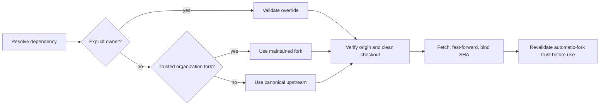

# Required repository resolution

**Why:** Athena must use trusted, current knowledge and automation rather than a
similarly named fork, stale checkout, or unverified remote.

## At a glance

Athena resolves a trusted owner, synchronizes an exact checkout, and binds use
to its reported revision. Any trust, authentication, checkout, or update failure
stops the dependent skill.



## Component details

### Owner selection

For dependency `<Repository>` with environment override `<OWNER_VARIABLE>`:

1. If `<OWNER_VARIABLE>` is non-empty, use `<value>/<Repository>`. An invalid explicit override is
   an error and does not fall back. Validate the owner as a GitHub owner name before using it in a
   path or command: 1–39 ASCII letters, digits, or single hyphens; no leading/trailing hyphen.
2. Otherwise determine the current repository owner with:

   ```bash
   gh repo view --json owner --jq .owner.login
   ```

   Prefer `<current-owner>/<Repository>` only when all automatic-fork trust gates pass:

   - The current repository's `owner.type` is `Organization`, not `User`.
   - The authenticated viewer's `viewerPermission` on the current repository is `WRITE` (push),
     `MAINTAIN`, or `ADMIN`.
   - GitHub confirms the candidate is a fork whose `parent.full_name` is
     `HomericIntelligence/<Repository>`.
   - The candidate repository and its remote default-branch tip SHA can be resolved and reported.
3. Otherwise use `HomericIntelligence/<Repository>`.

Do not automatically select a same-named repository for a user-owned current repository, for a
viewer with read/triage/no permission, or when canonical ancestry cannot be proved.

The fork decision must inspect repository metadata, not naming alone:

```bash
current_owner=$(gh repo view --json owner --jq '.owner.login')
gh api "repos/${current_owner}/<Repository>" \
  --jq '.fork == true and .parent.full_name == "HomericIntelligence/<Repository>"'
```

Only the literal result `true` qualifies for the ancestry check. Use structured API output and quote
every derived value. Resolve the current repository's `owner.type` and `viewerPermission`, then the
candidate's `.default_branch` and exact tip `.sha`. Modified fork content is allowed after these
automatic trust gates pass. A missing or ineligible same-owner candidate falls back to canonical
upstream. An API/authentication error that prevents a trustworthy decision is fatal.

An explicit owner override is an explicit trust decision and may select custom fork content without
the organization/viewer-permission gate. Before using any resolved dependency, report the exact
repository, commit SHA, and trust basis (`explicit override`, `maintained organization fork`, or
`canonical upstream`).

### Dependency map

| Purpose | Repository | Override | Checkout |
| --- | --- | --- | --- |
| Knowledge | `Mnemosyne` | `HOMERIC_INTELLIGENCE_MNEMOSYNE_OWNER` | `$HOME/.agent_brain/knowledge` |
| Automation | `Hephaestus` | `HOMERIC_INTELLIGENCE_HEPHAESTUS_OWNER` | `$HOME/.agent_brain/automation` |

### Checkout and revalidation

Requirements are authenticated `gh`, `git`, and network access. Create `$HOME/.agent_brain` when
needed. Clone the resolved repository when its checkout is absent. For an existing checkout:

- Require `origin` to identify the resolved `owner/repository`.
- Refuse to overwrite local changes or silently rewrite the remote.
- Fetch `origin`, resolve its default branch, and fast-forward it.
- Report the resolved repository and commit SHA.

For an automatically selected same-owner fork, immediately before reading knowledge or executing
automation, re-query and require the current repository's Organization owner, viewer permission,
candidate `parent.full_name`, resolved repository identity, default branch, and tip SHA to match the
reported trust decision and checked-out commit. Stop on any mismatch. This closes the race between
resolution and use.

An authentication failure, missing repository, invalid fork relationship, unexpected origin,
conflicting local state, clone failure, fetch failure, or fast-forward failure is fatal.

Mnemosyne writes use isolated worktrees and always end in a pull request. Hephaestus is read or
executed from its canonical checkout; Athena skills never edit it unless the user explicitly asks
for a Hephaestus change.
